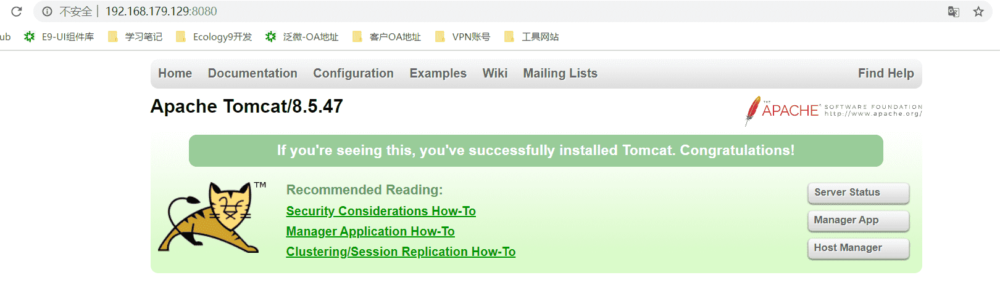

# Docker-Compose入门

## 1. 安装 Python

- 安装编译 Python 源程序所需的包

```bash
sudo apt install build-essential -y
sudo apt install libncurses5-dev libgdbm-dev libnss3-dev libssl-dev libreadline-dev libffi-dev -y
sudo apt-get install zlib1g-dev
```

- 下载 Python 3.8 源程序压缩包

```bash
wget https://www.python.org/ftp/python/3.8.0/Python-3.8.0.tgz
```

- 解压并编译

```bash
# step1: 解压程序包
sudo tar -xzf Python-3.8.0.tgz
# step2：进入Python包
cd Python-3.8.0/
# step3: 开始编译 设置安装路径
sudo ./configure --prefix=/usr/local/python3
# 如果有提醒：please run ./configure --enable-optimizations
# 使用该命令重新执行
sudo ./configure --prefix=/usr/local/python3 --enable-optimizations
sudo make && make install
# 出现以下信息表示安装成功
Successfully installed pip-19.2.3 setuptools-41.2.0
```

- 版本切换

```bash
# 切换python版本为python3
sudo update-alternatives --install /usr/bin/python python /usr/local/python3/bin/python3 1
sudo update-alternatives --config python
# 切换pip版本
sudo update-alternatives --install /usr/bin/pip pip /usr/local/python3/bin/pip3 1
sudo update-alternatives --config pip
```

## 2. 安装 Compose 

> 下载 `docker-compose`： https://github.com/docker/compose/releases 
>
> 或者在`linux` 上直接使用以下命令下载

```bash
curl -L https://github.com/docker/compose/releases/download/1.25.0-rc4/docker-compose-`uname -s`-`uname -m` -o /usr/local/bin/docker-compose
chmod +x /usr/local/bin/docker-compose
```

## 3. 启动tomcat

- 编写 `docker-compose.yml`

```yaml
version: '3'
services:
  tomcat:
    restart: always
    image: tomcat
    container_name: tomcat
    ports:
      - 8080:8080
```

- 执行命令：`docker-compose up`

- 打开浏览器访问：`http://ip:8080/`

