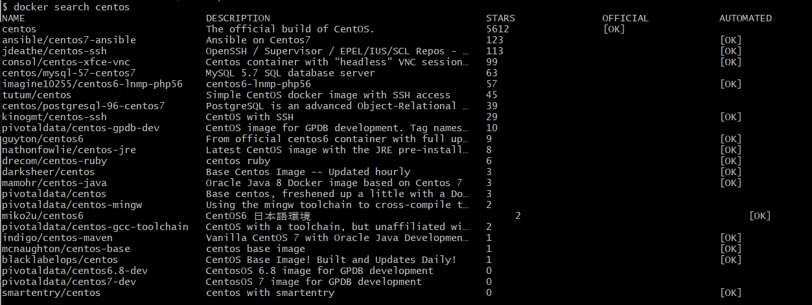
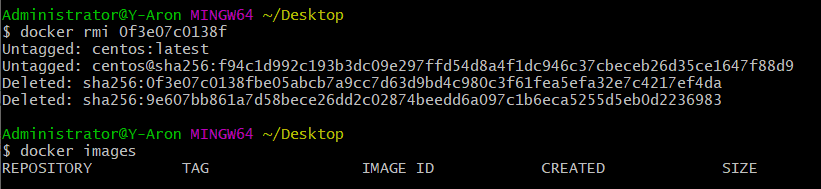
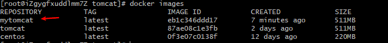
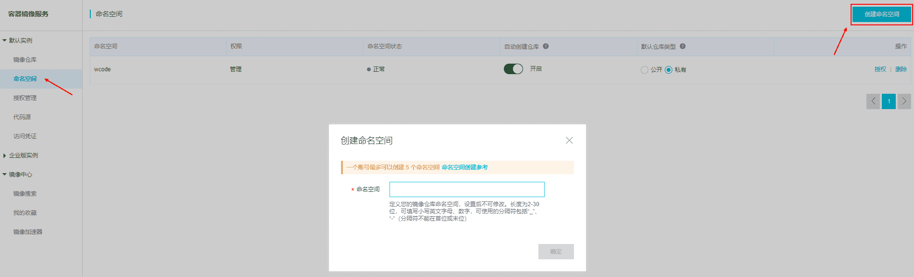
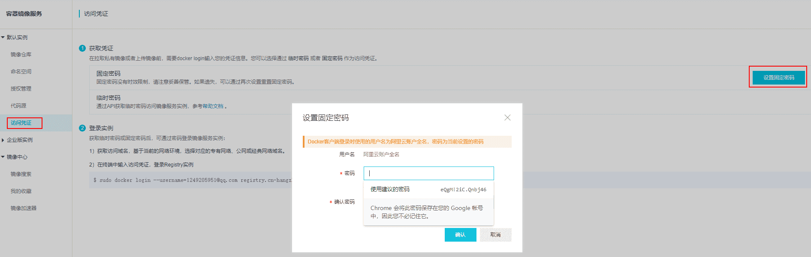
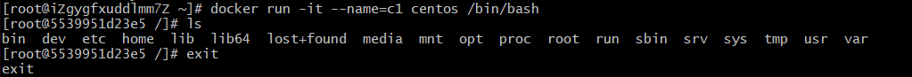
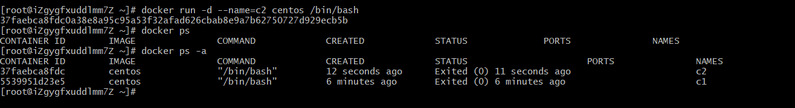
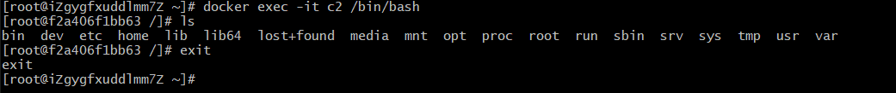
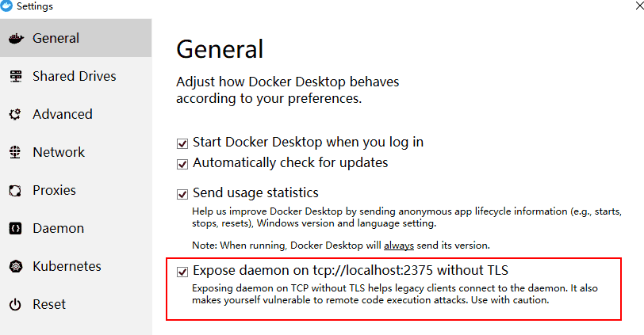

# Docker快速入门

## 1. Docker安装

### 1.1 CentOS 7 安装

```bash
# step 1: 安装必要的一些系统工具
sudo yum install -y yum-utils device-mapper-persistent-data lvm2
# Step 2: 添加软件源信息
sudo yum-config-manager --add-repo http://mirrors.aliyun.com/docker-ce/linux/centos/docker-ce.repo
# Step 3: 更新并安装Docker-CE
sudo yum makecache fast
sudo yum -y install docker-ce
# Step 4: 开启Docker服务
sudo service docker start
```

### 1.2 Window 安装

> 下载地址：https://download.docker.com/win/stable/Docker%20Desktop%20Installer.exe


> 右键 -> Settings -> Daemon -> 勾选 Advanced 
>
> 配置如下信息

```json
{
  "registry-mirrors": [
    "https://xh36jugz.mirror.aliyuncs.com"
  ],
  "insecure-registries": [],
  "debug": true,
  "experimental": false
}
```

### 1.3 Ubuntu 安装

```bash
# step 1: 安装必要的一些系统工具
sudo apt-get update
sudo apt-get -y install apt-transport-https ca-certificates curl software-properties-common
# step 2: 安装GPG证书
curl -fsSL http://mirrors.aliyun.com/docker-ce/linux/ubuntu/gpg | sudo apt-key add -
# Step 3: 写入软件源信息
sudo add-apt-repository "deb [arch=amd64] http://mirrors.aliyun.com/docker-ce/linux/ubuntu $(lsb_release -cs) stable"
# Step 4: 更新并安装Docker-CE
sudo apt-get -y update
sudo apt-get -y install docker-ce
# Step 5: 开启Docker服务
sudo service docker start
```

> 安装校验

```bash
[root@iZgygfxuddlmm7Z docker]# docker version
Client: Docker Engine - Community
 Version:           19.03.3
 API version:       1.40
 Go version:        go1.12.10
 Git commit:        a872fc2f86
 Built:             Tue Oct  8 00:58:10 2019
 OS/Arch:           linux/amd64
 Experimental:      false

Server: Docker Engine - Community
 Engine:
  Version:          19.03.3
  API version:      1.40 (minimum version 1.12)
  Go version:       go1.12.10
  Git commit:       a872fc2f86
  Built:            Tue Oct  8 00:56:46 2019
  OS/Arch:          linux/amd64
  Experimental:     false
 containerd:
  Version:          1.2.10
  GitCommit:        b34a5c8af56e510852c35414db4c1f4fa6172339
 runc:
  Version:          1.0.0-rc8+dev
  GitCommit:        3e425f80a8c931f88e6d94a8c831b9d5aa481657
 docker-init:
  Version:          0.18.0
  GitCommit:        fec3683
[root@iZgygfxuddlmm7Z docker]#
```

## 2. 切换Docker镜像源

### 2.1 创建配置文件

```bash
[root@iZgygfxuddlmm7Z docker]# cd /etc/docker/
[root@iZgygfxuddlmm7Z docker]# touch daemon.json
```

### 2.2 添加镜像源

> 使用阿里云镜像源 [开发者平台](https://cr.console.aliyun.com/cn-hangzhou/instances/mirrors )

```json
{
  "registry-mirrors": ["https://xh36jugz.mirror.aliyuncs.com"]
}
```

### 2.3 重启Docker

```bash
sudo systemctl daemon-reload
sudo systemctl restart docker
```

## 3. Docker常见命令

- 开机启动：`systemctl enable docker.service/docker`
- 启动`docker`：`systemctl start docker` ，`WSL`中应该使用 `sudo service docker start` 

- 停止`docker`：`systemctl stop docker`，`WSL`中应该使用 `sudo service docker stop` 
- 重启`docker`：`systemctl restart docker`，`WSL`中应该使用 `sudo service docker restart` 
- 查看 `docker` 状态：`systemctl status docker`
- 查看 `docker`概要信息：`docker info`
- 查看 `docker` 帮助文档：`docker --help`

## 4. Docker 镜像相关

### 4.1 列出镜像

> 命令：`docker images`


### 4.2 查找镜像

> 命令：`docker search centos`



### 4.3 拉取镜像

> 命令格式：`docker pull [选项][Docker Registry 地址[:端口号]/]仓库名[:标签]`
>
> 如：`docker pull centos`


### 4.4 删除镜像

>`docker rmi $IMAGE_ID`：删除指定镜像
>
>docker rmi `docker images -q`：删除所有镜像



### 4.5 构建镜像

```bash
[root@iZgygfxuddlmm7Z ~]# mkdir docker
[root@iZgygfxuddlmm7Z ~]# cd docker
[root@iZgygfxuddlmm7Z docker]# mkdir tomcat
[root@iZgygfxuddlmm7Z docker]# cd tomcat/
[root@iZgygfxuddlmm7Z tomcat]# vim Dockerfile
[root@iZgygfxuddlmm7Z tomcat]# cat Dockerfile
FROM tomcat
RUN echo "Hello Docker" > /usr/local/tomcat/webapps/ROOT/index.html
[root@iZgygfxuddlmm7Z tomcat]# docker build -t mytomcat .
Sending build context to Docker daemon  2.048kB
Step 1/2 : FROM tomcat
 ---> 87ae08c1e3fb
Step 2/2 : RUN echo "Hello Docker" > /usr/local/tomcat/webapps/ROOT/index.html
 ---> Using cache
 ---> eb1c346ddd17
Successfully built eb1c346ddd17
Successfully tagged mytomcat:latest
```



- 创建 `Dockerfile`文件
- 编写`docker`脚本
- 构建镜像：`docker build -t NAME .`

### 4.6 导入镜像

> 命令：`cat 镜像文件 | docker import - 镜像名称`

### 4.7 保存镜像

> 命令：`docker save -o 保存的镜像名称.tar 镜像名称`

### 4.8 载入镜像

> 命令：` docker load --input 本地镜像名称.tar 或 docker load < 本地镜像名称.tar`

### 4.9 镜像推送

> 将本地制作好的镜像推送到阿里云

- 登录阿里云： [https://cr.console.aliyun.com/cn-hangzhou/instances/repositories](https://links.jianshu.com/go?to=https%3A%2F%2Fcr.console.aliyun.com%2Fcn-hangzhou%2Finstances%2Frepositories) 

- 创建命名空间：[https://cr.console.aliyun.com/cn-hangzhou/instances/namespaces](https://links.jianshu.com/go?to=https%3A%2F%2Fcr.console.aliyun.com%2Fcn-hangzhou%2Finstances%2Fnamespaces) 



- 获取访问凭证： [https://cr.console.aliyun.com/cn-hangzhou/instances/credentials](https://links.jianshu.com/go?to=https%3A%2F%2Fcr.console.aliyun.com%2Fcn-hangzhou%2Finstances%2Fcredentials) 



- 登录阿里云镜像仓库

```bash
docker login --username=<阿里云登录账号> registry.cn-hangzhou.aliyuncs.com
```

- 构建镜像, 注意不要漏掉末尾的 `.` 

```bash
docker build -t registry.cn-hangzhou.aliyuncs.com/<命名空间>/<应用镜像名>:<镜像版本> .
```

- 推送镜像

```bash
docker push registry.cn-hangzhou.aliyuncs.com/<命名空间>/<应用镜像名>:<镜像版本>
```

## 5. 创建容器

> 命令：`docker run [OPTIONS] IMAGE [COMMAND] [ARG...]`

### 5.1 创建交互式容器

> 命令：`docker run -it --name=c1 centos /bin/bash`



### 5.2 创建守护式容器

> 命令：`docker run -itd --name=c2 centos /bin/bash`
>
> **守护式容器退出后会继续运行，而交互式容器退出后不会继续运行。**



> 登陆容器：`docker exec -it c2 /bin/bash`
>
> 退出容器：`exit`



参数 `OPTIONS` 选项：

- `-i`: 交互式容器
- `-t`：`tty`终端（分配一个终端，操作）
- `-rm`：容器退出后随之将其删除
- `-d`：守护式容器，后台运行
- `--name`：指定容器的名称（唯一，不能重复）
- `bash`： 放在镜像名后的是命令，这里我们希望有个交互式的 `Shell`，因此使用`bash`。

### 5.3 文件拷贝

> 宿主机文件拷贝到容器
>
> 命令：`docker cp 宿主机文件或目录 容器名称:容器目录`

```bash
[root@iZgygfxuddlmm7Z ~]# docker cp index.js c1:/root
[root@iZgygfxuddlmm7Z ~]# docker exec -it c1 /bin/bash
[root@5539951d23e5 /]# ls
bin  dev  etc  home  lib  lib64  lost+found  media  mnt  opt  proc  root  run  sbin  srv  sys  tmp  usr  var
[root@5539951d23e5 /]# cd root/
[root@5539951d23e5 ~]# ls
anaconda-ks.cfg  anaconda-post.log  index.js  original-ks.cfg
```

> 容器文件拷贝到宿主机
>
> 命令：`docker cp 容器名称:容器文件或目录 宿主机目录`

```bash
[root@iZgygfxuddlmm7Z ~]# docker cp c1:/root/original-ks.cfg /root
[root@iZgygfxuddlmm7Z ~]# ls
index.js  original-ks.cfg
```

### 5.4 容器目录挂载

> 命令：`docker run -itd --name c4 -v 宿主机目录:容器目录 centos /bin/bash`
>
> 将宿主机目录与容器目录做一个映射，当宿主机目录下文件改变时，容器目录的内容也会随之改变。

### 5.5 容器相关命令

- 查看正在允许的容器：`docker ps`
- 查看所有容器：`docker ps -a`
- 查看最后一次允许容器：`docker ps -l`
- 删除容器：`docker rm $CONTAINER ID `
- 登陆容器：`docker`
- 启动容器：`docker start $CONTAINER ID`
- 停止容器：`docker stop $CONTAINER ID`
- 查看容器：`docker inspect $CONTAINER ID`

- 查看容器日志：`docker logs 容器名称`

## 6. 其他问题

### 6.1 端口映射处理

> 解决方案：重启 `docker`: `systemctl restart docker`

```bash
docker: Error response from daemon: driver failed programming external connectivity on endpoint fervent_bhabha (dc0e233d18b8e75540ace7a217e040fd5d6b81a5d4a95c16f6e7e4e277bdb70d):  (iptables failed: iptables --wait -t nat -A DOCKER -p tcp -d 0/0 --dport 8080 -j DNAT --to-destination 172.17.0.2:8080 ! -i docker0: iptables: No chain/target/match by that name.
 (exit status 1)).
```

### 6.2 `WSL`运行`docker`

> ` docker for windows ` 配置中勾选下图选项



> Linux子系统中执行以下命令

```bash
echo "export DOCKER_HOST='tcp://0.0.0.0:2375'" >> ~/.bashrc
source ~/.bashr
```
