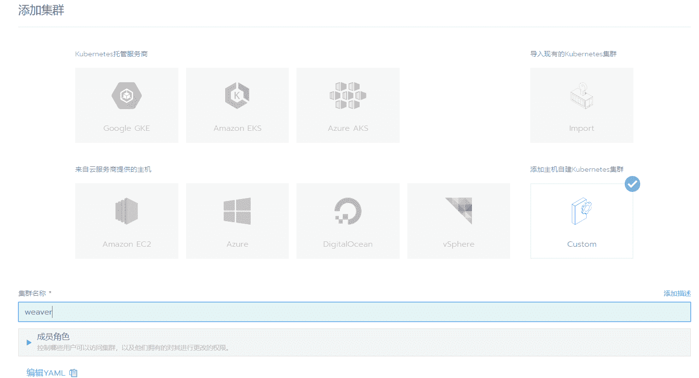

# Rancher入门

> `Rancher` 是`docker`中的一个镜像，所以要使用`rancher`，必须先 [安装docker](./index)

## 1. 安装Rancher

> 命令行：`docker run -d --restart=unless-stopped  -p 8000:80 -p 8443:443 rancher/rancher:v2.2.8`

### 1.1 版本说明

| Tag                      | Description                                                  |
| :----------------------- | :----------------------------------------------------------- |
| `rancher/rancher:latest` | 最新的开发版本，通过我们的CI自动化框架进行构建，该版本不推荐用于生产环境。 |
| `rancher/rancher:stable` | 最新的稳定版本，该版本被推荐用于生产。                       |
| `rancher/rancher:v2.x.x` | 可以通过明确指定镜像版本标签来安装特定的Rancher Server版本。 |

## 2. 登录Rancher

- 打开浏览器，输入 `https://server_ip:8000`，其中 `server_ip` 替换成服务器的`ip`
- 因为是自动使用的自签名证书，在第一次登录会提示安全授信问题，信任即可
- 设置管理员密码
- 设置Rancher Server URL

`Rancher Server URL` 是agent节点注册到`Rancher Server` 的地址，需要保证这个地址能够被agent主机访问，不要设置为`127.0.0.1`或者`localhost`。 

- 语言设置： 页面右下角可以切换语言 

## 3. 创建 K8S 集群

> 现在创建第一个Kubernetes集群，可以使用**自定义**选项。您可以添加云主机、内部虚拟机或物理主机作为集群节点，节点可以运行任何一种或多种主流Linux发行版

### 3.1 添加集群

> 在全局视图下，点击菜单中的集群 , 并点击添加集群

### 3.2 设置集群

- 选择 **Custom**，并设置集群名称,其他参数可不用修改，点击下一步； 

- 选择节点运行的角色

> 默认会勾选**Worker**角色，根据需要可以一次勾选多种角色。比如，假设我只有一个节点，那就需要把所有角色都选择上，选择后上面的命令行会自动添加相应的命令参数；

- 其他参数保持默认，点击命令行右侧的复制按钮，复制命令参数
- 登录预添加集群的主机，执行以上复制的命令
- 在主机上执行完命令后，最后点击完成
- 回到全局视图，可以查看集群的部署状态

## 4. 部署工作负载

sudo docker run -d --privileged --restart=unless-stopped --net=host -v /etc/kubernetes:/etc/kubernetes -v /var/run:/var/run rancher/rancher-agent:v2.2.8 --server https://127.0.0.1:8443 --token pm5gs9hd6zbltqpgzs2pzsj6pcbswwkhhfg78nkr6gn62g5c9sslwj --ca-checksum 23bf4012df55b34972705eec76f46076828ba185a56b2b94b59e1261bdf29466 --etcd --controlplane --worker

sudo docker run -d --privileged --restart=unless-stopped --net=host -v /etc/kubernetes:/etc/kubernetes -v /var/run:/var/run rancher/rancher-agent:v2.2.8 --server https://127.0.0.1:8443 --token r9gcmm6jn2dq7x4b46ftb6ccp62zcdkkrfrmx75gh2l68xs47dxw85 --ca-checksum f586374e80351307e165986d0e6b1fedb4541d36f46046d12af1684e970e8223 --etcd --controlplane --worker

/home/work/data/ecology

/home/work/app/resin

nginx:alpine

docker run -itd -p 8888:8080 -v /mnt/c/Users/Code/Desktop/weaver/ecology:/home/work/data/ecology -v /mnt/c/Users/Code/Desktop/weaver/resin:/home/work/app/resin --name=e9 

http://mirrors.aliyun.com/ubuntu/