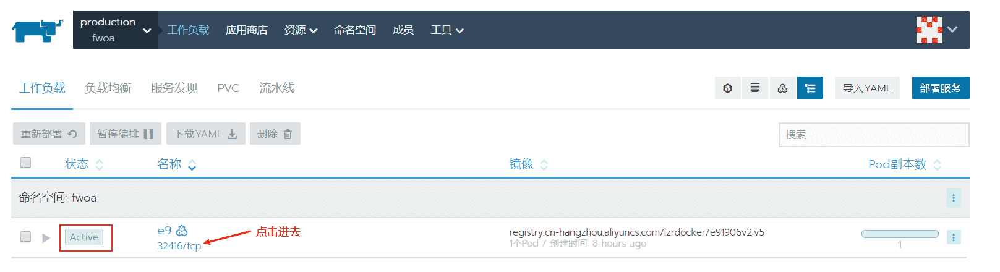

# Rancher入门

> `Rancher` 是`docker`中的一个镜像，所以要使用`rancher`，必须先 [安装docker](./index)

## 1. 安装Rancher

> 命令行：`docker run -d --restart=unless-stopped  -p 8000:80 -p 8443:443 rancher/rancher:v2.2.8`

### 1.1 版本说明

| Tag                      | Description                                                  |
| :----------------------- | :----------------------------------------------------------- |
| `rancher/rancher:latest` | 最新的开发版本，通过我们的CI自动化框架进行构建，该版本不推荐用于生产环境。 |
| `rancher/rancher:stable` | 最新的稳定版本，该版本被推荐用于生产。                       |
| `rancher/rancher:v2.x.x` | 可以通过明确指定镜像版本标签来安装特定的Rancher Server版本。 |

## 2. 登录Rancher

- 打开浏览器，输入 `https://server_ip:8000`，其中 `server_ip` 替换成服务器的`ip`
- 因为是自动使用的自签名证书，在第一次登录会提示安全授信问题，信任即可
- 设置管理员密码
- 设置Rancher Server URL

`Rancher Server URL` 是agent节点注册到`Rancher Server` 的地址，需要保证这个地址能够被agent主机访问，不要设置为`127.0.0.1`或者`localhost`。 

- 语言设置： 页面右下角可以切换语言 

## 3. 创建 K8S 集群

> 现在创建第一个Kubernetes集群，可以使用**自定义**选项。您可以添加云主机、内部虚拟机或物理主机作为集群节点，节点可以运行任何一种或多种主流Linux发行版

### 3.1 添加集群

> 在全局视图下，点击菜单中的集群 , 并点击添加集群


### 3.2 设置集群

- 选择 **Custom**，并设置集群名称,其他参数可不用修改，点击下一步； 


- 选择节点运行的角色

> 默认会勾选**Worker**角色，根据需要可以一次勾选多种角色。比如，假设我只有一个节点，那就需要把所有角色都选择上，选择后上面的命令行会自动添加相应的命令参数；


- 其他参数保持默认，点击命令行右侧的复制按钮，复制命令参数
- 登录预添加集群的主机，执行以上复制的命令
- 在主机上执行完命令后，最后点击完成
- 回到全局视图，可以查看集群的部署状态


## 4. 部署工作负载

### 4.1 e9 镜像获取

#### 4.1.1 载入已制作的镜像

- 下载已经制作的镜像包：https://pan.baidu.com/s/1lNjVYP--OiiGFgONm5dssg，提取码：`uogo` 

- 载入镜像


```bash
docker load --input e9.tar
```

#### 4.1.2 手动制作镜像

- 下载 `ecology`，`jdk` , `resin`，并放在 `/usr/local/weaver/` 路径下


- 修改 `resin` 相关配置

```bash
vim resin/bin/resin.sh

# 头部修改jdk路径
JAVA_HOME=/usr/local/weaver/jdk
export JAVA_HOME

vim resin/bin/startresin.sh

# 末尾修改成如下路径
/usr/local/weaver/resin/bin/resin.sh start

vim resin/conf/resin.xml
# 修改jdk路径
<javac compiler="../jdk/bin/javac" args="-encoding UTF-8"/>
# 修改ecology项目路径
<web-app id="/" root-directory="../ecology">
    <servlet-mapping url-pattern='/weaver/*' servlet-name='invoker'/>
    <form-parameter-max>100000</form-parameter-max>
</web-app>
```

- 使用 `Dockerfile` 定制镜像

```dockerfile
FROM ubuntu
COPY ecology/ /usr/local/weaver/ecology/
COPY resin/ /usr/local/weaver/resin/
COPY jdk1.8.0_231/ /usr/local/weaver/jdk/
EXPOSE 8080
RUN chmod +x /usr/local/weaver/resin/bin/resin.sh
CMD ["/bin/sh", "-c", "/usr/local/weaver/resin/bin/resin.sh console"]
```

- 构建镜像，注意要把路径切换到 `/usr/local/weaver` 下才能执行以下命令

```bash
docker build -t e9 .
```

等待一段时间，镜像构建完毕后查看镜像信息如下：


#### 4.1.3 拉取阿里云镜像

> 关于阿里云镜像的制作以及推送可以查看：

```bash
sudo docker pull registry.cn-hangzhou.aliyuncs.com/wcode/e91909:v2
```

### 4.2 部署服务

- 进入集群项目，点击部署服务


- 部署  `ecology9` 镜像


- 等待镜像部署，直到出现以下界面则表示部署成功



## 5. 更新补丁方案

### 5.1 使用 Dockerfile 重构镜像

创建 `e9` 目录，并创建 `ecology` 、`resin` 和 `Dockerfile`。如下图所示


其中，`Dockerfile` 内容

```bash
FROM registry.cn-hangzhou.aliyuncs.com/lzrdocker/e91906v2:v5
COPY ecology/ /home/work/data/ecology/
COPY resin/ /home/work/app/resin/
```

保存文件，使用已下命令重构镜像

```bash
docker build -t e9:v1 .
```

### 5.2 使用 wget 更新补丁

- 进入部署的 `e9` 服务


- 在容器中使用 `wget` 命令下载所要更新的补丁包，并覆盖相应的目录即可。

