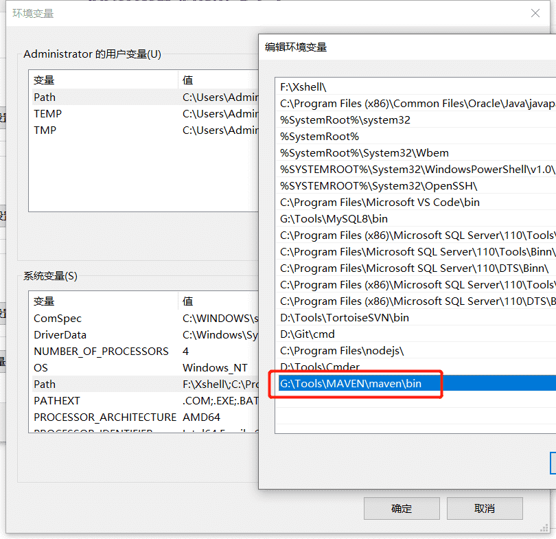
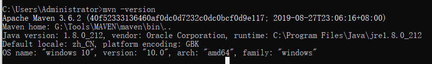

# Maven 快速入门

## 1. Maven下载与安装

### 1.1 下载Maven

> Maven 下载地址：http://mirrors.tuna.tsinghua.edu.cn/apache/maven/maven-3/3.6.2/binaries/apache-maven-3.6.2-bin.zip

### 1.2 安装Maven

- 在环境变量中添加 Maven 路径



- 打开CMD，输入 `mvn -version` 进行查看，有版本号输出证明安装成功。



## 2. Maven仓库介绍和配置

### 2.1 仓库介绍


-  本地仓库：指存在于我们本机的仓库，在我们加入依赖时候，首先会跑到我们的本地仓库去找，如果找不到则会跑到远程仓库中去找。 
-  远程仓库：指其他服务器上的仓库，包括全球中央仓库，公司内部的私服，又或者其他公司提供的公共库。 
-  中央仓库：Maven中央仓库，服务于全球 。地址： https://mvnrepository.com/ 
-  私服：私服是架设在局域网的一种特殊的远程仓库，目的是代理远程仓库及部署第三方构件。 
-  其他公共库：阿里云镜像的远程仓库 

### 2.2 配置文件

> 配置文件路径：`maven/config/settings.xml`

精简版配置如下：

```xml
<?xml version="1.0" encoding="UTF-8"?>
<settings xmlns="http://maven.apache.org/SETTINGS/1.0.0"
          xmlns:xsi="http://www.w3.org/2001/XMLSchema-instance"
          xsi:schemaLocation="http://maven.apache.org/SETTINGS/1.0.0 http://maven.apache.org/xsd/settings-1.0.0.xsd">
  <localRepository>G:\Tools\MAVEN\repository</localRepository>
  <offline>false</offline>
  <pluginGroups></pluginGroups>
  <proxies></proxies>
  <servers></servers>
  <mirrors></mirrors>
  <profiles></profiles>
  <activeProfiles></activeProfiles>
</settings>
```

- `localRepository`：本地仓库路径
- `offline`：离线模式，默认值为false。当因为各种原因无法与远程仓库连接时，可将该值修改为true 

- `pluginGroups`：插件组，内部由n个pluginGroup节点组成，默认自带了org.apache.maven.plugins和org.codehaus.mojo。若有特殊的需求是可进行扩展 

- `proxies`：代理设置，内部由n个proxy节点组成，公司若需要代理才能上网时可设置该参数 
- `servers`：仓库上传下载服务器，一般公司有私服时使用，也可以配置在pom.xml中，内部由n个server节点组成。有两种配置方式：
  - 通过`ID`匹配，username和password进行认证登录
  - 通过`ID`匹配指向一个privateKey（私钥）和一个passphrase 

```xml
<servers>
    <server>
      <id>deploymentRepo</id>
      <username>repouser</username>
      <password>repopwd</password>
    </server>
    <server>
      <id>siteServer</id>
      <privateKey>/path/to/private/key</privateKey>
      <passphrase>optional; leave empty if not used</passphrase>
    </server>
</servers>
```

- `mirrors`：镜像仓库列表，内部由n个mirror节点组成。 

```xml
<!-- 阿里云镜像源 -->
<mirror>
    <id>alimaven</id>
    <name>aliyun maven</name>
    <url>http://maven.aliyun.com/nexus/content/groups/public/</url>
    <mirrorOf>central</mirrorOf>
</mirror>
```

- `profiles`：根据环境参数来调整构建配置的列表，`settings.xml`中的`profile`元素是`pom.xml`中`profile`元素的提炼版，如果该profile被激活，它的值会覆盖任何其它定义在`pom.xml`中带有相同id的`profile`节点。 

```xml
<profiles>
    <profile>  
        <id>jdk18</id>  
        <activation>  
            <activeByDefault>true</activeByDefault>  
            <jdk>1.8</jdk>  
        </activation>  
        <properties>  
            <maven.compiler.source>1.8</maven.compiler.source>  
            <maven.compiler.target>1.8</maven.compiler.target>  
            <maven.compiler.compilerVersion>1.8</maven.compiler.compilerVersion>  
        </properties>   
    </profile>
</profiles>
```

- `activeProfiles`：手动激活profiles的列表，按照`profile`被应用的顺序定义`activeProfile`。 该元素包含了一组`activeProfile`元素，`activeProfile`值为profile中所定义的id，不论环境设置如何，其对应的 `profile`都会被激活。如果没有匹配的`profile`，则什么都不会发生。 

```xml
<activeProfiles>
    <activeProfile>alwaysActiveProfile</activeProfile>
    <activeProfile>anotherAlwaysActiveProfile</activeProfile>
</activeProfiles>
```

- 总结：一般情况而言，`settings.xml`无需配置太多的东西，作为优化，可配置localRepository和mirrors

