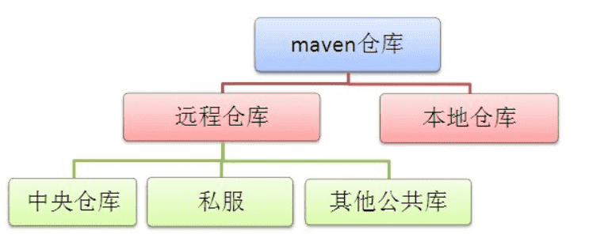

# Maven 快速入门

## 1. Maven下载与安装

### 1.1 下载Maven

> Maven 下载地址：http://mirrors.tuna.tsinghua.edu.cn/apache/maven/maven-3/3.6.2/binaries/apache-maven-3.6.2-bin.zip

### 1.2 安装Maven

- 在环境变量中添加 Maven 路径

- 打开CMD，输入 `mvn -version` 进行查看，有版本号输出证明安装成功。

## 2. Maven仓库介绍和配置

### 2.1 仓库介绍

-  本地仓库：指存在于我们本机的仓库，在我们加入依赖时候，首先会跑到我们的本地仓库去找，如果找不到则会跑到远程仓库中去找。 
-  远程仓库：指其他服务器上的仓库，包括全球中央仓库，公司内部的私服，又或者其他公司提供的公共库。 
-  中央仓库：Maven中央仓库，服务于全球 。地址： https://mvnrepository.com/ 
-  私服：私服是架设在局域网的一种特殊的远程仓库，目的是代理远程仓库及部署第三方构件。 
-  其他公共库：阿里云镜像的远程仓库 

### 2.2 配置文件

> 配置文件路径：`maven/config/settings.xml`