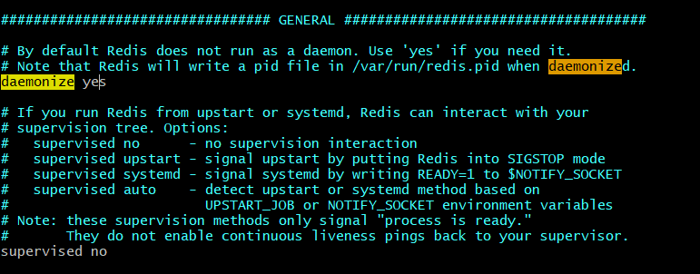

# Redis 快速入门

## 1. Redis 安装

### 1.1 Window 安装 Redis

> 下载地址：https://github.com/MSOpenTech/redis/releases 
>
> 下载  `Redis-x64-x.x.xxx.msi` 版本进行安装即可。安装完毕后目录结构如下
>

```
redis-server.exe：服务端程序，提供redis服务

redis-cli.exe: 客户端程序，通过它连接redis服务并进行操作

redis-check-dump.exe：本地数据库检查

redis-check-aof.exe：更新日志检查

redis-benchmark.exe：性能测试，用以模拟同时由N个客户端发送M个 SETs/GETs 查询 (类似于 Apache 的ab 工具).

redis.windows.conf: 配置文件，将redis作为普通软件使用的配置，命令行关闭则redis关闭

redis.windows-service.conf：配置文件，将redis作为系统服务的配置，用以区别开两种不同的使用方式
```

### 1.2 Linux 安装 Redis

#### 1.2.1 下载安装

- 安装编译环境

```bash
sudo apt-get install make gcc
```

- 安装 redis

```bash
# 下载 redis 源码
wget http://download.redis.io/releases/redis-5.0.6.tar.gz
# 解压
tar xzf redis-5.0.6.tar.gz
# 切换到解压目录
cd redis-5.0.6
# 切换到 root 权限
su root
# 编译安装
make PREFIX=/usr/local/redis install
```

#### 1.2.2 配置和启动

> redis.conf 是 redis 的配置文件，redis.conf 在 redis 源码目录下

- 拷贝配置文件到安装目录下

```bash
# 进入源码目录
cd /usr/local/redis-5.0.6
# 拷贝配置文件至安装目录
cp /usr/local/redis-5.0.6/redis.conf /usr/local/redis/redis.conf
```

- 前台启动

```bash
# 进入安装目录
cd /usr/local/redis/bin
./redis-server
```

- 后端模式启动

修改 redis.conf 配置文件，daemonize 参数设置为 yes，表示以后端模式启动



修改完毕后保存退出，重新启动 redis

```bash
 # 进入安装目录
 cd /usr/local/redis
 # 已后端模式启动 redis
 ./bin/redis-server ./redis.conf
```

