# Ubuntu入门

## 1. Vmware 安装Ubuntu

> 使用 VMware Workstation Pro 安装 Ubuntu Server 18.04.3 LTS
>
> VMware Workstation Pro 软件包：https://pan.baidu.com/s/1DhzksBM1hlogfDiTRUjtrw
>
> 镜像地址：[https://pan.baidu.com/s/1HxT_Txl_9X-aQb368sgGEA](https://pan.baidu.com/s/1HxT_Txl_9X-aQb368sgGEA)

- 安装 `VMware Workstation Pro` 
- 打开 `VMware Workstation Pro`  -> 新建虚拟机 -> 自定义（高级）

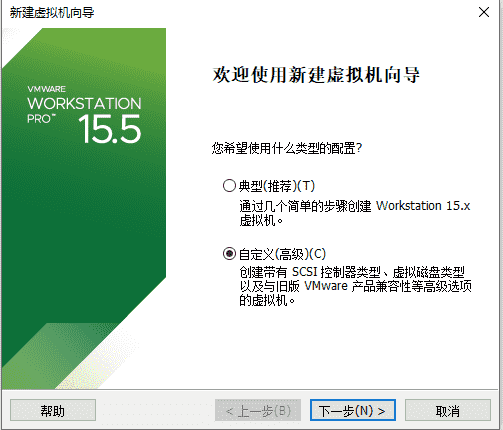

- 硬件兼容性选择 `Workstation 15.X`

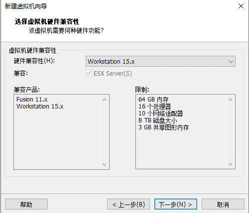

- 选择镜像文件

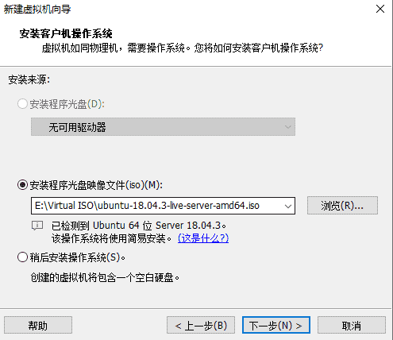

- 设置账户密码

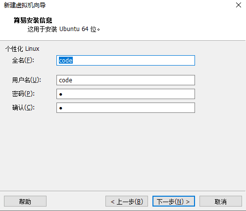

- 默认下一步，打开虚拟机选择语言


- 默认下一步，修改镜像源为阿里云镜像：http://mirrors.aliyun.com/ubuntu/

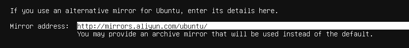

- 下一步，选择第一个，一直回车

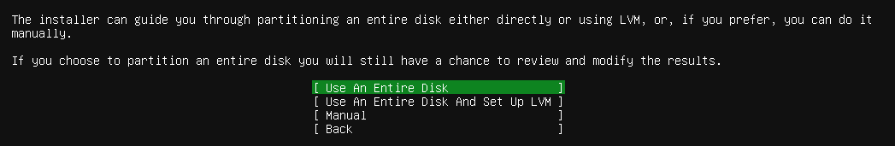

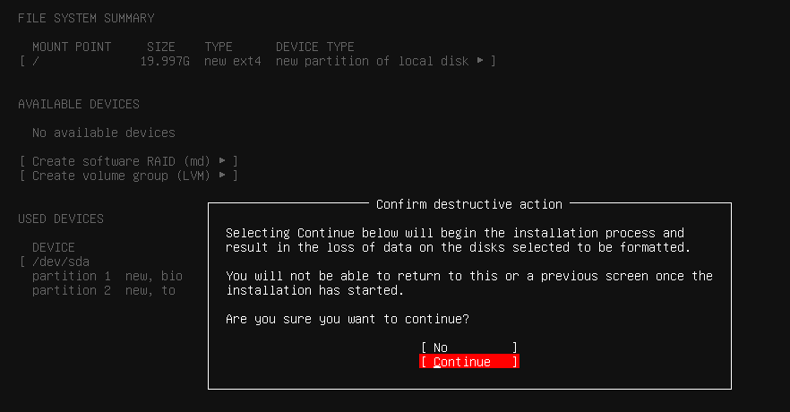

- 设置服务器信息

- 勾选安装 OpenSSH server

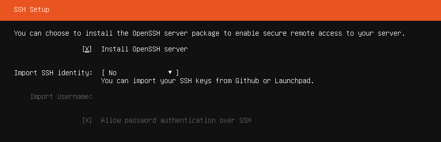

- 下一步，等待安装完后重启即可

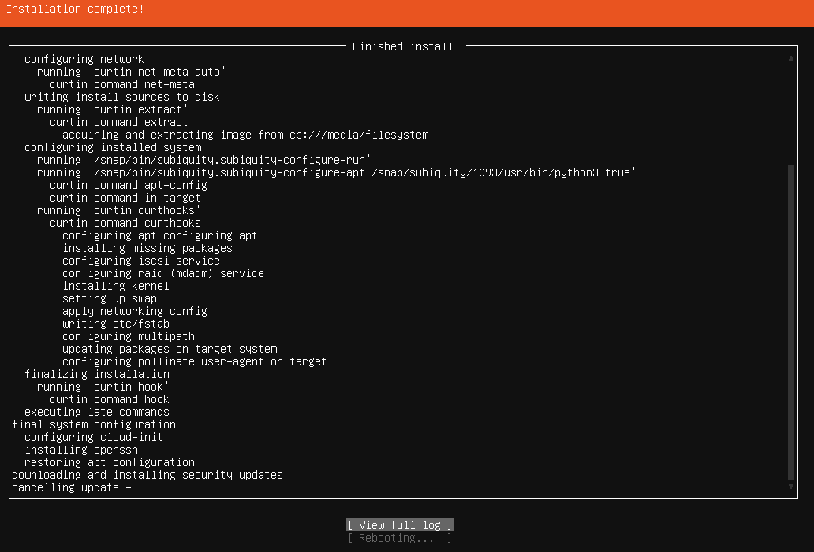

- 登录服务器

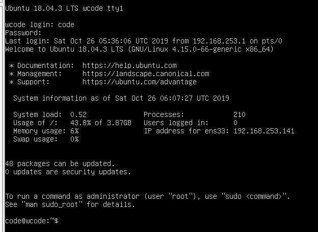

## 2. 安装 MySQL

### 2.1 下载软件包

> 配置 `ssh` 的 `root` 权限

```bash
# 设置root密码
sudo passwd root
# 使用root登录
su root
vi /etc/ssh/sshd_config
# 文件末尾加上
PermitRootLogin yes
# 重启服务器
reboot
```

> 下载软件包

```bash
sudo apt-get update
sudo apt-get install
wget https://repo.mysql.com//mysql-apt-config_0.8.14-1_all.deb
```

### 2.2 开始安装

- 执行如下命令

```bash
sudo dpkg -i mysql-apt-config_0.8.14-1_all.deb
```

- 弹出如下界面，选择第一个

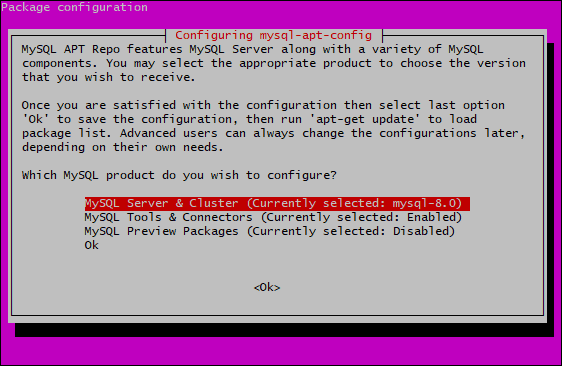

- 选择MySQL版本，选择MySQL8


- 回到上一个界面，选择🆗在回车

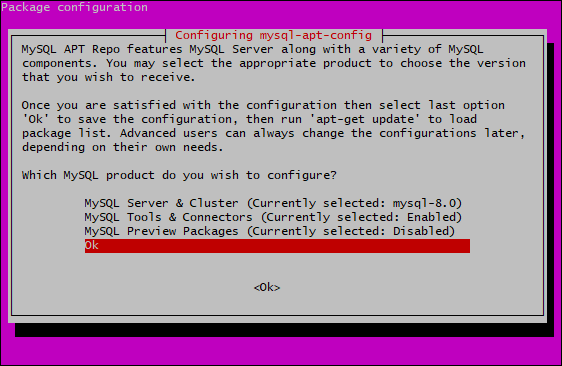

- 更新系统和软件源并安装MySQL8

```bash
sudo apt update
sudo apt install mysql-server
```

- 等待安装，直到以下界面出现时，输入密码

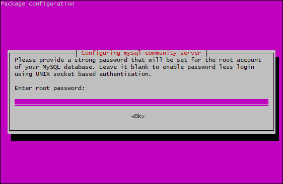

- 安装成功, 使用 root 登录 MySQL

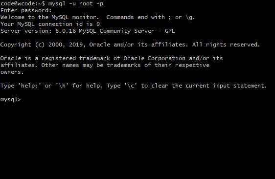

- 开启远程访问权限

```mysql
mysql -uroot -p
-- 进入mysql库
use mysql
-- 更新域属性，'%'表示允许外部访问：
update user set host='%' where user ='root';
FLUSH PRIVILEGES;
-- 执行授权语句
GRANT ALL PRIVILEGES ON *.* TO 'root'@'%'WITH GRANT OPTION;
```

## 3. 安装 Java

> Jdk 软件包下载地址：https://pan.baidu.com/s/1s7xB_7qZSkHZTj3TG4KXAQ

- 上传`Jdk`至服务器

```bash
scp jdk-8u231-linux-x64.tar.gz root@192.168.253.144:/usr/local/java
```

- 解压安装包

```bash
root@server:/usr/local/java# tar -zxvf jdk-8u231-linux-x64.tar.gz
```

- 配置系统环境变量

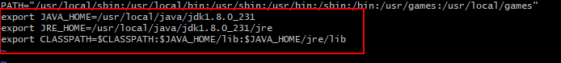

```bash
# vi /etc/environment
# 其他配置
export JAVA_HOME=/usr/local/java/jdk1.8.0_231
export JRE_HOME=/usr/local/java/jdk1.8.0_231/jre
export CLASSPATH=$CLASSPATH:$JAVA_HOME/lib:$JAVA_HOME/jre/lib
```

- 配置用户环境变量

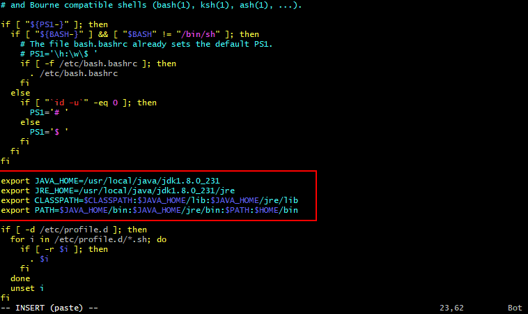

```bash
# vim /etc/profile
# 其他配置
export JAVA_HOME=/usr/local/java/jdk1.8.0_231
export JRE_HOME=/usr/local/java/jdk1.8.0_231/jre
export CLASSPATH=$CLASSPATH:$JAVA_HOME/lib:$JAVA_HOME/jre/lib
export PATH=$JAVA_HOME/bin:$JAVA_HOME/jre/bin:$PATH:$HOME/bin
```

- 重启配置

```bash
root@server:/home# source /etc/profile
```

- 检查是否安装成功

```bash
root@server:/home# java -version
java version "1.8.0_231"
Java(TM) SE Runtime Environment (build 1.8.0_231-b11)
Java HotSpot(TM) 64-Bit Server VM (build 25.231-b11, mixed mode)
```

## 4. 安装Tomcat

> tomcat软件包地址：https://pan.baidu.com/s/1fKZ-nAnsdXDWpHlyM_Bs4Q

- 上传`tomcat`至服务器

```bash
scp apache-tomcat-9.0.27.tar.gz root@192.168.253.144:/usr/local/tomcat
```

- 解压软件包

```bash
tar -zxvf apache-tomcat-9.0.27.tar.gz
```

- 启动`tomcat`

```bash
cd /usr/local/tomcat/apache-tomcat-9.0.27/bin
./startup.sh
Using CATALINA_BASE:   /usr/local/tomcat/apache-tomcat-9.0.27
Using CATALINA_HOME:   /usr/local/tomcat/apache-tomcat-9.0.27
Using CATALINA_TMPDIR: /usr/local/tomcat/apache-tomcat-9.0.27/temp
Using JRE_HOME:        /usr/local/java/jdk1.8.0_231/jre
Using CLASSPATH:       /usr/local/tomcat/apache-tomcat-9.0.27/bin/bootstrap.jar:/usr/local/tomcat/apache-tomcat-9.0.27/bin/tomcat-juli.jar
Tomcat started.
```

- 打开浏览器输入：`http://ip:8080`

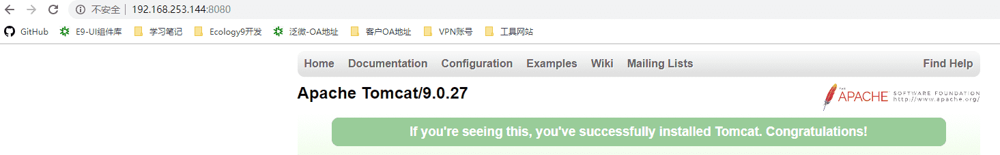