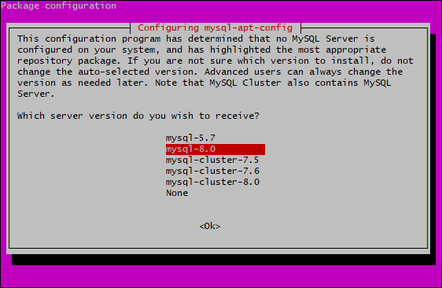

# Ubuntu入门

## 1. Vmware 安装Ubuntu

> 使用 VMware Workstation Pro 安装 Ubuntu Server 18.04.3 LTS
>
> VMware Workstation Pro 软件包：https://pan.baidu.com/s/1DhzksBM1hlogfDiTRUjtrw
>
> 镜像地址：[https://pan.baidu.com/s/1HxT_Txl_9X-aQb368sgGEA](https://pan.baidu.com/s/1HxT_Txl_9X-aQb368sgGEA)

- 安装 `VMware Workstation Pro` 
- 打开 `VMware Workstation Pro`  -> 新建虚拟机 -> 自定义（高级）


- 硬件兼容性选择 `Workstation 15.X`


- 选择镜像文件


- 设置账户密码


- 默认下一步，打开虚拟机选择语言


- 默认下一步，修改镜像源为阿里云镜像：http://mirrors.aliyun.com/ubuntu/


- 下一步，选择第一个，一直回车


- 设置服务器信息

- 勾选安装 OpenSSH server


- 下一步，等待安装完后重启即可


- 登录服务器


## 2. 安装 MySQL

### 2.1 下载软件包

```bash
sudo apt-get update
sudo apt-get install wget
wget https://repo.mysql.com//mysql-apt-config_0.8.14-1_all.deb
```

### 2.2 开始安装

- 执行如下命令

```bash
sudo dpkg -i mysql-apt-config_0.8.14-1_all.deb
```

- 弹出如下界面，选择第一个


- 选择MySQL版本，选择MySQL8



- 回到上一个界面，选择🆗在回车


- 更新系统和软件源并安装MySQL8

```shell
sudo apt update
sudo apt install mysql-server
```

- 等待安装，直到以下界面出现时，输入密码


- 安装成功, 使用 root 登录 MySQL


