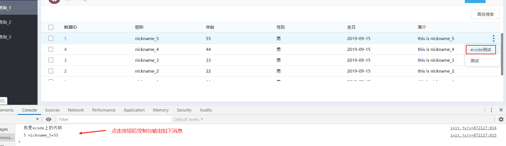
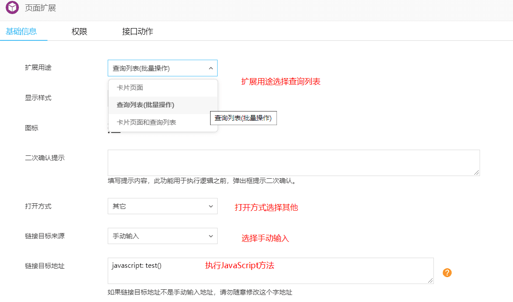
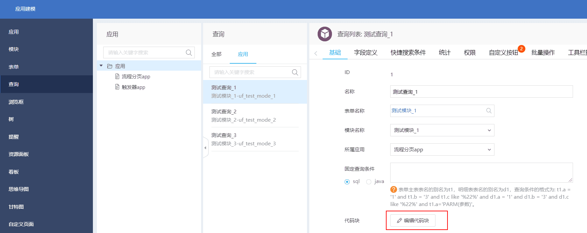
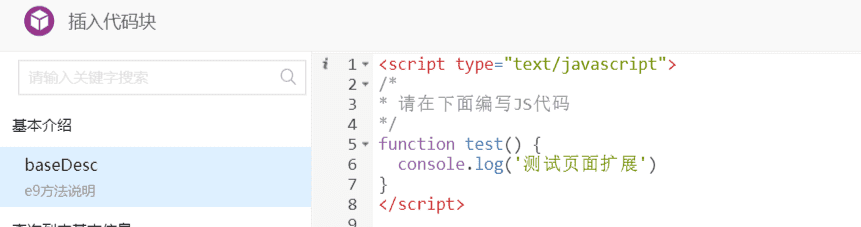
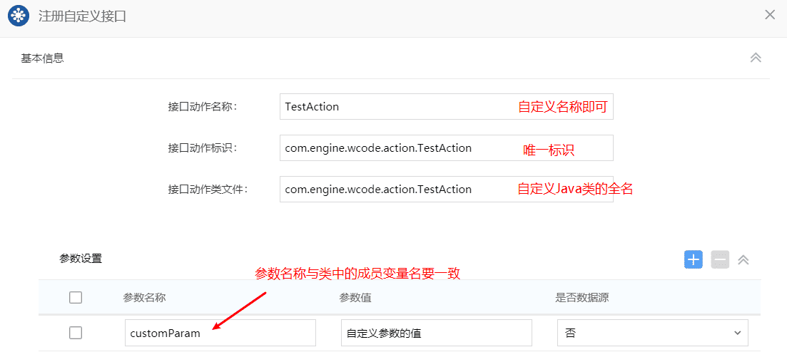
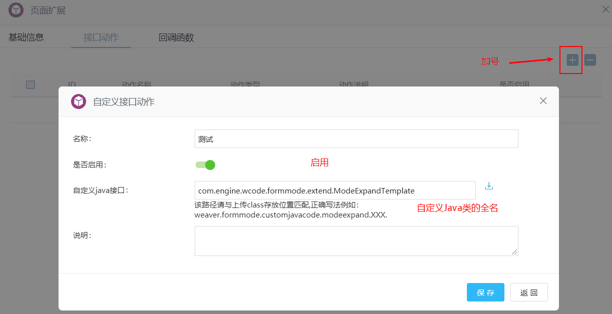
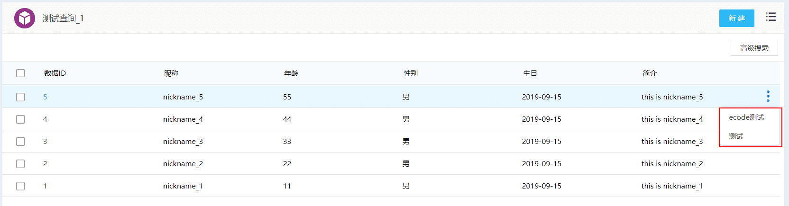
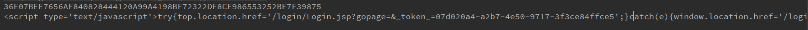
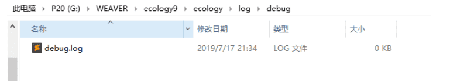
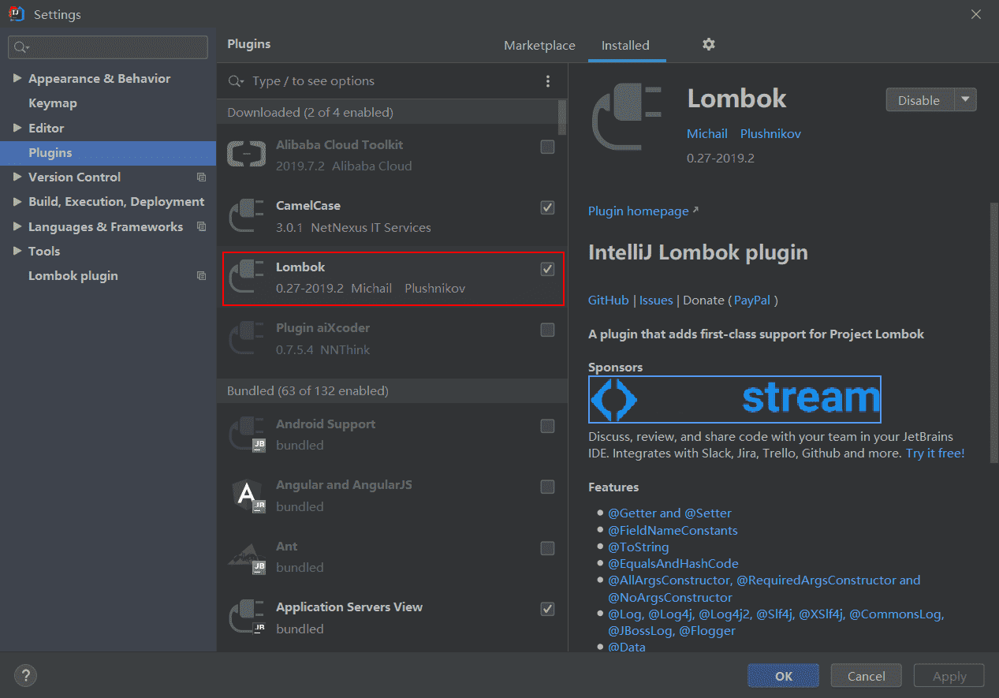

# Ecology9 开发手册

> 在线地址： [http://wcode.store/#/./weaver/Ecology9%E5%BC%80%E5%8F%91%E6%89%8B%E5%86%8C](http://wcode.store/#/./weaver/Ecology9开发手册) 

## 1. 环境搭建

### 1.1 Ecology安装和启动

- 准备 `ecology` | `resin` | `jdk1.8[可直接使用已安装的]`
- 修改resin配置 `resin/config/resin.conf`

```xml
// 修改jdk路径：相对路径或者绝对路径
<javac compiler="C:\Program Files\Java\jdk1.8.0_151\bin\javac" args="-encoding UTF-8"/>

// 修改ecology路径
<web-app id="/" root-directory="F:\WEAVER\ecology">
```

- 修改resin启动配置 `resin/resinstart.bat`

其中`java_home` 为`jdk`的路径，可以是相对路径也可以是绝对路径

```properties
set java_home=C:\Program Files\Java\jdk1.8.0_151
```

- 启动`resin` 点击`resinstart.bat`
- 初始验证码文件路径 `ecology/WEB-INF/code.key`

### 1.2 主要目录介绍

- `ecology/classbean`：存放编译后的class文件
- `ecology/log`：系统中日志存放目录
- `ecology/WEB-INF/prop`：`web`配置文件目录
- `ecology/WEB-INF/lib`：系统`jar`包路径 

### 1.3 数据库配置

> 如果数据库与Ecology不在同一台服务器上，则可以修改数据库配置文件中的数据库配置。
>
> 数据库配置文件路径：`ecology/WEB-INF/prop/weaver.properties`

```properties
# sqlServer
DriverClasses = com.microsoft.sqlserver.jdbc.SQLServerDriver
ecology.url = jdbc:sqlserver://host:port;DatabaseName=dbname
ecology.user = username
ecology.password = password
```

```properties
# oracle
DriverClasses = oracle.jdbc.OracleDriver
ecology.url = jdbc:oracle:thin:@host:port:ecology
ecology.user = username
cology.password = password
```

---

## 2. E9常见表结构

### 2.1 流程相关数据存储表

| 数据库表名               | 中文说明         | 备注                           |
| ------------------------ | ---------------- | ------------------------------ |
| workflow_base            | 流程基本信息     | isbill=1                       |
| workflow_bill            | 流程表单信息     | id > 0固定表名 id < 0 动态生成 |
| workflow_billfield       | 表单字段信息     |                                |
| workflow_billdetailtable | 表单明细表       |                                |
| workflow_nodebase        | 节点信息         |                                |
| workflow_flownode        | 流程节点信息     |                                |
| workflow_nodelink        | 流程出口信息     |                                |
| workflow_nodegroup       | 节点操作人信息   |                                |
| workflow_groupdetail     | 节点操作人详情   |                                |
| workflow_requestbase     | 请求基本信息     |                                |
| workflow_currentoperator | 请求节点操作人   |                                |
| workflow_requestlog      | 请求签字意见     |                                |
| workflow_nownode         | 请求当前节点     |                                |
| workflow_browserurl      | 系统浏览按钮信息 |                                |
| workflow_selectitem      | 下拉框信息       |                                |

### 2.2 人力资源相关数据存储

| 表名                 | 说明                         | 备注 |
| -------------------- | ---------------------------- | ---- |
| HrmResource          | 人力资源基本信息表           | -    |
| HrmResource_online   | 人员在线信息表               | -    |
| HrmResourceManager   | 系统管理员信息表             | -    |
| HrmDepartment        | 人力资源部门表               | -    |
| HrmDepartmentDefined | 人力资源部门自定义字段信息表 | -    |
| HrmSubCompany        | 人力资源分部表               | -    |
| hrmroles             | 角色信息表                   | -    |
| hrmrolemembers       | 角色人员                     | -    |
| hrmjobtitles         | 岗位信息表                   | -    |

## 3. 前端开发

> `ecology9`前端上采用`react`+`antd`+`mobx`+`react-router`等框架实现的单页面应用

### 3.1 流程开发

> 流程表单前端接口：[E9流程表单前端接口API](https://e-cloudstore.com/ecode/doc?appId=98cb7a20fae34aa3a7e3a3381dd8764e&tdsourcetag=s_pctim_aiomsg#E9%E6%B5%81%E7%A8%8B%E8%A1%A8%E5%8D%95%E5%89%8D%E7%AB%AF%E6%8E%A5%E5%8F%A3API](https://e-cloudstore.com/ecode/doc?appId=98cb7a20fae34aa3a7e3a3381dd8764e&tdsourcetag=s_pctim_aiomsg#E9流程表单前端接口API))

- 所有接口统一封装在全局对象`window.WfForm`中
- 表单字段相关操作，不推荐使用jQuery，禁止原生JS直接操作DOM结构！
- 在开发过程中，推荐都使用API接口操作，由产品统一运维；同时使用API才能完整的兼容移动终端

### 3.2 建模开发

#### 3.2.1 布局代码块

> 建模布局代码块使用上与流程表单的代码块基本一致，区别在于接口的SDK不同，建模表单的所有接口统一封装在全局对象 `window.ModeForm`中。
>
> [建模前端接口API](https://e-cloudstore.com/ecode/doc.html?appId=e783a1d75a784d9b97fbd40fdf569f7d&tdsourcetag=s_pctim_aiomsg)

#### 3.2.2 自定义按钮

> 后端应用中心 -> 建模引擎 -> 查询
>
> 任选一个查询页面 -> 自定义按钮 -> 右键 -> 新建
>
> 

- 方法体中存在多行代码时，每个语句必须以`;`结尾；否则会报错！

- `params`的值等于 ` ‘field1+field2+field3’` 这个值是一个字符串

- `id`指的是数据`ID`

> 前端显示


- **配置`ecode`使用**

> 新建前置文件 `index.js`并将方法挂到全局对象 `window.g` 下


> 新建自定义按钮




#### 3.2.3 页面扩展

> 后端应用中心 -> 建模引擎 -> 模块
>
> 任选一个模块 -> 页面扩展 -> 右键 -> 新建
>
> 

- 扩展用途：卡片页面、查询列表（批量操作）、卡片页面和查询列表
  - 卡片页面：可以设置页面扩展显示在卡片信息页面，可以选择在新建页面、编辑页面、查看页面显示页面扩展。
  - 查询列表（批量操作）：设置在查询列表时，则会在引用该模块的查询列表的批量操作中显示页面扩展项，在批量操作中勾选后会在前台列表中显示对应的页面扩展项。
  - 卡片页面和查询列表：可以设置页面扩展项既显示在对应的卡片页面又显示在查询列表（批量操作）中。
- `javascript:test()`: 该方法可以在 `建模引擎 -> 查询 -> 该模块的查询列表 -> 编辑代码块` 中定义





> 前端按钮测试如下


- 页面扩展同样可以配置 `ecode`使用，将**链接目标地址**改成: `javascript: window.g.test()`即可，建议这样做，方便后续代码维护。

### 3.3 Ecode在线编辑

> ecode官方文档：https://e-cloudstore.com/ecode/doc
>
> E9 技术站地址： https://e-cloudstore.com/e9/index2.html?tdsourcetag=s_pctim_aiomsg
>
> 使用已经封装好的组件进行页面开发或者页面改写会更加便捷迅速。

### 3.4 动态注入代码

> 通过前置加载动态注册代码，完全脱离代码块的实现方式。==非官方的方案，使用中有任何问题概不负责！==
>
> 官方用法请参考：案例库 -> PC 端 -> 表单提交事件批量控制 -> `register.js` 

- 打开ecode页面，将 [config.js](https://github.com/Y-Aron/wcode/blob/master/WEB-INF/config.js) 中的代码复制到 `系统配置 -> config.js` 中 

- 使用 `Wcode.runScript` 动态注入代码，参数说明如下

| 参数    | 类型            | 可选 | 默认            | 说明                                                         |
| ------- | --------------- | ---- | --------------- | ------------------------------------------------------------ |
| id      | string          | 必填 | ‘’              | 流程代码块，则 id 指的是 流程的workflowid；建模代码块，则 id 指的是 模块的 modeId；查询列表代码块，则 id 指的是查询列表的id，即 customid |
| mode    | string          | 必填 | ''              | Wcode.WF_TYPE: 流程代码块；MODE_TYPE：建模代码块；LIST_TYPE：查询列表代码块 |
| appId   | function        | 必填 | ''              | ecode 中应用的 id, 可使用 `${appid}` 占位符替换              |
| nodeId  | integer\|string | 选填 | 0               | 流程使用，指定节点时才加载代码，不指定则只在创建节点时加载   |
| type    | integer\|string | 选填 | 0               | 建模使用，指定布局时才加载代码，不指定则只在新建布局时加载   |
| menuIds | string          | 选填 | ‘ALL_MODE_LIST’ | 列表使用，指定查询列表在哪个菜单下时加载，不指定则默认所有菜单下存在该列表都加载。 |
| noCss   | boolean         | 选填 | true            | 是否禁止单独加载css，通常为了减少css数量，css默认前置加载    |
| cb      | function        | 选填 | function() {}   | 代码块成功加载完毕的回调方法                                 |

- 流程节点使用

```javascript
Wcode.runScript({
	mode: Wcode.WF_TYPE,
	id: '4',
	appId: '${appId}'
})
```

- 建模布局使用

```javascript
Wcode.runScript({
	mode: Wcode.MODE_TYPE,
	id: '1',
	appId: '${appId}',
	type: Wcode.SHOW_TEMPLATE,
})
```

- 查询列表使用

```javascript
Wcode.runScript({
	mode: Wcode.LIST_TYPE,
	id: '1',
	appId: '${appId}'
})
```

---

## 4. 后端开发

> 代码案例：[E9Demo](https://github.com/Y-Aron/E9Demo/tree/master)
>
> 工具类 wcode 代码： https://github.com/Y-Aron/wcode 

### 4.1 `Java`项目环境搭建

#### 4.1.1 `web.xml` 部分配置

> `API` 接口的`xml`配置

```xml
<!-- ecology/WEB-INF/web.xml -->
<servlet>
    <servlet-name>restservlet</servlet-name>
    <servlet-class>com.sun.jersey.spi.container.servlet.ServletContainer</servlet-class>
    <init-param>
        <param-name>com.sun.jersey.config.property.packages</param-name>
        <!-- 设置jersey的扫包路径；可配置多个，以；隔开 -->
        <param-value>com.cloudstore;com.api</param-value>
    </init-param>
    <load-on-startup>1</load-on-startup>
</servlet>
<servlet-mapping>
    <servlet-name>restservlet</servlet-name>
    <url-pattern>/api/*</url-pattern>
    <!-- 自定义接口前缀，绕开过滤器拦截 -->
    <url-pattern>/port/*</url-pattern>
</servlet-mapping>
```

注意： /api/* 的请求必须在用户登录时才能进行访问。否则会被过滤器过滤。其 web.xml 配置 SessionFilter 实
现了过滤拦截。当然也可以自定义接口前缀，如上配置了 /port/*

```xml
<filter>
    <filter-name>SessionFilter</filter-name>
    <filter-class>com.cloudstore.dev.api.service.SessionFilter</filter-class>
</filter>
<filter-mapping>
    <filter-name>SessionFilter</filter-name>
    <!-- 拦截 /api/* 请求，做是否登录以及其他逻辑判断 -->
    <url-pattern>/api/*</url-pattern>
</filter-mapping>
<filter-mapping>
    <filter-name>SessionFilter</filter-name>
    <url-pattern>/page/interfaces/*.jsp</url-pattern>
</filter-mapping>
```

#### 4.1.2 项目环境搭建

> 使用 `IDEA` 编辑器

- 创建`Java`项目
- 添加所需依赖

**File -> Project Structure -> Project Settings -> Libraries**

需要添加的`ecology`的依赖路径有: `ecology/WEB-INF/lib`; `resin/lib`; `ecology/classbean`;

其中`classbean`是必须要引入的, 其他两个按需引入

- 编译`Java`文件将编译后的`class`文件放入`ecology/classbean/`目录下即可

==注意:== `ecology/classbean` 最好备份, 因为`IDEA`在编译的时候可能会清除掉已有的`classbean`

后端项目结构以及开发案例详见手册: [E9后端开发指南](https://e-cloudstore.com/e9/file/E9BackendDdevelopmentGuide.pdf)

#### 4.1.3 Java项目结构

> 一般情况下遵循以下项目结构进行后端开发

其中，`com.api.wcode`和`com.engine.wcode`中的 `wcode`为自定义包名，不与已有的包重复即可。

```xml-dtd
com.api.wcode			
		|-- web			接口定义层
com.engine.wcode
		|-- web 		接口实现层
		|-- service 	服务定义层
			|-- impl 	服务实现层
		|-- domain		数据层
			|-- cmd		原子操作层定义
			|-- dao		Dao层
		|-- mapper		mapper接口定义层
```

### 4.2 后端API路径规范

| 模块     | 文件路径（含下级）  | 接口访问地址       |
| -------- | ------------------- | ------------------ |
| 流程     | com.api.workflow    | /api/workflow/…    |
| 门户     | com.api.portal      | /api/portal/…      |
| 文档     | com.api.doc         | /api/doc/…         |
| 建模     | com.api.formmode    | /api/formmode/…    |
| 移动建模 | com.api.mobilemode  | /api/mobilemode/…  |
| 会议     | com.api.meeting     | /api/meeting/…     |
| 人力     | com.api.hrm         | /api/hrm/…         |
| 财务     | com.api.fna         | /api/fna/…         |
| 项目     | com.api.prj         | /api/prj/…         |
| 公文     | com.api.odoc        | /api/odoc/…        |
| 集成     | com.api.integration | /api/integration/… |
| 微博     | com.api.blog        | /api/blog/…        |

### 4.3 自定义`Java`接口

#### 4.3.1 流程节点前后附加操作

> 在节点前后附加操作中可设置接口动作，完成流程自定义附加操作
>
> 接口动作标识不能重复；接口动作类文件必须是类全名，该类必须实现接 `weaver.interfaces.workflow.action` 方法 `public String execute(RequestInfo request)`

参考代码如下

```java
package com.engine.wcode.action;

import com.weaver.general.Util;
import org.slf4j.Logger;
import org.slf4j.LoggerFactory;
import weaver.hrm.User;
import weaver.interfaces.workflow.action.Action;
import weaver.soa.workflow.request.*;

public class TestAction implements Action {

    private String customParam; //自定义参数
    private final Logger logger = LoggerFactory.getLogger(TestAction.class);

    @Override
    public String execute(RequestInfo requestInfo) {
		logger.debug("进入action requestid = {}", requestInfo.getRequestid());
        showCurrentForm(requestInfo);

        showFormProperty(requestInfo);

        showDetailsTables(requestInfo);

        logger.debug("Action 执行完成，传入自定义参数：{}", this.getCustomParam());
//        requestInfo.getRequestManager().setMessagecontent("返回自定义的错误消息");
//        requestInfo.getRequestManager().setMessageid("自定义消息ID");
//        return FAILURE_AND_CONTINUE;  // 注释的三句话一起使用才有效果！
        return SUCCESS;
    }

    private void showCurrentForm(RequestInfo requestInfo) {
        String requestid = requestInfo.getRequestid(); // 请求ID
        String requestLevel = requestInfo.getRequestlevel(); // 请求紧急程度
        // 当前操作类型 submit:提交/reject:退回
        String src = requestInfo.getRequestManager().getSrc();
        // 流程ID
        String workFlowId = requestInfo.getWorkflowid();
        // 表单名称
        String tableName = requestInfo.getRequestManager().getBillTableName();
        // 表单数据ID
        int bill_id = requestInfo.getRequestManager().getBillid();
        // 获取当前操作用户对象
        User user = requestInfo.getRequestManager().getUser();
        // 请求标题
        String requestName =  requestInfo.getRequestManager().getRequestname();
        // 当前用户提交时的签字意见
        String remark = requestInfo.getRequestManager().getRemark();
        // 表单ID
        int form_id = requestInfo.getRequestManager().getFormid();
        // 是否是自定义表单
        int isbill = requestInfo.getRequestManager().getIsbill();

        logger.debug("requestid: {}", requestid);
        logger.debug("requestLevel: {}", requestLevel);
        logger.debug("src: {}", src);
        logger.debug("workFlowId: {}", workFlowId);
        logger.debug("tableName: {}", tableName);
        logger.debug("bill_id: {}", bill_id);
        logger.debug("user: {}", user);
        logger.debug("requestName: {}", requestName);
        logger.debug("remark: {}", remark);
        logger.debug("form_id: {}", form_id);
        logger.debug("isbill: {}", isbill);
    }
    /**
     * 获取主表数据
     */
    private void showFormProperty(RequestInfo requestInfo) {
        logger.debug("获取主表数据 ...");
        // 获取表单主字段值
        Property[] properties = requestInfo.getMainTableInfo().getProperty();
        for (Property property : properties) {
            // 主字段名称
            String name = property.getName();
            // 主字段对应的值
            String value = Util.null2String(property.getValue());
            logger.debug("name: {}, value: {}", name, value);
        }
    }

    /**
     * 取明细数据
     */
    private void showDetailsTables(RequestInfo requestInfo) {
        logger.debug("获取所有明细表数据 ...");
        // 获取所有明细表
        DetailTable[] detailTables = requestInfo.getDetailTableInfo().getDetailTable();
        if (detailTables.length > 0) {
            for (DetailTable table: detailTables) {
                // 当前明细表的所有数据，按行存储
                Row[] rows = table.getRow();
                for (Row row: rows) {
                    // 每行数据再按列存储
                    Cell[] cells = row.getCell();
                    for (Cell cell: cells) {
                        // 明细字段名称
                        String name = cell.getName();
                        // 明细字段的值
                        String value = cell.getValue();
                        logger.debug("name: {}, value: {}", name, value);
                    }
                }
            }
        }
    }

    public String getCustomParam() {
        return customParam;
    }

    public void setCustomParam(String customParam) {
        this.customParam = customParam;
    }
}
```

> 配置：后端应用中心 -> 流程引擎 -> 路径管理 -> 路径设置
>
> 任选一个流程 -> 流程设置 -> 节点信息 
>
> 任选一个节点 -> 节点前 / 节点后附加操作 
>
> 
>
> 

####  4.3.2  页面扩展接口

> 页面扩展  -> 接口动作 -> 自定义接口动作
>
> 执行页面扩展的后续操作，通过配置自定义 `Java`接口动作类实现。
>
> 接口动作类文件必须是类全名。该类必须继承 `weaver.formmode.customjavacode.AbstractModeExpandJavaCode` 方法 `public void doModeExpand(Map<String, Object> param)`

参考代码

```java
package com.engine.wcode.formmode.extend;

import weaver.conn.RecordSet;
import weaver.general.Util;
import weaver.hrm.User;
import weaver.soa.workflow.request.RequestInfo;
import weaver.formmode.customjavacode.AbstractModeExpandJavaCode;

import java.util.Map;

public class ModeExpandTemplate extends AbstractModeExpandJavaCode {

    @Override
    public void doModeExpand(Map<String, Object> param) throws Exception {
    	// 当前用户
        User user = (User) param.get("user");
        int billid = -1; // 数据id
        int modeid = -1; // 模块id
        RequestInfo requestInfo = (RequestInfo) param.get("RequestInfo");
        if (requestInfo != null) {
            billid = Util.getIntValue(requestInfo.getRequestid());
            modeid = Util.getIntValue(requestInfo.getWorkflowid());
            if (billid > 0 && modeid > 0) {
                RecordSet rs = new RecordSet();
                //------请在下面编写业务逻辑代码------
            }
        }
    }
}
```

> 配置：后端应用中心 -> 建模引擎 -> 模块 
>
> 任选一个模块 -> 页面扩展 -> 任选一个扩展名称 -> 接口动作 -> 点击 `+` 号 -> 自定义接口动作
>
> 

#### 4.3.3 计划任务

> 通过配置自定义 `Java`接口的实现类，定时执行相应的代码

- 按照设定的时间定时执行任务，计划任务标识不能重复
- 计划任务类必须是类的全名，该类必须继承 `weaver.interfaces.schedule.BaseCronJob`类,重写方法`public void execute() {}`
- 时间格式按`Cron`表达式的定义

**参考代码**

```java
package com.engine.wcode.cron;

import weaver.interfaces.schedule.BaseCronJob;

public class CronTemplate extends BaseCronJob {

    @Override
    public void execute() {
    	//------请在下面编写业务逻辑代码------
    }
}
```

> 配置：后端应用中心 -> 集成中心 -> 计划任务 -> 任务列表 -> 新建
>
> 

> **通过计划任务列表的每个计划任务的自定义按钮，可以对每个任务进行状态操作，具体使用如下所示**
>
> 

状态详解：

1. 启用: 计划任务将根据Cron表达式执行;

2. 禁用: 计划任务将不再执行，重启服务也不会再次执行;

3. 暂停: 针对计划任务进行停止，重启服务将恢复正常状态;

4. 恢复: 针对暂停状态的计划任务进行恢复，恢复后计划任务将继续执行;

5. 执行: 单次执行计划任务，不影响Cron表达式周期执行;

6. 测试: 检查填写的计划任务类是否符合规范（继承weaver.interfaces.schedule.BaseCronJob类,重写方法public void execute() {}）

#### 4.3.4 自定义按钮接口

> 通过配置自定义`Java`类，判断自定义按钮在查询列表中是否显示

**参考代码**

```java
package com.engine.wcode.formmode.button;

import org.slf4j.Logger;
import org.slf4j.LoggerFactory;
import weaver.formmode.interfaces.PopedomCommonAction;

public class CustomBtnShowTemplate implements PopedomCommonAction {

    private Logger logger = LoggerFactory.getLogger(CustomBtnShowTemplate.class);

    /**
     * 得到是否显示操作项
     * @param modeid 模块id
     * @param customid 查询列表id
     * @param uid 当前用户id
     * @param billid 表单数据id
     * @param buttonname 按钮名称
     * @retrun "true"或者"false"true显示/false不显示
     */
    @Override
    public String getIsDisplayOperation(String modeid, String customid,String uid, String billid, String buttonname) {
        logger.debug("modeId: {}", modeid);
        logger.debug("customId: {}", customid);
        logger.debug("uid: {}", uid);
        logger.debug("billId: {}", billid);
        logger.debug("buttonname: {}", buttonname);
        return "false";
    }
}
```

> 配置：后端应用中心 -> 建模引擎 -> 查询
>
> 任选一个查询列表 -> 自定义按钮 -> 右键 -> 新建
>
> 

**前端查询列表中，由于接口中返回false，则 ==受控按钮== 不显示**



### 4.4 数据库操作

#### 4.4.1 CURD

> 使用 `weaver.conn.RecordSet`可以对数据库进行 `CURD` 等数据库操作

**参考代码：**

```java
RecordSet rs = new RecordSet();
String sql = "select loginid, lastname from hrmresource where id=?";
// 防止sql注入, objects 为动态参数
rs.executeQuery(sql, 2);
if (rs.next()) {
	String loginid = rs.getString("loginid");
    String lastname = rs.getString("lastname");
}
String updateSql = "update hrmresource lastname=? where id=?";
// 返回是否更新成功
boolean bool = rs.executeUpdate(sql, "孙悟空", 2);
```

#### 4.4.2  使用事务

> 使用`weaver.conn.RecordSetTrans`可以对数据库进行事务操作

**参考代码**

```java
RecordSetTrans rst = new RecordSetTrans();
// 开启事务
rst.setAutoCommit(false);
String sql = "update hrmresource lastname=? where id=?";
try {
	int a = 1/0;
    rst.executeUpdate(sql, "猪八戒", 2);
    // 提交事务
    rst.commit();
} catch (Exception e) {
    e.printStackTrace();
    // 事务回滚                                    
    rst.rollback();
}
```

#### 4.4.3 Mybatis的使用

> 目前E9没有成熟的使用Mybatis的方案，以下是通过自己的研究给出一个不成熟的方案，有`Bug`概不负责！
>
> 支持多数据源，数据源配置如下：
>
> 后端应用中心 -> 集成中心-> 数据源设置 -> 新建
>
> 

> **`xml` ⽅式开发**

**创建 `mapper` 接⼝**

```java
package com.engine.wcode.mapper;

import java.util.List;
import java.util.Map;

public interface TestMapper {
	List<Map<String, String>> selectAll();
}
```

在 `../ecology/WEB-INF/config/mapper/ `路径下创建 `test.xml`

```xml
<?xml version="1.0" encoding="UTF-8"?>
<!DOCTYPE mapper PUBLIC "-//mybatis.org//DTD Mapper 3.0//EN" "http://mybatis.org/dtd/mybatis-3-mapper.dtd">
<mapper namespace="com.engine.wcode.mapper.TestMapper">
  <select id="selectAll" resultType="java.util.HashMap" >
    select loginid, password, lastname from hrmresource
  </select>
</mapper>
```

> **注解⽅式开发**
>
> 与`xml`⽅式相⽐,使⽤注解开发的⽅便之处在于不⽤写`mapper.xml`⽂件

**创建 `mapper` 接⼝**

```java
package com.engine.wcode.mapper;

import org.apache.ibatis.annotations.Select;

import java.util.List;
import java.util.Map;

public interface HrmMapper {
    @Select("select loginid, password, lastname from hrmresource")
    List<Map<String, String>> selectHrm();
}
```

> 使用 `Mybatis` 操作数据库

- 获取 `Mapper`

```java
package com.wcode.db;

import org.apache.ibatis.session.Configuration;
import org.apache.ibatis.session.ExecutorType;
import org.apache.ibatis.session.LocalCacheScope;
import org.apache.ibatis.session.SqlSession;
import weaver.conn.ConnectionPool;
import weaver.conn.WeaverConnection;

import java.util.Map;
import java.util.concurrent.ConcurrentHashMap;

import static weaver.conn.mybatis.MyBatisFactory.sqlSessionFactory;

/**
* ⽅法参数不接受 null或 ""
* @author Y-Aron
* @create 2019/5/8
*/
public class MapperUtil {

    private static final Map<Class, Object> cacheMapper = new ConcurrentHashMap<>(1);

    private static final Map<String, SqlSession> cacheSqlSession = new ConcurrentHashMap<>(1);

    public static <T> T getMapper(Class<T> clazz) {
        return MapperUtil.getMapper(clazz, false);
    }

    public static <T> T getMapper(Class<T> clazz, boolean enableCache) {
        return MapperUtil.getMapper(clazz, null, ExecutorType.SIMPLE, enableCache);
    }

    public static <T> T getMapper(Class<T> clazz, String dataSource) {
        return MapperUtil.getMapper(clazz, dataSource, false);
    }

    public static <T> T getMapper(Class<T> clazz, String dataSource, boolean enableCache) {
        return MapperUtil.getMapper(clazz, dataSource, ExecutorType.SIMPLE, enableCache);
    }

    public static <T> T getMapper(Class<T> clazz, String dataSource, ExecutorType executorType, boolean enableCache) {
        String threadName = Thread.currentThread().getName();
        SqlSession sqlSession = cacheSqlSession.get(threadName);
        if (sqlSession == null) {
            ConnectionPool pool = ConnectionPool.getInstance();
            WeaverConnection connection = pool.getConnection(dataSource);
            Configuration config = sqlSessionFactory.getConfiguration();
            if (executorType == null) {
                executorType = config.getDefaultExecutorType();
            }
            if (enableCache) {
                config.setLocalCacheScope(LocalCacheScope.STATEMENT);
            }
            sqlSession = sqlSessionFactory.openSession(executorType, connection);
        }
        cacheSqlSession.put(threadName, sqlSession);
        return MapperUtil.getMapper(clazz, sqlSession);
    }

    public static <T> T getMapper(Class<T> clazz, SqlSession sqlSession) {
        if (cacheMapper.containsKey(clazz)) {
            //noinspection unchecked
            return (T) cacheMapper.get(clazz);
        }
        Configuration config = sqlSession.getConfiguration();
        if (!config.hasMapper(clazz)) {
            config.addMapper(clazz);
        }
        T mapper = sqlSession.getMapper(clazz);
        cacheMapper.put(clazz, mapper);
        return mapper;
    }

    private static SqlSession getCurrentSqlSession() {
        if (cacheSqlSession.size() == 0) return null;
        return cacheSqlSession.get(Thread.currentThread().getName());
    }
}
```

- 数据库操作

```java
HrmMapper mapper = MapperUtil.getMapper(HrmMapper.class);
mapper.selectHrm();
```

### 4.5 缓存SDK

> 缓存基类：`Util_DataCache`

| 方法名称                                                 | 方法作用                                                  |
| -------------------------------------------------------- | --------------------------------------------------------- |
| getObjVal(String name)                                   | 从所有缓存获取 缓存数据 (主要函数)                        |
| setObjVal(String name, Object value)                     | 设置所有缓存数据 (主要函数)                               |
| setObjVal(String name, Object value,int seconds)         | 设置所有缓存数据 支持 超时自动消失 (主要函数)             |
| containsKey(String name)                                 | 判断该键名的所有缓存是否存在                              |
| clearVal(String name)                                    | 清除该键名的所有缓存                                      |
| setObjValWithEh(String name,Object value)                | 设置本地缓存 ( 特定情况下使用）                           |
| getObjValWithEh(String name)                             | 获取本地缓存（特定情况下使用）                            |
| setObjValWithRedis(String name,Object value)             | 设置Redis缓存 需要自己释放数据( 特定情况下使用）          |
| setObjValWithRedis(String name,Object value,int seconds) | 单独设置Redis缓存 超时时间(s)后释放数据( 特定情况下使用） |
| getObjValWithRedis(String name)                          | 单独获取Redis缓存( 特定情况下使用）                       |
| containsKeylWithEh(String name)                          | 判断本地缓存是否存在该键名( 特定情况下使用）              |
| clearValWithEh(String name)                              | 清除本地缓存( 特定情况下使用）                            |
| containsKeyWithRedis(String name)                        | 判断Redis上是否存在该键名( 特定情况下使用）               |
| clearValWithRedis(String name)                           | 清除Redis缓存                                             |

>  检查页面

`chechRedis.jsp` 检查`Redis`环境的状态

`getRedis.jsp` 检查`DataKey`的数据

注意数据变更后必须再次执行`setObjVal`把数据推送到`Redis`

```java
import com.cloudstore.dev.api.util.Util_DataCache;
public Map<String,String> refreshDataFormDB() {
    Map<String,String> map = new HashMap<String, String>();
    Map<String,String> mapdb = getSystemIfo("y");
    map.putAll(mapdb);
    if(mapdb.size()>0) {
        Util_DataCache.setObjVal(em_url, mapdb.get(em_url));
        Util_DataCache.setObjVal(em_corpid, mapdb.get(em_corpid));
        Util_DataCache.setObjVal(accesstoken,mapdb.get(accesstoken));
        Util_DataCache.setObjVal(ec_id,mapdb.get(ec_id));
        Util_DataCache.setObjVal(ec_url, mapdb.get(ec_url));
        Util_DataCache.setObjVal(ec_name, mapdb.get(ec_name));
        Util_DataCache.setObjVal(rsa_pub, mapdb.get(rsa_pub));
        Util_DataCache.setObjVal(ec_version, mapdb.get(ec_version));
        Util_DataCache.setObjVal(ec_iscluster, mapdb.get(ec_iscluster));
        Util_DataCache.setObjVal(em_url, mapdb.get(em_url));
        Util_DataCache.setObjVal(em_url_open, mapdb.get(em_url_open));
    }
    return map;
}
```

### 4.6 Rest API 接口

##### 4.6.1 流程表单数据接口

>  https://www.evernote.com/l/AuMO8ps7HVpMlYkjCMpRC9xyc1VYIcbo1I0/ 

##### 4.6.2 流程待办列表接口

>  https://www.evernote.com/l/AuM0l0TdGS9OvZuHd1eztup5KNwIgFokDTU/ 

##### 4.6.3 流程列表数据接口

>  https://www.evernote.com/l/AuP8WpYtOmhHkYgnhs7aOKy_AL9kMACGWm4/ 

## 5. 对接异构系统

### 5.1 接口白名单配置

##### 5.1.1 `web.xml` 配置

> 在`web.xml`中配置(兼容以前的格式使用`weaver_session_filter.properties`后可以不添加参数配置)
>
> `SessionCloudFilter`过滤器修改一下`unchecksessionurl`路径主要功能超时自动跳转首页

- `checkurl` 头部验证路径 适用于 EM

- `uncheckurl` 头部验证放行路径 适用于 EM

- `unchecksessionurl`路径为不检查放行的路径（白名单）

```xml
<filter>
    <filter-name>SessionCloudFilter</filter-name>
    <filter-class>com.cloudstore.dev.api.service.SessionFilte</filter-class>
    
    <init-param>
        <param-name>checkurl</param-name>
        <param-value>/api/hrm/emmanager;</param-value>
    </init-param>
    
    <init-param>
        <param-name>uncheckurl</param-name>
        <param-value>/api/ec/dev/app/getCheckSystemInfo;/api/ec/dev/app/emjoin;</param-value>
    </init-param>
    <init-param>
        <param-name>unchecksessionurl</param-name>
        <param-value></param-value>
    </init-param>
</filter>
// ……(其他配置信息不动)
```

##### 5.1.2 `properties`配置

- `weaver_session_filter.properties`(系统) 

外部配置文件，配置放行的路径地址。(启用了`weaver_session_filter.properties`会自动覆盖原`web.xml`中的路径）

- `weaver_session_filter_dev.properties`(用户自定义)

用户自定义配置文件，配置放行的路径地址(项目二开的路径建议放用户定义配置文件，升级时不被覆盖)会自动覆盖web.xml 中的路径地址。

```properties
# 头部验证路径 适用于 EM
checkurl=/api/hrm/emmanager;
# 头部验证放行路径 适用于 EM
uncheckurl=/api/ec/dev/app/getCheckSystemInfo;/api/ec/dev/app/emjoin;
#  session验证放行 不检查放行的路径（白名单）
unchecksessionurl=/api/doc/upload/mobile/uploadFile;/api/doc/upload/mobile/shareFile;/weaver/weaver.file.FileDownload;/api/ec/dev/app/getCheckSystemInfo;/api/ec/dev/app/emjoin;/api/hrm/emmanager/;
```

### 5.2 Token认证

>  [Token认证](http://wcode.store/#/./weaver/Token异构系统认证) 

### 5.3 单点登录

> 单点登录：直接通过URL打开 `E9` 页面

- 在 `ecology/WEB-INF/web.xml` 文件默认加上以下配置

```xml
<servlet>
    <servlet-name>getToken</servlet-name>
    <servlet-class>weaver.weaversso.GetToken</servlet-class>
</servlet>
<servlet-mapping>
    <servlet-name>getToken</servlet-name>
    <url-pattern>ssologin/getToken</url-pattern>
</servlet-mapping>
<filter>
    <filter-name>WeaverLoginFilter</filter-name>
    <filter-class>weaver.weaversso.WeaverLoginFilter</filter-class>
</filter>
<filter-mapping>
    <filter-name>WeaverLoginFilter</filter-name>
    <url-pattern>*.jsp</url-pattern>
    <url-pattern>*.html</url-pattern>
</filter-mapping>
```

- 在 `ecology/WEB-INF/prop/WeaverLoginClient.properties` 配置文件中加入以下参数

其中 `test` 指的是下文中的 `appid` 参数，`127.0.0.1` 指的是授权的 IP 地址

```properties
test=127.0.0.1
```

- 重启 `E9` 服务

- 使用 `Java` 测试

```java
package com.wcode.util;

import org.apache.http.NameValuePair;
import org.apache.http.client.entity.UrlEncodedFormEntity;
import org.apache.http.client.methods.HttpPost;
import org.apache.http.message.BasicNameValuePair;
import org.apache.http.protocol.HTTP;
import java.io.IOException;
import java.util.ArrayList;
import java.util.List;

/**
 * @author King
 * @version 1.0.0
 * @create 2019/11/5 16:17
 */
public class SsoUtils {

    private static final String SSO_API = "/ssologin/getToken";

    public static String getToken(String ip, int port, String appId, String loginId) throws IOException {
        String url = ip + ":" + port + SSO_API;
        HttpPost req = new HttpPost(url);
        List<NameValuePair> params = new ArrayList<>(2);
        params.add(new BasicNameValuePair("appid", appId));
        params.add(new BasicNameValuePair("loginid", loginId));
        req.setEntity(new UrlEncodedFormEntity(params, HTTP.DEF_CONTENT_CHARSET));
        return HttpUtils.getString(req);
    }

    public static void main(String[] args) throws IOException {
        String token = SsoUtils.getToken("http://127.0.0.1", 80, "test", "lcs");
        System.out.println("ssoToken: " + token);
        String url = "http://127.0.0.1/systeminfo/version.jsp";
        HttpPost req = new HttpPost(url);
        List<NameValuePair> params = new ArrayList<>(1);
        params.add(new BasicNameValuePair("ssoToken", token));
        req.setEntity(new UrlEncodedFormEntity(params));
        System.out.println(HttpUtils.getString(req));
    }
}
```

控制台输出内容如下：



## 6. 其他开发

### 6.1 日志配置

> `Ecology`底层采用的是`log4j`日志框架, 可根据环境自定义日志配置
>
> `log4j`配置文件路径: `ecology/WEB-INF/log4jinit.properties`

- 打开配置文件, 在文件末尾加上如下代码, 然后重启`resin`服务

```properties
# appender
log4j.logger.debug=DEBUG,debug
log4j.appender.debug=org.apache.log4j.DailyRollingFileAppender
# 按日期滚动文件
log4j.appender.debug.DatePattern='_'yyyyMMdd'.log'
# 自定义日志文件路径
log4j.appender.debug.File=@debug/debug.log
log4j.appender.debug.layout=org.apache.log4j.PatternLayout
# 输出内容格式
log4j.appender.debug.layout.ConversionPattern=%d{HH:mm:ss.SSS}[%p] %l: %m%n
log4j.additivity.debug=false
```

- 代码中使用: 

```java
// 获取自定义的 logger, 其中 debug为配置文件中 log4j.logger.debug中的debug
Logger logger = LoggerFactory.getLogger("debug");
// 支持占位符输出, 不定参数
logger.debug("debug级别消息: {}, {}", "参数1", "参数2");
logger.info("info级别消息!");
logger.warn("warn级别消息!");
logger.error("error级别消息!");
```

- 最终日志输出路径:



**建议**: 将重要的日志以 `info` 级别以上输出, 开发的日志以 `debug` 级别输出, 这样的话再正式环境下只需修改配置, 即可实现只输出 `info` 级别的日志, 减少日志的输出!

```properties
# 将日志级别提升至INFO
log4j.logger.debug=INFO,debug
```

### 6.2 Redis 配置

- 本地下载`redis`
- `ecology/WEB-INF/prop/weaver_new_session.properties`

```properties
#1表示启用新的session方式，其他值表示不启用
status=1
#用于调试的USERID
debugUsers=
#session id生成模式，1表示自定义生成模式（UUID模式），其他值表示中间件自定义生成模式
useCustomSessionId=1
#同步频率设置（单位，秒）
#主表同步频率
SessionTableSync=2
#明细表同步频率
SessionItemTableSync=5
#超时扫描频率
SessionOverTime=300
#垃圾数据清理扫描频率
SessionLeak=3600

#启动模式，默认是数据库模式
#className=weaver.session.util.DBUtil
className=weaver.session.util.RedisSessionUtil
#redis ip
redisIp=127.0.0.1
#redis port
redisPort=6379
#redis password
redisPassword=123456
enableImmediatelySync=true
etoken=
```

### 6.3 lombok 配置

- 下载 `lombok.jar`
- `idea` 安装 `lombok plugin`



- 代码中使用

```java
import lombok.Getter;
import lombok.Setter;
import lombok.ToString;

@Setter
@Getter
@ToString
public class TestDTO {
    private String name;
    private String password;
}
```

### 6.4 Webservice 使用

> 使用`SoapUI` 解析 `webservice`接口

- SoapUI 介绍和使用方式可以参考博文： https://www.cnblogs.com/yatou-de/p/9273346.html 
- 软件下载：https://pan.baidu.com/s/1j36r6_NO_pcTfNDCwjLrog，提取码: 8v9x

> 使用 `HttpClient` 以 `xml` 报文形式调用 `webservice` 服务

请求报文可以通过 `SoapUI` 查看


```java
import com.wcode.util.WsUtils;

import java.io.IOException;

public class TestWebService {

    public static void main(String[] args) throws IOException, DocumentException {
        String url = "http://www.webxml.com.cn/webservices/ChinaTVprogramWebService.asmx";
        String xml = "<soapenv:Envelope xmlns:soapenv=\"http://schemas.xmlsoap.org/soap/envelope/\" xmlns:web=\"http://WebXml.com.cn/\">\n" +
                "   <soapenv:Header/>\n" +
                "   <soapenv:Body>\n" +
                "      <web:getTVstationDataSet>\n" +
                "         <web:theAreaID>18</web:theAreaID>\n" +
                "      </web:getTVstationDataSet>\n" +
                "   </soapenv:Body>\n" +
                "</soapenv:Envelope>";
        String resp = WsUtils.execute(url, xml);
        Element rootElement = WsUtils.getRootElement(resp);
        List<Element> elements = WsUtils.getElements(rootElement, "TvStation");
        for (Element element : elements) {
            Element e1 = element.element("tvStationID");
            System.out.println(e1.getTextTrim());
            Element e2 = element.element("tvStationName");
            System.out.println(e2.getTextTrim());
        }
    }
}
```

### 6.5 SQL缓存注意事项

-  原则上禁止通过非程序渠道直接修改oa数据库数据。如果一定要修改，请修改完数据后，chrome浏览器访问/commcache/cacheMonitor.jsp界面，点击重启加载配置。这样操作修改的数据可以及时生效。 
-  如果存在第三方程序修改oa数据库的表，则需要将会修改的表的名称以（名称=名称）的格式增加到例外配置文件：ecology\WEB-INF\prop\cacheBackList.properties中，然后再使用重启加载配置，使其生效。 
-  如果客户二次开发中存在非RecordSet（系统标准sql操作类）类修改数据库里的表，也需要将该表名按注意事项2的方式操作，将其加入例外配置文件中。 
-  如果客户二次开发中还存在调用自己新建的存储过程，视图，函数（方法）。也需要将存储过程，视图，函数（方法）中涉及到的表名加入到例外配置文件中ecology\WEB-INF\prop\cacheBackList.properties。然后再使用重启加载配置，使其生效。 
-  集群环境，如果开启sql缓存，必须所有节点全部开启，关闭也必须所有节点同时全部关闭，否则必然存在缓存不同步问题 

### 6.6 容器化部署

> 具体部署资料： http://wcode.store/#/./docker/rancher 
