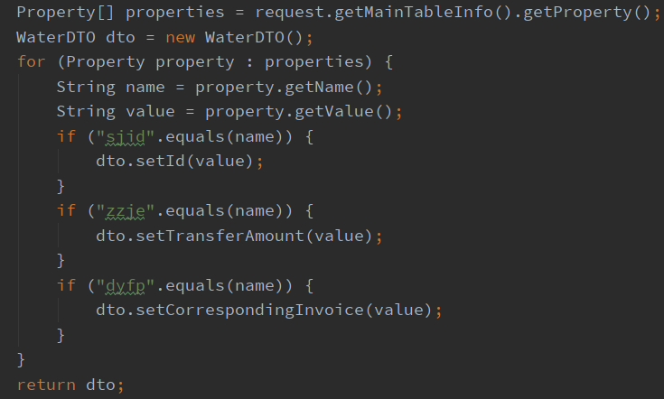
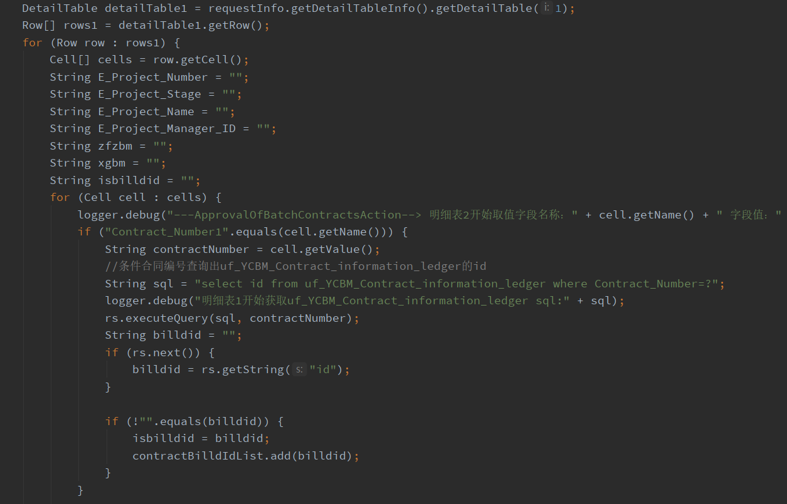
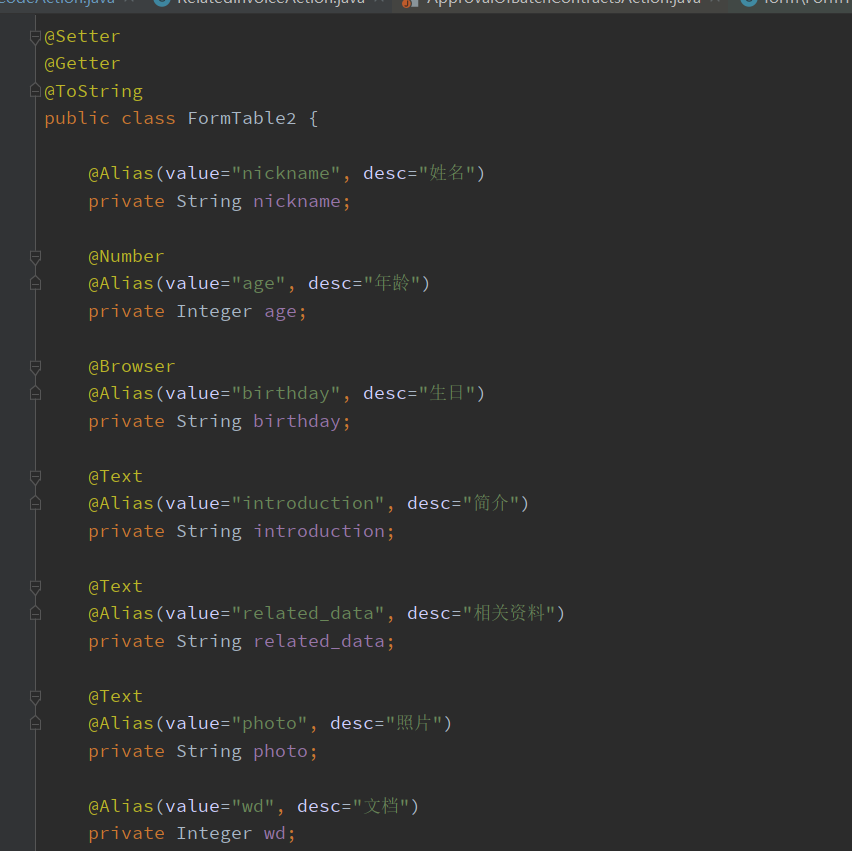
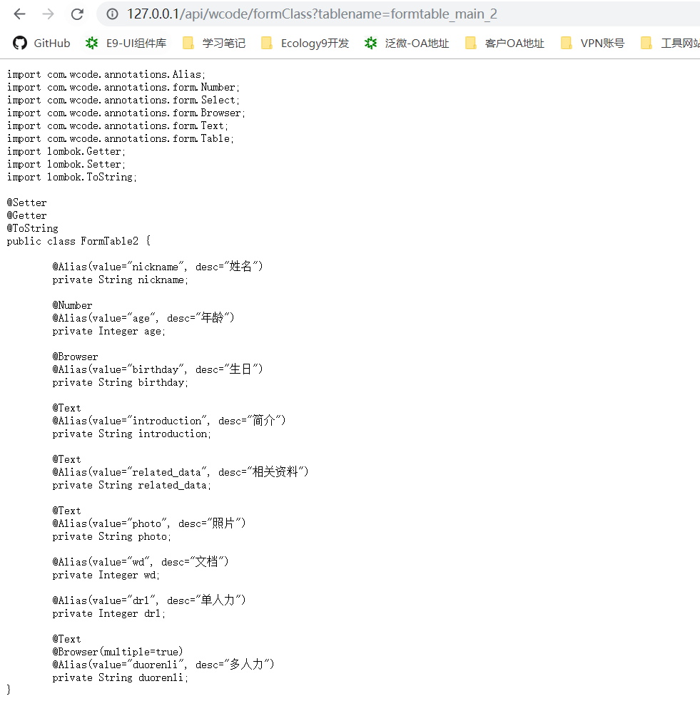

# 1. Wcode使用

## 1.1 传统表单参数获取

> 在传统的二次开发中，关于流程节点后操作的 `Action` 中表单参数的获取。过程繁杂且不规范。代码可读性和维护性较差。

获取主表的参数可能会这样做



获取明细表的参数是这样的



**当表单字段一多，则代码可读性会变得相当差，效率低，不易维护。**

## 1.2 快速定义流程表单

> 基于 `wcode.jar` 允许使用注解快速定义表单参数，适配目前有的字段类型，包括单行文本框，浏览框，下拉框，多行文本框等。

一个简单的流程表单定义可能只需要这样



`Action`中获取参数的方式如下，相对于传统的方式，可以直观的看出整个`Action`的代码简化了很多。

```java
import com.wcode.util.RequestUtils;
import lombok.SneakyThrows;
import lombok.extern.slf4j.Slf4j;
import weaver.interfaces.workflow.action.Action;
import weaver.soa.workflow.request.RequestInfo;

import java.util.List;

/**
 * @author: jack
 * @create: 2019/12/16 14:52
 * @version: 1.0.0
 **/
@Slf4j(topic = "debug")
public class TestAction implements Action {

    @SneakyThrows
    @Override
    public String execute(RequestInfo requestInfo) {
        TestEntity entity = RequestUtils.convert(requestInfo, TestEntity.class);
        log.debug("主表参数: {}", entity);
        List<FormTable2MX1> mx1List = RequestUtils.convertList(requestInfo, FormTable2MX1.class);
        log.debug("明细表一参数：{}", mx1List);
        return FAILURE_AND_CONTINUE;
    }
}
```

## 1.3 WCode 中定义表单的相关注解

### 1.3.1 @Alias

- `com.wcode.annotations.Alias`

使用方式：

```java
@Alias(value="wb", desc="文本")
private String text;
```

说明：默认使用 类成员字段名如`text` 作为表单字段名，允许使用该注解定义实际的字段名

### 1.3.2 @Number

- `com.wcode.annotations.form.Number`

使用方式：

```java
@Number
@Alias(value="zs", desc="整数")
private Integer zs;
```

说明：在数据库操作中，整数浮点数类型的字段，在插入或更新的时候，是不允许使用 空字符串进行保存。为了杜绝这个潜在异常，使用该注解，则会自动将空字符串转为 `null`

```java
RecordSet rs = new RecordSet();
String sql = "update formtable_main_2 set age=?";
String age = “”;
// 这个操作是会报错
rs.executeUpdate(sql, age);
age = null;
// 这个操作不会
rs.executeUpdate(sql, age);
```

### 1.3.3 @Text

- `com.wcode.annotations.form.Text`

使用方式

```java
@Text
@Alias(value="dhwb", desc="多行文本")
private String dhwb;
```

说明：在数据库中，与数字类型相反，当类型为 `text` 的字段是不允许使用 `null` 进行保存的。使用该注解，则会自动将 null 转为 空字符串。

```java
RecordSet rs = new RecordSet();
String sql = "update formtable_main_2 set dhwb=?";
String dhwb = null;
// 这个操作是会报错
rs.executeUpdate(sql, dhwb);
dhwb = "";
// 这个操作不会
rs.executeUpdate(sql, dhwb);
```

### 1.3.4 @Browser

- `com.wcode.annotations.form.Browser`

使用方式

```java
// 浏览框：单选
@Browser(table = "hrmresource", showName = "loginid")
private Integer ry;
// 浏览框：单选
@Browser(table = "hrmresource", showName = "loginid")
private String ry;
// 浏览框：多选
@Browser(table = "hrmresource", showName = "loginid", multiple=true)
private String dr;
// 浏览框：多选
@Browser(table = "hrmresource", showName = "loginid", multiple=true)
private Map<String, String> dr;
```

说明：流程表单中，对于浏览框的值默认是使用表的`ID`值，该注解提供了两个参数 `table,showName`，该组参数在参数解析过程中，会自动查询数据库的值，以 `showName` 定义的字段进行返回。如果该字段类型为 `Integer`，但是 `showName` 返回的值为字符串，则进行回退，以原先的ID进行赋值。

在注解中使用 ` multiple`参数则表示该浏览框属于多选字段，与单选的一样，如果字段类型为`Map`，会自动进行解析，以 `id-showName` 键值对形式保存到`Map`集合中，后续会考虑支持以 `Map<String, JavaBean>` 进行保存。

### 1.3.5 @Select

- `com.wcode.annotations.form.Select`

使用方式

```java
@Select({"0-是","1-否"})
@Alias(value="xlk", desc="下拉框")
private Integer xlk;
```

说明：该注解允许以数组定义下拉框的值和显示名称，格式：`value-showName`，当使用这个注解时，会自动将该字段的值以 `showName` 解析。

## 1.4 快速生成表单

> 使用 `http://ip:port/api/wcode/formClass?tablename=` 快速定义表单

