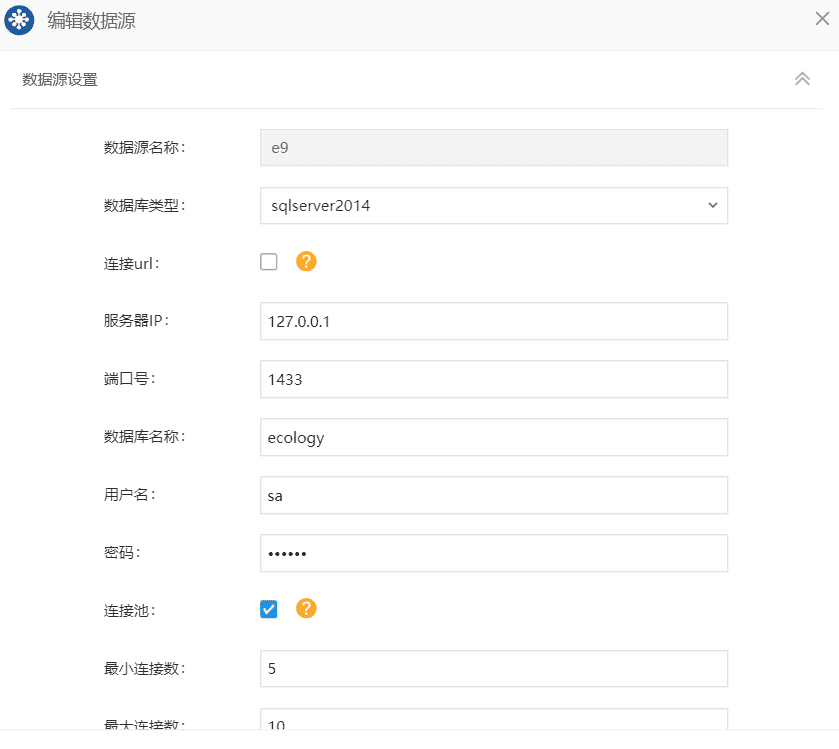

# 泛微开发入门

## 1. 前端开发基础

### 1.1 ` ECMAScript6`的使用

> ECMAScript 和 JavaScript 的关系是：前者是后者的规格，后者是前者的一种实现。
>
> ES6 既是一个历史名词，也是一个泛指，含义是 5.1 版以后的 JavaScript 的下一代标准，涵盖了 ES2015、ES2016、ES2017 等等，而 ES2015 则是正式名称，特指该年发布的正式版本的语言标准。本书中提到 ES6 的地方，一般是指 ES2015 标准，但有时也是泛指 “下一代 JavaScript 语言”。

## 1.2 ES6常见的语法

### 1.2.1 let 和 const 命令

ES6 新增了`let`命令，用来声明变量。它的用法类似于`var`，但是所声明的变量，只在`let`命令所在的代码块内有效。

```javascript
{
  let a = 10;
  var b = 1;
}

a // ReferenceError: a is not defined.
b // 1
```

`const`声明一个只读的常量。一旦声明，常量的值就不能改变。

```javascript
const PI = 3.1415;
PI // 3.1415

PI = 3;
// TypeError: Assignment to constant variable.
```

### 1.2.2 变量的解构赋值

ES6 允许按照一定模式，从数组和对象中提取值，对变量进行赋值，这被称为解构（Destructuring）

如果解构不成功，变量的值就等于`undefined`

- 数组的解构赋值

```javascript
let [foo, [[bar], baz]] = [1, [[2], 3]];
foo // 1
bar // 2
baz // 3

let [ , , third] = ["foo", "bar", "baz"];
third // "baz"

let [x, , y] = [1, 2, 3];
x // 1
y // 3

let [head, ...tail] = [1, 2, 3, 4];
head // 1
tail // [2, 3, 4]

let [x, y, ...z] = ['a'];
x // "a"
y // undefined
z // []
```

- 对象的解构赋值

```javascript
// 常见用法
let { bar, foo, baz } = { foo: 'aaa', bar: 'bbb' };
foo // "aaa"
bar // "bbb"
baz // undefined


// foo是匹配的模式，baz才是变量。真正被赋值的是变量baz，而不是模式foo
let { foo: baz } = { foo: 'aaa', bar: 'bbb' };
baz // "aaa"
foo // error: foo is not defined

// 嵌套使用
let obj = {
  p: [
    'Hello',
    { y: 'World' }
  ]
};
// 第一个p作为变量，则进行赋值，第二个p作为模式，不会进行赋值
let { p, p: [x, { y }] } = obj;
x // "Hello"
y // "World"
p // ["Hello", {y: "World"}]
```

### 1.2.3 ... 运算符

- 函数 `rest` 参数的使用

```javascript
function f(a, ...b) {
    console.log(a, b)
}
f(1,2,3,4,5) // 1 [2,3,4,5]
```

- 数组拆解

```javascript
const a = [1,2,3]
const b = [4,5,6]
const c = [...a, ...b]
c // [1,2,3,4,5,6]
```

- 对象拆解

```javascript
const obj = { a: 111, b:222 }
const copyObj = { ...obj, c: 333 }
copyObj // { a: 111, b:222, c: 333 }
```

### 1.2.4 函数的扩展

- 参数默认值：ES6 允许为函数的参数设置默认值，即直接写在参数定义的后面。

```javascript
// 基本用法
function log(x, y = 'World') {
  console.log(x, y);
}

log('Hello') // Hello World
log('Hello', 'China') // Hello China
log('Hello', '') // Hello

// 参数默认值可以与解构赋值的默认值，结合起来使用。
function foo({x, y = 5}) {
  console.log(x, y);
}

foo({}) // undefined 5
foo({x: 1}) // 1 5
foo({x: 1, y: 2}) // 1 2
foo() // TypeError: Cannot read property 'x' of undefined
```

- 箭头函数：ES6 允许使用（`=>`）定义函数。

```javascript
// 基本用法
var f = v => v;
// 等同于
var f = function (v) {
  return v;
};

// 箭头函数可以与变量解构结合使用。
const full = ({ first, last }) => first + ' ' + last;
// 等同于
function full(person) {
  return person.first + ' ' + person.last;
}

// rest 参数与箭头函数结合
const numbers = (...nums) => nums;
numbers(1, 2, 3, 4, 5) // [1,2,3,4,5]
const headAndTail = (head, ...tail) => [head, tail];
headAndTail(1, 2, 3, 4, 5) // [1,[2,3,4,5]]
```

## 1.3 React基础

> React 是一个用于构建用户界面的 `Javascript` 库。
>
> React 主要用于构建UI，很多人认为 React 是 MVC 中的 V（视图）。
>
> React 起源于 Facebook 的内部项目，用来架设 Instagram 的网站，并于 2013 年 5 月开源。
>
> React 拥有较高的性能，代码逻辑非常简单，越来越多的人已开始关注和使用它。

### 1.3.1 JSX语法

`JSX` 即`Javascript XML`，它是对`JavaScript` 语法扩展。React 使用 `JSX` 来替代常规的 `JavaScript`。你也可以认为`JSX`其实就是`JavaScript`。当遇到 `<`，`JSX`就当HTML解析，遇到 `{` 就当`JavaScript`解析。

- 基本用法

```javascript
const element = (
  <h1 className="greeting">
    Hello, world!
  </h1>
);
// 等价于
const element = React.createElement(
  'h1',
  {className: 'greeting'},
  'Hello, world!'
);
```

- 在 `JSX` 中嵌入表达式

 声明了一个名为 `name` 的变量，然后在 `JSX` 中使用它，并将它包裹在大括号中： 

```javascript
const name = 'Josh Perez';
const element = <h1>Hello, {name}</h1>;
```

### 1.3.2 React简单实例

```jsx
class HelloMessage extends React.Component {
  render() {
    return (
      <div>
        Hello {this.props.name}
      </div>
    );
  }
}

ReactDOM.render(
  <HelloMessage name="React" />,
  document.getElementById('hello-example')
);
```

## 2. E-code 前端开发平台

> 推荐 OA 上的所有前端开发统一使用 ecode 进行代码开发管理。
>
> Ecode 官方文档： https://e-cloudstore.com/ecode/doc 
>
> E9 技术站地址： https://e-cloudstore.com/e9/index2.html?tdsourcetag=s_pctim_aiomsg
>
> 组件库地址： http://203.110.166.60:8087/#/pc/doc/common-index 

本章节是针对 `ecode` 文档的细节补充

### 2.1 流程开发

关于流程页面上的前端开发，建议不要直接使用代码块进行开发！所有的开发代码统一在 ecode 平台上进行，然后在流程表单代码块中插入如下代码，或者使用 [全局流程代码块整合](https://e-cloudstore.com/ecode/doc#4、全局流程代码块整合) 方案加载代码。


```javascript
// 建议在代码块中添加 代码在ecode 中的文件路径，方便寻找对应的代码。
// 默认分类/测试
ecodeSDK.load({
    // ${appId}泛值ecode平台中的文件夹主键id
    id: '${appId}',
    noCss: true,
    cb: function() {}
})
```

### 2.2 建模开发

#### 2.2.1 布局代码块

建模布局页面的使用方式与流程基本一致，在代码块中加载代码块。不建议使用[全局流程代码块整合](https://e-cloudstore.com/ecode/doc#4、全局流程代码块整合)进行加载。


#### 2.2.2 自定义按钮

> 后端应用中心 -> 建模引擎 -> 查询
>
> 任选一个查询页面 -> 自定义按钮 -> 右键 -> 新建 

1. 方法体中存在多行代码时，每个语句必须以`;`结尾；否则会报错！

2. `params`的值等于 `‘field1+field2+field3’` 这个值是一个字符串

3. `id`指的是数据`ID`

> 自定义按钮实现效果
>
> 

---

> 使用 ecode 进行代码管理
>
> 新建前置文件 `index.js`并将方法挂到全局对象 `window.g` 下（window.g 为自定义对象，可以任意）
>
> 

自定义按钮的配置如下： 

注意：全局方法的参数中，最后一个参数表示当前行的数据ID，如下例子所示

```javascript
// ecode 中定义的方法
function test = (p1, p2, p3, id) => {
	console.log(p1, p2, p3, id)
}
window.g = {
    test
}
// 自定义按钮配置
// javascript:window.g.test(1,2,3) => 输出 1 2 3 数据ID
// javascript:window.g.test(1,2,3, '任意值') => 输出 1 2 3 数据ID
```

#### 2.2.3 页面扩展

> 后端应用中心 -> 建模引擎 -> 模块
>
> 任选一个模块 -> 页面扩展 -> 右键 -> 新建
>
>  

- 扩展用途：卡片页面、查询列表（批量操作）、卡片页面和查询列表
  - 卡片页面：可以设置页面扩展显示在卡片信息页面，可以选择在新建页面、编辑页面、查看页面显示页面扩展。
  - 查询列表（批量操作）：设置在查询列表时，则会在引用该模块的查询列表的批量操作中显示页面扩展项，在批量操作中勾选后会在前台列表中显示对应的页面扩展项。
  - 卡片页面和查询列表：可以设置页面扩展项既显示在对应的卡片页面又显示在查询列表（批量操作）中。
- `javascript:test()`: 该方法可以在 `建模引擎 -> 查询 -> 该模块的查询列表 -> 编辑代码块` 中定义

 

  

> 前端按钮测试如下
>
>  

- 页面扩展同样可以配置 `ecode`使用，将**链接目标地址**改成: `javascript: window.g.test()`即可，建议这样做，方便后续代码维护。

## 3. 后端开发

> E9 后端开发详见：https://e-cloudstore.com/e9/file/E9BackendDdevelopmentGuide.pdf 
>
> 本章节是针对笔记中未描述的开发点进行补充！

### 3.1 JavaWeb项目搭建

- 使用 `Idea` 创建一个`Java`项目
- 添加 `jar` 依赖：**File -> Project Structure -> Project Settings -> Libraries**

需要添加的`ecology`的依赖路径有: `ecology/WEB-INF/lib`; `resin/lib`; `ecology/classbean`;

其中`classbean`是必须要引入的, 其他两个按需引入

- 编译`Java`文件将编译后的`class`文件放入`ecology/classbean/`目录下即可

### 3.2 Maven项目搭建

- 将 `ecology/classbean` 打成 `jar` 包，进入 ecology 目录，执行以下命令

命令：`jar -cvf ecology-[版本号].jar classbean`

例如：`jar -cvf ecology-9.1909.04.jar classbean`

- 将 `ecology-9.1909.04.jar` 加入到本地 maven 仓库

```shell
// -Dfile参数指的是jar的路径
mvn install:install-file -DgroupId=com.weaver -DartifactId=ecology -Dversion=9.1909.04 -Dpackaging=jar -Dfile=ecology-9.1909.04.jar
```

- 创建 `maven` 项目，并在 `POM.xml` 中配置如下

```xml
<dependency>
	<groupId>com.weaver</groupId>
	<artifactId>ecology</artifactId>
	<version>9.1909.04</version>
</dependency>
```

### 3.3 自定义 Java 接口

#### 3.3.1 流程节点前后附加操作

> 在节点前后附加操作中可设置接口动作，完成流程自定义附加操作
>
> 接口动作标识不能重复；接口动作类文件必须是类全名，该类必须实现接 `weaver.interfaces.workflow.action` 方法 `public String execute(RequestInfo request)`

代码参考：

```java
import com.weaver.general.Util;
import org.slf4j.Logger;
import org.slf4j.LoggerFactory;
import weaver.hrm.User;
import weaver.interfaces.workflow.action.Action;
import weaver.soa.workflow.request.*;

public class TestAction implements Action {

    private String customParam; //自定义参数
    private final Logger logger = LoggerFactory.getLogger(TestAction.class);

    @Override
    public String execute(RequestInfo requestInfo) {
        logger.debug("进入action requestid = {}", requestInfo.getRequestid());
        showCurrentForm(requestInfo);

        showFormProperty(requestInfo);

        showDetailsTables(requestInfo);

        logger.debug("Action 执行完成，传入自定义参数：{}", this.getCustomParam());
//        requestInfo.getRequestManager().setMessagecontent("返回自定义的错误消息");
//        requestInfo.getRequestManager().setMessageid("自定义消息ID");
//        return FAILURE_AND_CONTINUE;  // 注释的三句话一起使用才有效果！
        return SUCCESS;
    }

    private void showCurrentForm(RequestInfo requestInfo) {
        String requestid = requestInfo.getRequestid(); // 请求ID
        String requestLevel = requestInfo.getRequestlevel(); // 请求紧急程度
        // 当前操作类型 submit:提交/reject:退回
        String src = requestInfo.getRequestManager().getSrc();
        // 流程ID
        String workFlowId = requestInfo.getWorkflowid();
        // 表单名称
        String tableName = requestInfo.getRequestManager().getBillTableName();
        // 表单数据ID
        int bill_id = requestInfo.getRequestManager().getBillid();
        // 获取当前操作用户对象
        User user = requestInfo.getRequestManager().getUser();
        // 请求标题
        String requestName =  requestInfo.getRequestManager().getRequestname();
        // 当前用户提交时的签字意见
        String remark = requestInfo.getRequestManager().getRemark();
        // 表单ID
        int form_id = requestInfo.getRequestManager().getFormid();
        // 是否是自定义表单
        int isbill = requestInfo.getRequestManager().getIsbill();

        logger.debug("requestid: {}", requestid);
        logger.debug("requestLevel: {}", requestLevel);
        logger.debug("src: {}", src);
        logger.debug("workFlowId: {}", workFlowId);
        logger.debug("tableName: {}", tableName);
        logger.debug("bill_id: {}", bill_id);
        logger.debug("user: {}", user);
        logger.debug("requestName: {}", requestName);
        logger.debug("remark: {}", remark);
        logger.debug("form_id: {}", form_id);
        logger.debug("isbill: {}", isbill);
    }
    /**
     * 获取主表数据
     */
    private void showFormProperty(RequestInfo requestInfo) {
        logger.debug("获取主表数据 ...");
        // 获取表单主字段值
        Property[] properties = requestInfo.getMainTableInfo().getProperty();
        for (Property property : properties) {
            // 主字段名称
            String name = property.getName();
            // 主字段对应的值
            String value = Util.null2String(property.getValue());
            logger.debug("name: {}, value: {}", name, value);
        }
    }

    /**
     * 取明细数据
     */
    private void showDetailsTables(RequestInfo requestInfo) {
        logger.debug("获取所有明细表数据 ...");
        // 获取所有明细表
        DetailTable[] detailTables = requestInfo.getDetailTableInfo().getDetailTable();
        if (detailTables.length > 0) {
            for (DetailTable table: detailTables) {
                // 当前明细表的所有数据，按行存储
                Row[] rows = table.getRow();
                for (Row row: rows) {
                    // 每行数据再按列存储
                    Cell[] cells = row.getCell();
                    for (Cell cell: cells) {
                        // 明细字段名称
                        String name = cell.getName();
                        // 明细字段的值
                        String value = cell.getValue();
                        logger.debug("name: {}, value: {}", name, value);
                    }
                }
            }
        }
    }

    public String getCustomParam() {
        return customParam;
    }

    public void setCustomParam(String customParam) {
        this.customParam = customParam;
    }
}
```

接口配置：

> 后端应用中心 -> 流程引擎 -> 路径管理 -> 路径设置
>
> 任选一个流程 -> 流程设置 -> 节点信息
>
> 任选一个节点 -> 节点前 / 节点后附加操作
>
>  
>
>  

#### 3.3.2 建模页面扩展接口

> 页面扩展 -> 接口动作 -> 自定义接口动作
>
> 执行页面扩展的后续操作，通过配置自定义 `Java`接口动作类实现。
>
> 接口动作类文件必须是类全名。该类必须继承 `weaver.formmode.customjavacode.AbstractModeExpandJavaCode` 方法 `public void doModeExpand(Map param)`

参考代码如下：

```java
import weaver.conn.RecordSet;
import weaver.general.Util;
import weaver.hrm.User;
import weaver.soa.workflow.request.RequestInfo;
import weaver.formmode.customjavacode.AbstractModeExpandJavaCode;

import java.util.Map;

public class ModeExpandTemplate extends AbstractModeExpandJavaCode {

    @Override
    public void doModeExpand(Map<String, Object> param) throws Exception {
        // 当前用户
        User user = (User) param.get("user");
        int billid = -1; // 数据id
        int modeid = -1; // 模块id
        RequestInfo requestInfo = (RequestInfo) param.get("RequestInfo");
        if (requestInfo != null) {
            billid = Util.getIntValue(requestInfo.getRequestid());
            modeid = Util.getIntValue(requestInfo.getWorkflowid());
            if (billid > 0 && modeid > 0) {
                RecordSet rs = new RecordSet();
                //------请在下面编写业务逻辑代码------
            }
        }
    }
}
```

接口配置：

> 后端应用中心 -> 建模引擎 -> 模块
>
> 任选一个模块 -> 页面扩展 -> 任选一个扩展名称 -> 接口动作 -> 点击 `+` 号 -> 自定义接口动作
>
>  

#### 3.3.3 计划任务接口

> 通过配置自定义 `Java`接口的实现类，定时执行相应的代码

- 按照设定的时间定时执行任务，计划任务标识不能重复
- 计划任务类必须是类的全名，该类必须继承 `weaver.interfaces.schedule.BaseCronJob`类,重写方法`public void execute() {}`
- 时间格式按`Cron`表达式的定义

参考代码如下：

```java
import weaver.interfaces.schedule.BaseCronJob;

public class CronTemplate extends BaseCronJob {

    @Override
    public void execute() {
        //------请在下面编写业务逻辑代码------
    }
}
```

> 配置：后端应用中心 -> 集成中心 -> 计划任务 -> 任务列表 -> 新建
>
> 

> **通过计划任务列表的每个计划任务的自定义按钮，可以对每个任务进行状态操作，具体使用如下所示**
>
> 

状态详解：

1. 启用: 计划任务将根据Cron表达式执行;
2. 禁用: 计划任务将不再执行，重启服务也不会再次执行;
3. 暂停: 针对计划任务进行停止，重启服务将恢复正常状态;
4. 恢复: 针对暂停状态的计划任务进行恢复，恢复后计划任务将继续执行;
5. 执行: 单次执行计划任务，不影响Cron表达式周期执行;
6. 测试: 检查填写的计划任务类是否符合规范（继承weaver.interfaces.schedule.BaseCronJob类,重写方法public void execute() {}）

#### 3.3.4 自定义按钮接口

> 通过配置自定义`Java`类，判断自定义按钮在查询列表中是否显示

参考代码如下：

```java
import org.slf4j.Logger;
import org.slf4j.LoggerFactory;
import weaver.formmode.interfaces.PopedomCommonAction;

public class CustomBtnShowTemplate implements PopedomCommonAction {

    private Logger logger = LoggerFactory.getLogger(CustomBtnShowTemplate.class);

    /**
     * 得到是否显示操作项
     * @param modeid 模块id
     * @param customid 查询列表id
     * @param uid 当前用户id
     * @param billid 表单数据id
     * @param buttonname 按钮名称
     * @retrun "true"或者"false"true显示/false不显示
     */
    @Override
    public String getIsDisplayOperation(String modeid, String customid,String uid, String billid, String buttonname) {
        logger.debug("modeId: {}", modeid);
        logger.debug("customId: {}", customid);
        logger.debug("uid: {}", uid);
        logger.debug("billId: {}", billid);
        logger.debug("buttonname: {}", buttonname);
        return "false";
    }
}
```

> 配置：后端应用中心 -> 建模引擎 -> 查询
>
> 任选一个查询列表 -> 自定义按钮 -> 右键 -> 新建
>
> 

前端查询列表中，由于接口中返回false，则 **受控按钮** 不显示

 

### 3.4  Rest Api 接口

> E-cology9 相比 E8，增加了 rest api接口定义框架 `jersey`，使用该框架可以很方便的使用http请求进行相关开发。

####  3.4.1 开放接口

- 流程表单数据接口：https://www.evernote.com/l/AuMO8ps7HVpMlYkjCMpRC9xyc1VYIcbo1I0/
- 流程代办列表接口：https://www.evernote.com/l/AuM0l0TdGS9OvZuHd1eztup5KNwIgFokDTU/ 
- 流程列表数据接口：https://www.evernote.com/l/AuP8WpYtOmhHkYgnhs7aOKy_AL9kMACGWm4/ 

#### 3.4.2 自定义 Api 接口

创建 `com.api.demo.web.TestActionApi.java`

```java
package com.api.demo.web;

import com.demo.jack.web.TestAction;

import javax.ws.rs.Path;

@Path("/demo/test")
public class TestActionApi extends TestAction {
}
```

创建 `com.demo.jack.web.TestAction`

```java
package com.demo.jack.web;

import javax.ws.rs.GET;
import javax.ws.rs.Path;
import javax.ws.rs.Produces;
import javax.ws.rs.core.MediaType;

public class TestAction {

    @GET
    @Path("/hello")
    @Produces(MediaType.TEXT_PLAIN)
    public String hello() {
        return "hello weaver!";
    }
}
```

启动 `resin`，打开浏览器输入：`http://127.0.0.1/api/demo/test/hello` 

输出：`hello weaver!`

### 3.5 项目结构和代码规范

> 每个人都有属于自己的一套开发规范，以下是一套相对而言比较规范的二开规范，仅供参考

#### 3.5.1 使用 Weaverboot-E9（beta）

> Weaverboot-E9 提供一套完整的 IOC + AOP 的解决方案。可以很快速的代理所有的接口。同时提供类似与spring 的依赖注入的写法。方便快速编码。该方案目前属于内测版，但推荐使用！
>
> 官方文档： https://www.e-cloudstore.com/ecode/doc.html?appId=bb6e1c9796c1483cb8ed7c15df025ea8 

- `ecology/WEB-INF/web.xml` 加入以下配置

```xml
<servlet>
    <servlet-name>WeaIocInitServlet</servlet-name>
    <servlet-class>com.weaverboot.frame.ioc.prop.init.WeaIocInitServlet</servlet-class>
    <load-on-startup>1</load-on-startup>
</servlet>
<servlet-mapping>
        <servlet-name>WeaIocInitServlet</servlet-name>
        <url-pattern>/weaIoc/init</url-pattern>
</servlet-mapping>
<filter>
    <filter-name>WeaComponentFilter</filter-name>
    <filter-class>com.weaverboot.frame.ioc.filter.WeaComponentFilter</filter-class>
</filter>
<filter-mapping>
    <filter-name>WeaComponentFilter</filter-name>
    <url-pattern>/api/*</url-pattern>
</filter-mapping>
```

- `ecology/WEB-INF/prop/` 中创建 `weaverboot.properties`

```properties
# 扫包路径
scanPackage=com.demo.jack.**
```

- `ecology/WEB-INF/lib/`  下添加 `Weaverboot-E9.jar`(暂不提供下载链接，想体验找云商店)

#### 3.5.2 基于 weaverboot 的代码分层

> 暂时不对数据层进行拆分， 未对`mybatis` 进行整合。直接使用 RecordSet 对数据库进行操作即可！

- 接口层

```java
package com.demo.jack.web;

import com.demo.jack.service.TestService;
import com.weaverboot.frame.ioc.anno.fieldAnno.WeaAutowired;
import lombok.extern.slf4j.Slf4j;
import javax.ws.rs.GET;
import javax.ws.rs.Path;
import javax.ws.rs.Produces;
import javax.ws.rs.core.MediaType;

@Slf4j(topic = "debug")
public class TestAction {

    @WeaAutowired
    private TestService testService;

    @GET
    @Path("/get")
    @Produces(MediaType.TEXT_PLAIN)
    public String testGet() {
        log.debug("{}", testService.getMessage());
        return testService.getMessage();
    }
}
```

- 服务层

```java
package com.demo.jack.service;

public interface TestService {

    String getMessage();
}
```

```java
package com.demo.jack.service.impl;

import com.demo.jack.service.TestService;
import com.weaverboot.frame.ioc.anno.classAnno.WeaIocService;

@WeaIocService
public class TestServiceImpl implements TestService {

    @Override
    public String getMessage() {
        return "this is test service impl ret list";
    }
}
```

#### 3.5.3 使用 Wcode

> Wcode 是针对二次开发项目中一些常用方法的提取的工具类，包括流程表单的快速定义，流程创建以及 Mybatis 的相关使用。
>
> 文档详见： [http://wcode.store/#/./weaver/Wcode%E4%BD%BF%E7%94%A8](http://wcode.store/#/./weaver/Wcode使用) 

#### 3.5.4 使用 lombok

- 下载 `lombok.jar`
- `idea` 安装 `lombok plugin`


- 代码中使用

```java
import lombok.Getter;
import lombok.Setter;
import lombok.ToString;

@Setter
@Getter
@ToString
public class TestDTO {
    private String name;
    private String password;
}
```

#### 3.5.5 日志框架的使用

> `Ecology`底层采用的是`log4j`日志框架, 可根据环境自定义日志配置
>
> `log4j`配置文件路径: `ecology/WEB-INF/log4jinit.properties`

- 打开配置文件, 在文件末尾加上如下代码, 然后重启`resin`服务

```properties
# appender
log4j.logger.debug=DEBUG,debug
log4j.appender.debug=org.apache.log4j.DailyRollingFileAppender
# 按日期滚动文件
log4j.appender.debug.DatePattern='_'yyyyMMdd'.log'
# 自定义日志文件路径
log4j.appender.debug.File=@debug/debug.log
log4j.appender.debug.layout=org.apache.log4j.PatternLayout
# 输出内容格式
log4j.appender.debug.layout.ConversionPattern=%d{HH:mm:ss.SSS}[%p] %l: %m%n
log4j.additivity.debug=false
```

- 代码中使用: 

```java
// 获取自定义的 logger, 其中 debug为配置文件中 log4j.logger.debug中的debug
Logger logger = LoggerFactory.getLogger("debug");
// 支持占位符输出, 不定参数
logger.debug("debug级别消息: {}, {}", "参数1", "参数2");
logger.info("info级别消息!");
logger.warn("warn级别消息!");
logger.error("error级别消息!");
```

- 最终日志输出路径:


**建议**: 将重要的日志以 `info` 级别以上输出, 开发的日志以 `debug` 级别输出, 这样的话再正式环境下只需修改配置, 即可实现只输出 `info` 级别的日志, 减少日志的输出!

```properties
# 将日志级别提升至INFO
log4j.logger.debug=INFO,debug
```

### 3.6 数据库操作

#### 3.6.1 CURD

> 使用 `weaver.conn.RecordSet`可以对数据库进行 `CURD` 等数据库操作

**参考代码：**

```java
RecordSet rs = new RecordSet();
String sql = "select loginid, lastname from hrmresource where id=?";
// 防止sql注入, objects 为动态参数
rs.executeQuery(sql, 2);
if (rs.next()) {
	String loginid = rs.getString("loginid");
    String lastname = rs.getString("lastname");
}
String updateSql = "update hrmresource lastname=? where id=?";
// 返回是否更新成功
boolean bool = rs.executeUpdate(sql, "孙悟空", 2);
```

#### 3.6.2  使用事务

> 使用`weaver.conn.RecordSetTrans`可以对数据库进行事务操作

**参考代码**

```java
RecordSetTrans rst = new RecordSetTrans();
// 开启事务
rst.setAutoCommit(false);
String sql = "update hrmresource lastname=? where id=?";
try {
	int a = 1/0;
    rst.executeUpdate(sql, "猪八戒", 2);
    // 提交事务
    rst.commit();
} catch (Exception e) {
    e.printStackTrace();
    // 事务回滚                                    
    rst.rollback();
}
```

#### 3.6.3 Mybatis的使用

> 目前E9没有成熟的使用Mybatis的方案，以下是通过自己的研究给出一个不成熟的方案，有`Bug`概不负责！
>
> 支持多数据源，数据源配置如下：
>
> 后端应用中心 -> 集成中心-> 数据源设置 -> 新建
>
> 

> **`xml` ⽅式开发**

**创建 `mapper` 接⼝**

```java
package com.engine.wcode.mapper;

import java.util.List;
import java.util.Map;

public interface TestMapper {
	List<Map<String, String>> selectAll();
}
```

在 `../ecology/WEB-INF/config/mapper/ `路径下创建 `test.xml`

```xml
<?xml version="1.0" encoding="UTF-8"?>
<!DOCTYPE mapper PUBLIC "-//mybatis.org//DTD Mapper 3.0//EN" "http://mybatis.org/dtd/mybatis-3-mapper.dtd">
<mapper namespace="com.engine.wcode.mapper.TestMapper">
  <select id="selectAll" resultType="java.util.HashMap" >
    select loginid, password, lastname from hrmresource
  </select>
</mapper>
```

> **注解⽅式开发**
>
> 与`xml`⽅式相⽐,使⽤注解开发的⽅便之处在于不⽤写`mapper.xml`⽂件

**创建 `mapper` 接⼝**

```java
package com.engine.wcode.mapper;

import org.apache.ibatis.annotations.Select;

import java.util.List;
import java.util.Map;

public interface HrmMapper {
    @Select("select loginid, password, lastname from hrmresource")
    List<Map<String, String>> selectHrm();
}
```

> 使用 `Mybatis` 操作数据库

- 获取 `Mapper`

```java
package com.wcode.db;

import org.apache.ibatis.session.Configuration;
import org.apache.ibatis.session.ExecutorType;
import org.apache.ibatis.session.LocalCacheScope;
import org.apache.ibatis.session.SqlSession;
import weaver.conn.ConnectionPool;
import weaver.conn.WeaverConnection;

import java.util.Map;
import java.util.concurrent.ConcurrentHashMap;

import static weaver.conn.mybatis.MyBatisFactory.sqlSessionFactory;

/**
* ⽅法参数不接受 null或 ""
*/
public class MapperUtil {

    private static final Map<Class<?>, Object> CACHE_MAPPER = new ConcurrentHashMap<>(1);

    private static final Map<String, SqlSession> CACHE_SQL_SESSION = new ConcurrentHashMap<>(1);

    public static <T> T getMapper(Class<T> clazz) {
        return MapperUtil.getMapper(clazz, false);
    }

    public static <T> T getMapper(Class<T> clazz, boolean enableCache) {
        return MapperUtil.getMapper(clazz, null, ExecutorType.SIMPLE, enableCache);
    }

    public static <T> T getMapper(Class<T> clazz, String dataSource) {
        return MapperUtil.getMapper(clazz, dataSource, false);
    }

    public static <T> T getMapper(Class<T> clazz, String dataSource, boolean enableCache) {
        return MapperUtil.getMapper(clazz, dataSource, ExecutorType.SIMPLE, enableCache);
    }

    public static <T> T getMapper(Class<T> clazz, String dataSource, ExecutorType executorType, boolean enableCache) {
        String threadName = Thread.currentThread().getName();
        SqlSession sqlSession = CACHE_SQL_SESSION.get(threadName);
        if (sqlSession == null) {
            ConnectionPool pool = ConnectionPool.getInstance();
            WeaverConnection connection = pool.getConnection(dataSource);
            Configuration config = sqlSessionFactory.getConfiguration();
            if (executorType == null) {
                executorType = config.getDefaultExecutorType();
            }
            if (enableCache) {
                config.setLocalCacheScope(LocalCacheScope.STATEMENT);
            }
            sqlSession = sqlSessionFactory.openSession(executorType, connection);
        }
        CACHE_SQL_SESSION.put(threadName, sqlSession);
        return MapperUtil.getMapper(clazz, sqlSession);
    }

    public static <T> T getMapper(Class<T> clazz, SqlSession sqlSession) {
        if (CACHE_MAPPER.containsKey(clazz)) {
            //noinspection unchecked
            return (T) CACHE_MAPPER.get(clazz);
        }
        Configuration config = sqlSession.getConfiguration();
        if (!config.hasMapper(clazz)) {
            config.addMapper(clazz);
        }
        T mapper = sqlSession.getMapper(clazz);
        CACHE_MAPPER.put(clazz, mapper);
        return mapper;
    }

    private static SqlSession getCurrentSqlSession() {
        if (CACHE_SQL_SESSION.size() == 0) {
            return null;
        }
        return CACHE_SQL_SESSION.get(Thread.currentThread().getName());
    }
}
```

- 数据库操作

```java
HrmMapper mapper = MapperUtil.getMapper(HrmMapper.class);
mapper.selectHrm();
```

## 4. 缓存相关

#### 4.1 缓存SDK

> 缓存基类：`Util_DataCache`

| 方法名称                                                 | 方法作用                                                  |
| -------------------------------------------------------- | --------------------------------------------------------- |
| getObjVal(String name)                                   | 从所有缓存获取 缓存数据 (主要函数)                        |
| setObjVal(String name, Object value)                     | 设置所有缓存数据 (主要函数)                               |
| setObjVal(String name, Object value,int seconds)         | 设置所有缓存数据 支持 超时自动消失 (主要函数)             |
| containsKey(String name)                                 | 判断该键名的所有缓存是否存在                              |
| clearVal(String name)                                    | 清除该键名的所有缓存                                      |
| setObjValWithEh(String name,Object value)                | 设置本地缓存 ( 特定情况下使用）                           |
| getObjValWithEh(String name)                             | 获取本地缓存（特定情况下使用）                            |
| setObjValWithRedis(String name,Object value)             | 设置Redis缓存 需要自己释放数据( 特定情况下使用）          |
| setObjValWithRedis(String name,Object value,int seconds) | 单独设置Redis缓存 超时时间(s)后释放数据( 特定情况下使用） |
| getObjValWithRedis(String name)                          | 单独获取Redis缓存( 特定情况下使用）                       |
| containsKeylWithEh(String name)                          | 判断本地缓存是否存在该键名( 特定情况下使用）              |
| clearValWithEh(String name)                              | 清除本地缓存( 特定情况下使用）                            |
| containsKeyWithRedis(String name)                        | 判断Redis上是否存在该键名( 特定情况下使用）               |
| clearValWithRedis(String name)                           | 清除Redis缓存                                             |

>  检查页面

`chechRedis.jsp` 检查`Redis`环境的状态

`getRedis.jsp` 检查`DataKey`的数据

注意数据变更后必须再次执行`setObjVal`把数据推送到`Redis`

```java
import com.cloudstore.dev.api.util.Util_DataCache;
public Map<String,String> refreshDataFormDB() {
    Map<String,String> map = new HashMap<String, String>();
    Map<String,String> mapdb = getSystemIfo("y");
    map.putAll(mapdb);
    if(mapdb.size()>0) {
        Util_DataCache.setObjVal(em_url, mapdb.get(em_url));
        Util_DataCache.setObjVal(em_corpid, mapdb.get(em_corpid));
        Util_DataCache.setObjVal(accesstoken,mapdb.get(accesstoken));
        Util_DataCache.setObjVal(ec_id,mapdb.get(ec_id));
        Util_DataCache.setObjVal(ec_url, mapdb.get(ec_url));
        Util_DataCache.setObjVal(ec_name, mapdb.get(ec_name));
        Util_DataCache.setObjVal(rsa_pub, mapdb.get(rsa_pub));
        Util_DataCache.setObjVal(ec_version, mapdb.get(ec_version));
        Util_DataCache.setObjVal(ec_iscluster, mapdb.get(ec_iscluster));
        Util_DataCache.setObjVal(em_url, mapdb.get(em_url));
        Util_DataCache.setObjVal(em_url_open, mapdb.get(em_url_open));
    }
    return map;
}
```

#### 4.2 Redis的使用

- 本地下载`redis`
- `ecology/WEB-INF/prop/weaver_new_session.properties`

```properties
#1表示启用新的session方式，其他值表示不启用
status=1
#用于调试的USERID
debugUsers=
#session id生成模式，1表示自定义生成模式（UUID模式），其他值表示中间件自定义生成模式
useCustomSessionId=1
#同步频率设置（单位，秒）
#主表同步频率
SessionTableSync=2
#明细表同步频率
SessionItemTableSync=5
#超时扫描频率
SessionOverTime=300
#垃圾数据清理扫描频率
SessionLeak=3600

#启动模式，默认是数据库模式
#className=weaver.session.util.DBUtil
className=weaver.session.util.RedisSessionUtil
#redis ip
redisIp=127.0.0.1
#redis port
redisPort=6379
#redis password
redisPassword=123456
enableImmediatelySync=true
etoken=
```

####  4.3 SQL 缓存注意事项

> Ecology 平台具有数据缓存机制，在项目中尽量不要直接对数据库进行操作，如执行存储过程或者触发器。如果实在没有办法则需要进行 Sql 缓存配置（切记！）

- 原则上禁止通过非程序渠道直接修改oa数据库数据。如果一定要修改，请修改完数据后，chrome浏览器访问/commcache/cacheMonitor.jsp界面，点击重启加载配置。这样操作修改的数据可以及时生效。
- 如果存在第三方程序修改oa数据库的表，则需要将会修改的表的名称以（名称=名称）的格式增加到例外配置文件：ecology\WEB-INF\prop\cacheBackList.properties中，然后再使用重启加载配置，使其生效。
- 如果客户二次开发中存在非RecordSet（系统标准sql操作类）类修改数据库里的表，也需要将该表名按注意事项2的方式操作，将其加入例外配置文件中。
- 如果客户二次开发中还存在调用自己新建的存储过程，视图，函数（方法）。也需要将存储过程，视图，函数（方法）中涉及到的表名加入到例外配置文件中ecology\WEB-INF\prop\cacheBackList.properties。然后再使用重启加载配置，使其生效。
- 集群环境，如果开启sql缓存，必须所有节点全部开启，关闭也必须所有节点同时全部关闭，否则必然存在缓存不同步问题

## 5. 异构系统对接

### 5.1 接口白名单配置

> 对于 ecology 平台而言，所有的 rest api 接口都要经过登陆认证。否则不允许接入。在内网环境或者保证网络安全的情况下可以使用接口白名单配置。跳过登陆认证进行接口访问。

- `weaver_session_filter.properties`(系统)

外部配置文件，配置放行的路径地址。(启用了`weaver_session_filter.properties`会自动覆盖原`web.xml`中的路径）

- `weaver_session_filter_dev.properties`(用户自定义)

用户自定义配置文件，配置放行的路径地址(项目二开的路径建议放用户定义配置文件，升级时不被覆盖)会自动覆盖web.xml 中的路径地址。

```properties
# 头部验证路径 适用于 EM
checkurl=/api/hrm/emmanager;
# 头部验证放行路径 适用于 EM
uncheckurl=/api/ec/dev/app/getCheckSystemInfo;/api/ec/dev/app/emjoin;
#  session验证放行 不检查放行的路径（白名单）
unchecksessionurl=/api/doc/upload/mobile/uploadFile;/api/doc/upload/mobile/shareFile;/weaver/weaver.file.FileDownload;/api/ec/dev/app/getCheckSystemInfo;/api/ec/dev/app/emjoin;/api/hrm/emmanager/;
```

### 5.2 Token 认证

> 相比接口白名单，使用 token 进行接口访问相对而言更加安全，其数据不易被抓取。
>
> token 认证文档：[Token认证](http://wcode.store/#/./weaver/Token异构系统认证)

### 5.3 Webservice 的使用

> Web Service是一个平台独立的，低耦合的，自包含的、基于可编程的web的应用程序，可使用开放的XML（标准通用标记语言下的一个子集）标准来描述、发布、发现、协调和配置这些应用程序，用于开发分布式的交互操作的应用程序

#### 5.3.1 白名单配置

> 如果发现 `http://oa地址/services/`无法访问，将需要调用该WEBSERVICE的IP添加到白名单中

在  `ecology/WEB-INF/securityXML/weaver_security_custom_rules_1.xml`  中的 `<root>` 节点下面添加类似如下的节点(IP可以指定某个网段，也可以指定具体IP）：

```xml
<webservice-ip-list>
	<ip>80.16.</ip>
</webservice-ip-list>
```

#### 5.3.2 使用 Http 调用 Webservice

> WebService的相关方法可以通过使用 http 传输对应的 xml 字符串进行调用。可以使用`SoapUI` 解析 `webservice`接口信息

- SoapUI 介绍和使用方式可以参考博文： https://www.cnblogs.com/yatou-de/p/9273346.html 
- 软件下载：https://pan.baidu.com/s/1j36r6_NO_pcTfNDCwjLrog，提取码: 8v9x

> 使用 `HttpClient` 以 `xml` 报文形式调用 `webservice` 服务

请求报文可以通过 `SoapUI` 查看


```java
import com.wcode.util.WsUtils;

import java.io.IOException;

public class TestWebService {

    public static void main(String[] args) throws IOException, DocumentException {
        String url = "http://www.webxml.com.cn/webservices/ChinaTVprogramWebService.asmx";
        String xml = "<soapenv:Envelope xmlns:soapenv=\"http://schemas.xmlsoap.org/soap/envelope/\" xmlns:web=\"http://WebXml.com.cn/\">\n" +
                "   <soapenv:Header/>\n" +
                "   <soapenv:Body>\n" +
                "      <web:getTVstationDataSet>\n" +
                "         <web:theAreaID>18</web:theAreaID>\n" +
                "      </web:getTVstationDataSet>\n" +
                "   </soapenv:Body>\n" +
                "</soapenv:Envelope>";
        String resp = WsUtils.execute(url, xml);
        Element rootElement = WsUtils.getRootElement(resp);
        List<Element> elements = WsUtils.getElements(rootElement, "TvStation");
        for (Element element : elements) {
            Element e1 = element.element("tvStationID");
            System.out.println(e1.getTextTrim());
            Element e2 = element.element("tvStationName");
            System.out.println(e2.getTextTrim());
        }
    }
}
```

### 5.4 单点登录

> 第三方通过URL后面拼接 `?ssoToken=` 参数，允许直接打开 oa 页面
>
> 官方文档： https://e-cloudstore.com/e9/file/Third-partysinglesign-onEcologysolution.pdf 

## 6. 其他开发

### 6.1 远程调试

> 该方案只能在测试或者开发环境中使用，不允许在生产环境中使用！**切记 ！！！**

配置`JVM`远程调试参数: `resin\conf\resin.properties`

```properties
# 初始配置
jvm_args  : -Xmx5550m -Xms5550m -XX:ParallelGCThreads=20 -XX:+UseConcMarkSweepGC -XX:+UseParNewGC -XX:+DisableExplicitGC -javaagent:wagent.jar
# 修改后的配置
jvm_args  : -Xdebug -Xrunjdwp:transport=dt_socket,server=y,suspend=n,address=9090 -Xmx5550m -Xms5550m -XX:ParallelGCThreads=20 -XX:+UseConcMarkSweepGC -XX:+UseParNewGC -XX:+DisableExplicitGC -javaagent:wagent.jar
```


总结：更为详细的配置过程参考： https://www.jianshu.com/p/4c657bf02cb3 

### 6.2 容器化部署

> 具体部署资料： http://wcode.store/#/./docker/rancher 