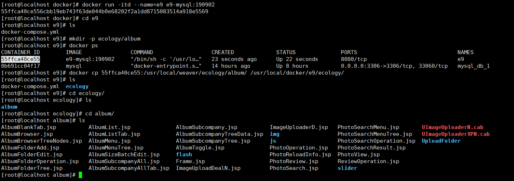

# 泛微平台系统部署

> 本文主要描述了泛微平台环境部署的几种方案，包括 `window / linux` 环境下的 `e-cology`，`e-mobile`部署，集群部署，docker 微服务部署等。

## 1. 单机部署

> 通常情况下，如果客户的服务器系统是 `window server`，那么在部署 `e-cology`时，数据库一般选用 `sql server`(版本建议在2014以上)

### 1.1 SQL Server 部署

SQL Server 的安装包可以在  https://msdn.itellyou.cn/  中获取，在安装包的选择上需要注意的是：

` sql_server_xx_express_with_tools` = ` sql_server_xx_express` + ` sql_server_xx_management_studio`

- `sql_server_xx_express`：表示企业版数据库
- `sql_server_xx_management_studio`：数据库管理工具软件。

这里我们选择的是 ` cn_sql_server_2014_express_with_tools_x64 `，因为该安装包中包含数据库管理工具。


安装 `SQL Server 2014`

- 提取安装包，开始安装。**注意以下窗口在安装过程中不允许关闭掉，否则会安装失败！**


- 一直下一步，直到以下步骤时进行`sa` 账号密码设置


- 选择下一步，等待安装完毕即可


### 1.2 Oracle 部署

> 如果客户服务器系统是 linux，那么一般采用 `Oracle` 或 `MySql` 作为数据库，这边要向客户表述 `Oracle` 与 `MySQL`的区别，其主要区别是 `Oracle` 属于商业产品，盗版可能会被告，但是其性能卓越，抗压性较强。`MySQL` 属于开源产品，抗压性较弱。
>
> 一般企业用户所使用的 `linux` 发行版本都是 `CentOS` 或者  `Red Hat`，接下来会以 `CentOS` 系统为例进行 Oracle 部署的介绍

#### 1.2.0 快速安装

如果选择脚本安装的方式，则只要看 `1.2.0` 即可，其他的为具体步骤。

脚本地址：

- `install.sh`： https://github.com/Y-Aron/cloud-note/blob/master/weaver/shell/oracle/install.sh 
- `dbca.rsp`： https://github.com/Y-Aron/cloud-note/blob/master/weaver/shell/oracle/dbca.rsp 
- `new_sid.sh`： https://github.com/Y-Aron/cloud-note/blob/master/weaver/shell/oracle/new_sid.sh 

`shell` 脚本安装步骤如下：

- 上传 `install.sh`，`dbca.rsp`，`new_sid.sh` 到与`oracle`安装包同级目录下

- 切换至 root 用户，执行 `install.sh` 脚本

```bash
su root
./install.sh
```

- `dbca.rsp`：静默安装 `oracle sid` 的相关配置文件，可根据实际情况自行配置

- 当出现 `Successfully Set Software` 提醒时，执行 `new_sid.sh`

```bash
./new_sid.sh
```

#### 1.2.1 安装前准备

- 使用 `Xshell` 软件连接服务器：软件安装自行百度

- 配置镜像源：复制并执行以下命令

```shell
cd /etc/yum.repos.d/
# 下载并安装阿里云镜像
yum install wget
sudo wget http://mirrors.aliyun.com/repo/Centos-7.repo
sudo mkdir repo_bak
mv /etc/yum.repos.d/repo_bak/Centos-7.repo /etc/yum.repos.d/
# 清除并重新生成yum缓存
yum clean all
yum makecache
```

- 下载 `Oracle11gR2`：https://pan.baidu.com/s/1gA33_cOlyzq6Bu3C4R8Vfw

#### 1.2.2 安装 Oracle

- 安装所需的软件包

```shell
yum -y install binutils compat-libstdc++-33 compat-libstdc++-33.i686 elfutils-libelf elfutils-libelf-devel gcc gcc-c++ glibc glibc.i686 glibc-common glibc-devel glibc-devel.i686 glibc-headers ksh libaio libaio.i686 libaio-devel libaio-devel.i686 libgcc libgcc.i686 libstdc++ libstdc++.i686 libstdc++-devel make sysstat unixODBC unixODBC
```

- 创建用户组和用户

```shell
# 创建 oinstall 用户组
groupadd oinstall
# 创建 dba 用户组
groupadd dba 
# 创建 oracle 用户
useradd -g oinstall -G dba oracle
# 设置密码
passwd oracle
```

- 修改`kernel` 内核参数

``` shell
vi /etc/sysctl.conf 
# ---------------------------------------
# 配置文件内加入 修改以下参数。如果没有可以自己添加，如果默认值比参考值大，则不需要修改。
# 这个内核参数用于设置系统范围内共享内存段的最大数量。该参数的默认值是 4096 。通常不需要更改。
kernel.shmmni = 4096
# 该参数定义了共享内存段的最大尺寸（以字节为单位）。缺省为32M，对于oracle来说，该缺省值太低了，# 通常将其设置为2G。
kernel.shmmax = 2147483648
# 该参数表示系统一次可以使用的共享内存总量（以页为单位）。缺省值就是2097152，通常不需要修改。
kernel.shmall = 2097152
kernel.sem = 250 32000 100 128
fs.aio-max-nr = 1048576
# 设置最大打开文件数
fs.file-max = 65536
# 可使用的IPv4端口范围
net.ipv4.ip_local_port_range = 9000 65500
net.core.rmem_default = 262144
net.core.rmem_max = 4194304
net.core.wmem_default = 262144
net.core.wmem_max = 1048586
# ---------------------------------------

# 保存退出后设置立刻生效
sysctl -p
```

- 修改系统资源限制

```shell
vi /etc/security/limits.conf

# 配置文件下方加入
oracle soft nproc 2047
oracle hard nproc 16384
oracle soft nofile 1024
oracle hard nofile 65536
oracle soft stack  10240

# 修改用户验证选项 关联设置
vi /etc/pam.d/login
# 在最后一条规则之前加入以下session配置
session    required     /lib64/security/pam_limits.so
session    required     pam_limits.so
```

- 创建安装目录和设置目录权限

```shell
# oracle: 安装目录
mkdir -p /usr/local/oracle/product/11.2.0/db_1
# oradata: 数据存储目录
mkdir /usr/local/oracle/oradata
# flash_recovery_area: 恢复目录
mkdir /usr/local/oracle/flash_recovery_area
# oraInventory: 清单目录
mkdir /usr/local/oraInventory
chown -R oracle:oinstall /usr/local/oracle
chown -R oracle:oinstall /usr/local/oraInventory
chmod -R 775 /usr/local/oracle
chmod -R 775 /usr/local/oraInventory
```

- 上传文件到 `/home` 目录下，并解压

```shell
yum install unzip
unzip linux.x64_11gR2_database_1of2.zip
unzip linux.x64_11gR2_database_2of2.zip
```

- 准备oracle安装应答模板文件 `db_install.rsp`

```shell
cp /home/database/response/* /usr/local/oracle/
# 编辑应答文件的相关配置
vi /usr/local/oracle/db_install.rsp
# -------------------------------------
# 安装类型,只装数据库软件
oracle.install.option=INSTALL_DB_SWONLY
# 安装组
UNIX_GROUP_NAME=oinstall
# INVENTORY目录（**不填就是默认值,本例此处需修改,因个人创建安装目录而定）
INVENTORY_LOCATION=/usr/local/oraInventory
# 选择语言　
SELECTED_LANGUAGES=en,zh_CN
# oracle_home: 路径根据目录情况注意修改 本例安装路径/usr/local/oracle
ORACLE_HOME=/usr/local/oracle/product/11.2.0/db_1
# oracle_base: 注意修改
ORACLE_BASE=/usr/local/oracle
# oracle版本
oracle.install.db.InstallEdition=EE
# 自定义安装，否，使用默认组件
oracle.install.db.isCustomInstall=false
# dba用户组
oracle.install.db.DBA_GROUP=dba
# oper用户组
oracle.install.db.OPER_GROUP=dba
# 注意此参数 设定一定要为true
DECLINE_SECURITY_UPDATES=true
# -------------------------------------
```

- 切换用户并开始静默安装

```shell
# 切换到oracle / 进入解压目录
su oracle
cd /home/database/
# 防止报错
unset DISPLAY
./runInstaller -silent -ignorePrereq -responseFile /usr/local/oracle/db_install.rsp

# /home/database是安装包解压后的路径，此处根据安装包解压所在位置做修改，因人而异。
　　# runInstaller 是主要安装脚本
　　# -silent 静默模式
　　# -force 强制安装
　　# -ignorePrereq忽略warning直接安装
　　#-responseFile读取安装应答文件
```

- 出现以下提醒则表示安装成功


- 安装成功后还需要执行以下命令

```shell
su root
密码：
cd /usr/local/oraInventory/
./orainstRoot.sh
cd /usr/local/oracle/product/11.2.0/db_1/
./root.sh
```

- 设置Oracle用户环境变量

```shell
# 切换至oracle账号
su oracle
# 编辑用户环境变量
echo 'export ORACLE_BASE=/usr/local/oracle
export ORACLE_HOME=$ORACLE_BASE/product/11.2.0/db_1
export LANG="zh_CN.UTF-8"
export NLS_LANG="SIMPLIFIED CHINESE_CHINA.AL32UTF8"
export NLS_DATE_FORMAT="yyyy-mm-dd hh24:mi:ss"
export PATH=$PATH:$ORACLE_HOME/bin ' >> ~/.bashrc
# 立即生效
source ~/.bashrc
```

- 配置监听以及监听的相关命令

```shell
# 静默方式配置监听
netca /silent/responseFile /usr/local/oracle/netca.rsp
# 启动监听
lsnrctl start
# 暂停监听
lsnrctl stop
# 查看监听
lsnrctl status
# 检查是否监听正常启动
netstat -tnulp | grep 1521
(No info could be read for "-p": geteuid()=1001 but you should be root.)
tcp6       0      0 :::1521                 :::*                    LISTEN 
```

#### 1.2.3 静默方式建立新库

- 新建 `dbca.rsp` 

```shell
su oracle
vi /home/oracle/dbca.rsp
# --------------------------------------------------
[GENERAL]
RESPONSEFILE_VERSION = "11.2.0"
# 必须指定为创建数据库
OPERATION_TYPE = "createDatabase"
[CREATEDATABASE]
# 数据库的Global database name
GDBNAME = "orcl"
# 数据库的实例名
SID = "orcl"
TEMPLATENAME = "General_Purpose.dbc"
STORAGETYPE=FS
# 指定数据文件存储的目录
DATAFILEDESTINATION =/usr/local/oracle/oradata
# 指定数据文件恢复的目录
RECOVERYAREADESTINATION=/usr/local/oracle/flash_recovery_area
# 指定字符集
CHARACTERSET = "AL32UTF8"
# 指定国家字符集
NATIONALCHARACTERSET= "AL16UTF16"
LISTENERS=LISTENER
TOTALMEMORY = "700"
# 指定sys用户密码[必填]
SYSPASSWORD = "123456"
# 指定system用户密码[必填]
SYSTEMPASSWORD = "123456"
# 指定使用自动内存管理
AUTOMATICMEMORYMANAGEMENT = "TRUE"
# --------------------------------------------------
```

- 以静默方式开始创建数据库

```shell
dbca -silent -responseFile /home/oracle/dbca.rsp
```

- 修改 Oracle 用户的环境变量

```shell
vi ~/.bashrc 
# --------------------------------------------------
# 与上述安装的数据库SID一致
export ORACLE_SID=orcl
export ORACLE_OWNER=$ORACLE_SID
# --------------------------------------------------

# 立即生效
source ~/.bashrc

# 修改监听文件
vi /usr/local/oracle/product/11.2.0/db_1/network/admin/listener.ora

# --------------------------------------------------
# 添加SID相关配置，注意 SID_NAME区分大小写！
SID_LIST_LISTENER =
  (SID_LIST =
    (SID_DESC =
      (ORACLE_HOME =/usr/local/oracle/product/11.2.0/db_1)
      (SID_NAME = orcl)
    )
  )

LISTENER =
  (DESCRIPTION_LIST =
    (DESCRIPTION =
      (ADDRESS = (PROTOCOL = IPC)(KEY = EXTPROC1521))
      (ADDRESS = (PROTOCOL = TCP)(HOST = localhost)(PORT = 1521))
    )
  )

ADR_BASE_LISTENER = /usr/local/oracle
# --------------------------------------------------

# 重启监听
lsnrctl stop
lsnrctl start
```

- 出现以下信息则表明服务启动成功


#### 1.2.4 开启远程连接

```shell
# 关闭centos7防火墙
systemctl stop firewalld.service
# 关闭开机启动
systemctl disable firewalld.service
# 安装iptables防火墙
yum install iptables-services
# 新增1521接口
iptables -A INPUT -p tcp --dport 1521 -j ACCEPT  
service iptables save
# 设置开机启动
systemctl enable iptables
# 重启iptabls服务
systemctl restart iptables.service
```

#### 1.2.5  开机自动启动

```shell
vi /usr/local/oracle/product/11.2.0/db_1/bin/dbstart
# -------------------------------
# 修改ORACLE_HOME_LISTNER参数
ORACLE_HOME_LISTNER=$ORACLE_HOME
# -------------------------------

vi /usr/local/oracle/product/11.2.0/db_1/bin/dbshut
# -------------------------------
# 修改ORACLE_HOME_LISTNER参数
ORACLE_HOME_LISTNER=$ORACLE_HOME
# -------------------------------

vi /etc/oratab
# -------------------------------
# 修改为 :Y
orcl:/usr/local/oracle/product/11.2.0/db_1:Y
# -------------------------------
```

切换到 root 用户，执行 `vi /etc/init.d/oracle`

```shell
#!/bin/sh  
# chkconfig: 345 61 61  
# description: Oracle 11g R2 AutoRun Servimces  
# /etc/init.d/oracle  
# Run-level Startup script for the Oracle Instance, Listener, and  
# Web Interface  
export ORACLE_BASE=/usr/local/oracle  
export ORACLE_HOME=$ORACLE_BASE/product/11.2.0/db_1
export ORACLE_SID=orcl
export ORACLE_UNQNAME=$ORACLE_SID    
export PATH=$ORACLE_HOME/bin:/user/sbin:$PATH  
export LD_LIBRARY_PATH=$ORACLE_HOME/lib:$LD_LIBRARY_PATH  
ORA_OWNR="oracle"  
# if the executables do not exist -- display error  
if [ ! -f $ORACLE_HOME/bin/dbstart -o ! -d $ORACLE_HOME ]  
then  
echo "Oracle startup: cannot start"  
exit 1  
fi  
# depending on parameter -- startup, shutdown, restart  
# of the instance and listener or usage display  
case "$1" in  
start)  
# Oracle listener and instance startup  
su $ORA_OWNR -lc $ORACLE_HOME/bin/dbstart  
echo "Oracle Start Succesful!OK."  
;;  
stop)  
# Oracle listener and instance shutdown  
su $ORA_OWNR -lc $ORACLE_HOME/bin/dbshut  
echo "Oracle Stop Succesful!OK."  
;;  
reload|restart)  
$0 stop  
$0 start  
;;  
*)  
echo $"Usage: `basename $0` {start|stop|reload|reload}"  
exit 1  
esac  
exit 0
```

保存退出后执行以下命令

```shell
cd /etc/init.d
chmod +x oracle
chkconfig --add oracle 
chkconfig oracle on
```

#### 1.2.6 创建表空间与用户

- 进入`sqlplus`

```shell
sqlplus / as sysdba
```

- 创建表空间

```sql
create tablespace e9 logging datafile'/usr/local/oracle/oradata/orcl/e9.dbf' size 1024m autoextend on next 100m maxsize 10240m extent management local;
```

- 创建用户

```sql
create user weaver identified by 123456 default tablespace e9;
```

- 5.4 给用户赋权限

```sql
grant dba to weaver;
```

#### 1.2.7 常见问题

- `ORA-01034: ORACLE not available ORA-27101`

```bash
# Step1: 启动oracle监听
lsnrctl start
# Step2: 设置实例名，实例名一般是"orcl"
set ORACLE_SID=orcl
# Step3: 启动oracle服务
# 进入 sql 控制台，执行 startup命令，如果被告知已经启动，可以先输入shutdown immediate, 然后在输入startup
sqlplus / as sysdba
startup;
```

### 1.3 下载与安装 E9

> 安装包下载文档：https://www.e-cology.com.cn/spa/document/index.jsp?id=3861088&newsDataType=fullSearch&router=1#/main/document/detail?_key=niim1h 
>
> 将 `ecology`，`jdk`, `resin` 下载并放置在同一目录下

#### 1.3.1 E9 程序包介绍

- `Ecology`：`E9` 的主程序包
- `Jdk`：`Java` 运行程序
- `Resin`：`Resin` 中间件

#### 1.3.2 Resin 基本配置

`resin/conf/resin.xml`

```xml
<!-- 修改jdk路径，可以是相对路径也可以是绝对路径 -->
<javac compiler="../jdk/bin/javac" args="-encoding UTF-8"/>

<!-- 修改ecology路径，可以是相对路径也可以是绝对路径 -->
<web-app id="/" root-directory="../ecology">
```

`resin/conf/resin.properties`

```properties
# 修改服务端口
app.http          : 80
app.https         : 8443
```

#### 1.3.3 Resin-Win 配置

在 `window` 环境下，`resin/resinstart.bat` 为启动文件，可右键编辑内容，其中 `java_home` 为 `jdk` 路径，这里使用相对路径即可，当然也可以使用绝对路径 。单击 `resinstart.bat` 启动服务

```bash
set java_home=../jdk
resin.exe
```

#### 1.3.4 Resin-Linux 配置

- 编译安装 `resin`

```bash
# prefix: resin路径
# with-java-home: jdk路径
cd /usr/local/weaver/resin
chmod +x ./configure
./configure --prefix=/usr/local/weaver/resin --with-java-home=/usr/local/weaver/jdk --enable-64bit
make
make install
```

- 修改相关配置文件

```bash
# 修改 resin/bin/resin.sh 中的jdk路径
sed -i "s/jdk1.8.0_151/jdk/g" /usr/local/weaver/resin/bin/resin.sh
sed -i "s/weaver/local\\/weaver/g" /usr/local/weaver/resin/bin/resin.sh
#  修改 resin.sh 路径
sed -i "s/weaver/local\\/weaver/g" /usr/local/weaver/resin/bin/startresin.sh
sed -i "s/weaver/local\\/weaver/g" /usr/local/weaver/resin/bin/stopresin.sh
# 修改 resin/conf/resin.xml 中的jdk和ecology路径
# jdk 必须是绝对路径，ecology可以是绝对路径也可以是相对  路径
sed -i "s/#INSTALLDIR#JDK\\\bin\\\javac/\\/usr\\/local\\/weaver\\/jdk\\/bin\\/javac/g" /usr/local/weaver/resin/conf/resin.xml
sed -i "s/#INSTALLDIR#ecology/..\\/ecology/g" /usr/local/weaver/resin/conf/resin.xml
```

- 启动 `resin`，打开浏览器输入 `http://127.0.0.1` 即可使用 `e9`

### 1.4 Redis 部署以及配置

> E9 默认使用 `ehcache2.x` 进行数据缓存，支持使用 `redis` 进行数据缓存。
>
> Redis 是完全开源免费的，遵守BSD协议，是一个高性能的key-value数据库。 

#### 1.4.1 window 安装 Redis

window安装 redis 比较简单，下载安装包即可，地址： https://github.com/microsoftarchive/redis/releases 

下载安装包 `Redis-x64-3.2.100.msi`，点击下一步即可~


#### 1.4.2 Linux 安装 Redis

- 安装编译环境

```bash
# ubuntu
sudo apt-get install make gcc
# centos
yum install make gcc
```

- 安装 redis

```bash
cd ~
# 下载 redis 源码
wget http://download.redis.io/releases/redis-5.0.6.tar.gz
# 解压
tar xzf redis-5.0.6.tar.gz
# 切换到解压目录
cd redis-5.0.6
# 切换到 root 权限
su root
# 编译安装
make PREFIX=/usr/local/redis install
```

- 配置和启动

> redis.conf 是 redis 的配置文件，redis.conf 在 redis 源码目录下
>
> 拷贝配置文件到安装目录下

```bash
# 进入源码目录
cd ~/redis-5.0.6
# 拷贝配置文件至安装目录
cp ~/redis-5.0.6/redis.conf /usr/local/redis/redis.conf
```

- 前台启动

```bash
# 进入安装目录
cd /usr/local/redis/bin
./redis-server
```

- 后端模式启动

修改 redis.conf 配置文件，daemonize 参数设置为 yes，表示以后端模式启动


修改完毕后保存退出，重新启动 redis

```bash
 # 进入安装目录
 cd /usr/local/redis
 # 已后端模式启动 redis
 ./bin/redis-server ./redis.conf
```

#### 1.4.3 E9 使用 Redis

` ecology/WEB-INF/prop/weaver_new_session.properties `，开启redis并修改相关配置，注意redis的密码一定要有，否则会报错！

```properties
# 1表示启用新的session方式，其他值表示不启用
status=1
# 用于调试的USERID
debugUsers=
# session id生成模式，1表示自定义生成模式（UUID模式），其他值表示中间件自定义生成模式
useCustomSessionId=1
# 同步频率设置（单位，秒）
# 主表同步频率
SessionTableSync=2
# 明细表同步频率
SessionItemTableSync=5
# 超时扫描频率
SessionOverTime=300
# 垃圾数据清理扫描频率
SessionLeak=3600

#启动模式，默认是数据库模式
# className=weaver.session.util.DBUtil
className=weaver.session.util.RedisSessionUtil
# redis ip
redisIp=127.0.0.1
# redis port
redisPort=6379
# redis password, 注意密码必须设置，否则会报错！
redisPassword=123456
enableImmediatelySync=true
etoken=
```

使用 redis 可视化工具可以看到如下结果，则表明启动了redis


## 2. 集群部署

> `e9` 集群部署与 `e8` 基本一致，只增加了一个`redis` 配置。
>
> 集群方案有很多，比如：`ec+nginx+weblogic` ，`ec+nginx+resin`，`ec+F5+resin`，本文只介绍 `ec+nginx+resin`

#### 2.0 集群准备

集群部署需要准备：

- 一台文件服务器（`NFS`）服务器地址：`192.168.44.143`
- 一台主服务器（`Ecology+MySQL+Nginx`）服务器地址：`192.168.44.139`
- 一台从服务器（`Ecology`）服务器地址：`192.168.44.144`

#### 2.1 文件服务器配置

##### 2.1.1 NFS 服务器部署

- 安装`nfs`

```bash
yum install -y nfs-utils
# 设置开启启动
sudo systemctl enable rpcbind
sudo systemctl enable nfs
```

- 配置对外共享文件：`/etc/exports`

```bash
vi /etc/exports
# 在 /etc/exports 中添加以下内容
# 意思是将本地文件夹 /data 共享给192.168.44.139和144服务器
# 也可以用*号代替，比如: /data *(rw,sync,no_root_squash)
# 意思是将本地文件夹 /data 共享到所有和这个文件服务器相通的机器
/data 192.168.44.139(rw,sync,no_root_squash)
/data 192.168.44.144(rw,sync,no_root_squash)
```

- 重启`nfs`服务

```bash
exportfs -rv
systemctl restart nfs
# 针对 rhel5
systemctl resatrt portmap
# 针对 rhel6
systemctl restart rpcbin
```

##### 2.1.2 文件同步配置

> 切换至主（从）服务器操作

- 在需要共享的节点挂载共享文件到对应目录

```bash
# 主服务器：192.168.44.139
yum install -y nfs-utils
# 创建挂载目录
mkdir /data
# 设置文件挂载
mount -t nfs 192.168.44.143:/data  /data
```

- 将 ecology 以下目录拷贝到 `/data/e9` 中,一般情况下主服务器做拷贝即可。

```bash
# 备份文件，注意这里使用mv而不是cp
cd /usr/local/weaver/ecology
mkdir -p nfs_bak/WEB-INF
# 移动以下目录至 nfs_bak 下
\mv album formmode mobilemode mobile  email  filesystem  images  images_face  images_frame  LoginTemplateFile messager  m_img  others page  upgrade wui nfs_bak
# 进入WEB-INF目录，移动以下文件夹至 nfs_bak/WEB-INF 下
cd WEB-INF
\mv securityRule securityXML service lib/keys weaver_security_rules.xml weaver_security_config.xml hrmsettings.xml ../nfs_bak/WEB-INF

# 将相关文件拷贝到 /data 目录下
# 在/data中创建 ec/WEB-INF 目录
mkdir -p /data/ec/WEB-INF
\cp -rf /usr/local/weaver/ecology/nfs_bak /data/ec
# 以下两个文件是不存在的，需要手动创建
mkdir -p /data/ec/LoginTemplateFile /data/ec/others
```

- 创建软链接

```bash
ln -sf /data/ec/album /usr/local/weaver/ecology
ln -sf /data/ec/formmode /usr/local/weaver/ecology
ln -sf /data/ec/mobilemode /usr/local/weaver/ecology
ln -sf /data/ec/email /usr/local/weaver/ecology
ln -sf /data/ec/filesystem /usr/local/weaver/ecology
ln -sf /data/ec/images /usr/local/weaver/ecology
ln -sf /data/ec/images_face /usr/local/weaver/ecology
ln -sf /data/ec/images_frame /usr/local/weaver/ecology
ln -sf /data/ec/LoginTemplateFile /usr/local/weaver/ecology
ln -sf /data/ec/messager /usr/local/weaver/ecology
ln -sf /data/ec/m_img /usr/local/weaver/ecology
ln -sf /data/ec/others /usr/local/weaver/ecology
ln -sf /data/ec/page /usr/local/weaver/ecology
ln -sf /data/ec/upgrade /usr/local/weaver/ecology
ln -sf /data/ec/wui /usr/local/weaver/ecology
ln -sf /data/ec/WEB-INF/securityRule /usr/local/weaver/ecology/WEB-INF
ln -sf /data/ec/WEB-INF/securityXML /usr/local/weaver/ecology/WEB-INF
ln -sf /data/ec/WEB-INF/service /usr/local/weaver/ecology/WEB-INF
ln -sf /data/ec/WEB-INF/lib/keys /usr/local/weaver/ecology/WEB-INF/lib/keys
ln -sf /data/ec/WEB-INF/weaver_security_rules.xml /usr/local/weaver/ecology/WEB-INF/weaver_security_rules.xml
ln -sf /data/ec/WEB-INF/weaver_security_config.xml /usr/local/weaver/ecology/WEB-INF/weaver_security_config.xml
ln -sf /data/ec/WEB-INF/hrmsettings.xml /usr/local/weaver/ecology/WEB-INF/hrmsettings.xml
```

##### 2.1.3 缓存同步设置

- 配置 `/etc/hosts`：清空原有127默认配置，将集群各节点 `ip`地址加入到`hosts`中


- 修改 `ecology/WEB-INF/weaver.properties`，加入以下内容。注意，所有节点都需要配置！

```properties
# 主节点ip(集群中任意一个节点，但有且只能有一个)
MainControlIP = 192.168.44.139
# 本机ip:本机服务端口port
ip = 192.168.44.144:80
broadcast=231.12.21.132
syncType=http
# initial_hosts为参数为所有的应用服务器的节点的访问地址
# 格式：ip1:port,ip2:port  （中间以逗号分隔）
initial_hosts= 192.168.44.139:80,192.168.44.144:80
```

#### 2.2 部署 Nginx

- 在主服务器（192.168.44.139）下载安装 `nginx`

```bash
# 下载nginx安装包
yum install -y wget
wget https://nginx.org/download/nginx-1.17.8.tar.gz
# 下载编译依赖包
yum install -y gcc-c++ pcre pcre-devel zlib zlib-devel openssl openssl-devel
tar -zxvf nginx-1.17.8.tar.gz
cd nginx-1.17.8
# 编译安装
./configure --prefix=/usr/local/nginx
make && make install
# 查看安装目录
whereis nginx
# nginx: /usr/local/nginx
```

- 编辑 `/usr/local/nginx/conf/nginx.conf`

```nginx
worker_processes  1;

events {
    worker_connections  1024;
}

http {
    upstream ecologycluster {
        ip_hash;
        # e-cology服务器地址1
        server 192.168.44.139:80;
        # e-cology服务器地址2
        server 192.168.44.144:80;
        # ...
    }
    include       mime.types;
    default_type  application/octet-stream;

    sendfile        on;
    
    keepalive_timeout  65;
    server {
        listen       8889;
        server_name  e9;
        location / {
            root                    html;
            index                   index.html index.htm index.jsp;
            proxy_pass              http://ecologycluster;
            proxy_next_upstream     http_502 http_504 http_500 http_404 http_403 error timeout invalid_header;
            proxy_redirect          off;
            proxy_set_header        X-Forwarded-For $proxy_add_x_forwarded_for;
            proxy_set_header        X-Real-IP $remote_addr;
            proxy_set_header        Host $http_host;
            proxy_read_timeout      3600;
            proxy_send_timeout      3600;
            access_log              off;
            send_timeout            300;
        }
    }
}
```

- 启动`nginx`

```bash
cd /usr/local/nginx/sbin 
./nginx -c /usr/local/nginx/conf/nginx.conf
```

- 打开浏览器输入 `http://192.168.44.139:8889`， 注意这里访问的是 `nginx` 地址！

#### 2.3 故障测试

- 将两台服务器都停掉，再访问 `http://192.168.44.139:8889`
- 开启从服务器，将主服务器（192.168.44.139）停掉，再访问 `http://192.168.44.139:8889`
- 开启主服务器，将从服务器（192.168.44.144）停掉，再访问 `http://192.168.44.139:8889`

## 3. Docker 部署

> Docker 部署适用于客户服务器系统为 `linux`，`window` 系统不推荐使用。
>
> Docker 部署不是成熟方案，并且需要一定技术支撑，该方案量力而为。
>
> 下面使用 `CentOS` 系统进行`Docker-E9`部署

#### 3.1 Docker 安装

```bash
# step 1: 安装必要的一些系统工具
sudo yum install -y yum-utils device-mapper-persistent-data lvm2
# Step 2: 添加软件源信息
sudo yum-config-manager --add-repo http://mirrors.aliyun.com/docker-ce/linux/centos/docker-ce.repo
# Step 3: 更新并安装Docker-CE
sudo yum makecache fast
sudo yum -y install docker-ce
# Step 4: 开启Docker服务
sudo service docker start
```

#### 3.2 配置加速器

```bash
# 配置阿里云加速器
echo "{
  \"registry-mirrors\": [\"https://xh36jugz.mirror.aliyuncs.com\"]
}">/etc/docker/daemon.json
# 重启docker
sudo systemctl daemon-reload
sudo systemctl restart docker
```

#### 3.3 制作 E9 镜像

> 创建目录：`mkdir /usr/local/weaver`

##### 3.3.1 使用 `ubuntu` 依赖

- 上传 `Ecology9.00.xxxx.xx.zip`，`jdk-8u231-linux-x64.tar.gz`， `Resin-4.0.58.zip` 至 `/usr/local/weaver` 目录
- 解压文件

```bash
# 安装解压工具，如果已经安装可省略
yum install unzip
# 解压文件夹, ecology按照具体的版本号
unzip Ecology9.00.xxxx.xx.zip
unzip Resin-4.0.58.zip
unzip jdk-8u231-linux-x64.tar.gz
# 对解压出来的文件夹重命名
mv Resin resin
mv jdk1.8.0_231 jdk
```

- 修改 resin 相关配置：查看 [1.3.4 Resin-Linux 配置](#1.3.4 Resin-Linux 配置)

- 创建 `ubuntu` 依赖的 `Dockerfile` 

```bash
echo 'FROM ubuntu
COPY ecology/ /usr/local/weaver/ecology/
COPY resin/ /usr/local/weaver/resin/
COPY jdk/ /usr/local/weaver/jdk/
EXPOSE 8080
RUN chmod +x /usr/local/weaver/resin/bin/resin.sh
CMD ["/bin/sh", "-c", "/usr/local/weaver/resin/bin/resin.sh console"]'>/usr/local/weaver/Dockerfile
```

##### 3.3.2 使用 `resin:e9` 依赖

- 使用该依赖则只需上传 `Ecology9.00.xxxx.xx.zip` 至 `/usr/local/weaver` 目录即可

- 解压文件

```bash
# 安装解压工具，如果已经安装可省略
yum install unzip
# 解压文件夹, ecology按照具体的版本号
unzip Ecology9.00.xxxx.xx.zip
```

- 创建 `resin:e9` 依赖的 `Dockerfile`

```bash
echo 'FROM registry.cn-hangzhou.aliyuncs.com/weaver/resin:e9
COPY ecology/ /usr/local/weaver/ecology/'>Dockerfile
```

##### 3.3.3 构建镜像

- 路径切换到 `/usr/local/weaver` 下，执行镜像构建命令，注意末尾的 `.` 号是必须的！

```bash
cd /usr/local/weaver
# ec系统瘦身
rm -rf $(find /usr/local/weaver/ecology -name="**.map.js")
# 修改初始验证码
sed -i 's/wEAver2018/1/g' /usr/local/weaver/ecology/WEB-INF/code.key
# 开始构建镜像
docker build -t e9:191202 .
```

- 出现以下信息表示镜像构建成功


##### 3.3.4 镜像瘦身

> `e-cology9` 构建镜像时，会存在一个让客户吐槽的问题，那就是构建出的镜像过大，从图中可以看出，`e9:191202` 镜像包已经达到 `5.05GB` 大小，下面介绍几个镜像瘦身的方案，大约能瘦身 `1-2G` 左右

通过软件分析`e-cology9` 程序，发现文件扩展名为 `.map`, `.jar`, `.js` 的文件占比重最大。其中 `.jar` 为后端文件，`.js` 为前端文件，这两个不要轻易的进行删减！那么我们可以动的只剩下 `.map` 文件了。


关于 `.map.js` 文件介绍：

`source map`文件是`js`文件压缩后，文件的变量名替换对应、变量所在位置等元信息数据文件，一般这种文件和`min.js`主文件放在同一个目录下。 比如压缩后原变量是map，压缩后通过变量替换规则可能会被替换成a，这时source map文件会记录下这个mapping的信息，这样的好处就是说，在调试的时候，如果有一些 `js`报错，那么浏览器会通过解析这个map文件来重新merge压缩后的`js`,使开发者可以用未压缩前的代码来调试，这样会给我们带来很大的方便！ 

**换句话说以 .map 后缀的文件，唯一的作用是方便在开发过程中进行调试，但是在生产环境中，可以被删除。**

OK，删除掉 `.map` 文件后，整个程序的体积瞬间少了 `1.0GB` 左右，接下来还有一个能删除的目录，那就是 `ecology/data`，这个目录下存放的是数据库初始化的 `sql` 文件，从图中可以看出这些 `sql` 文件差不多占 `200M` 左右，个人建议第一次构建镜像时不要删除这些文件，等待数据库初始化完毕，二次构建镜像时把这些文件删除，这样 `e-cology9` 镜像体积又能瘦下来了~


#### 3.4 安装 docker-compose

> 百度云盘下载：https://pan.baidu.com/s/1bEGXrwbQo32Gu8UbXgyFQQ
>
> 下载 `docker-compose` 上传至 `/usr/local/bin/` 下，然后执行以下命令

```shell
chmod +x /usr/local/bin/docker-compose
```

#### 3.5 启动 Ecology

##### 3.5.1 创建 `docker-compose.yml`

```yml
version: '3.1'
services: 
  ecology:
    restart: always
    image: e9-mysql:190902
    container_name: e9
    ports: 
      - 8080:80
    volumes:
      - ./ecology/album:/usr/local/weaver/ecology/album
      - ./ecology/formmode:/usr/local/weaver/ecology/formmode
      - ./ecology/messager:/usr/local/weaver/ecology/messager
      - ./ecology/mobilemode:/usr/local/weaver/ecology/mobilemode
      - ./ecology/mobile:/usr/local/weaver/ecology/mobile
      - ./ecology/email:/usr/local/weaver/ecology/email
      - ./ecology/filesystem:/usr/local/weaver/ecology/filesystem
      - ./ecology/images_face:/usr/local/weaver/ecology/images_face
      - ./ecology/images_frame:/usr/local/weaver/ecology/images_frame
      - ./ecology/license:/usr/local/weaver/ecology/license
      - ./ecology/log:/usr/local/weaver/ecology/log
      - ./ecology/LoginTemplateFile:/usr/local/weaver/ecology/LoginTemplateFile
      - ./ecology/m_img:/usr/local/weaver/ecology/m_img
      - ./ecology/wui:/usr/local/weaver/ecology/wui
      - ./ecology/others:/usr/local/weaver/ecology/others
      - ./ecology/page:/usr/local/weaver/ecology/page
      - ./ecology/upgrade:/usr/local/weaver/ecology/upgrade
      - ./ecology/WEB-INF/securityRule:/usr/local/weaver/ecology/WEB-INF/securityRule
      - ./ecology/WEB-INF/securityXML:/usr/local/weaver/ecology/WEB-INF/securityXML
      - ./ecology/WEB-INF/service:/usr/local/weaver/ecology/WEB-INF/service
      - ./ecology/WEB-INF/prop:/usr/local/weaver/ecology/WEB-INF/prop
      - ./resin/log:/usr/local/weaver/resin/log
      - ./resin/logs:/usr/local/weaver/resin/logs
    environment:
      TZ: Asia/Shanghai
```

##### 3.5.2 数据持久化说明

在 `docker` 中，无论是原生的 `-v` 参数也好，还是 `docker-compose` 的 `volumes` 参数也罢。在启动容器时，会将宿主机上的相关目录复制到容器内部。以 `ecology/album`  目录为例，当宿主机上 `./ecology/album`目录不存在，或者该目录下不存在任何文件，那么启动容器后，使用 `exec`  命令登陆容器后会发现容器内的 `/usr/local/ecology/album` 目录下的所有文件都被清空！


**总结：在启动容器时，需要手动创建所要持久化的目录，并且将相关目录下的文件`copy`到对应目录中**

如果使用已经构建好的镜像，不确定镜像内的文件是什么。那么可以采用以下方案：

1. 启动容器时先不挂载数据卷：`docker run -itd --name=e9 e9-mysql:190902`
2. 使用 `cp` 命令将容器内的文件 `copy` 到宿主机中：`sudo docker cp containerID:container_path host_path`



##### 3.5.3 启动服务

- 执行 `docker-compose up` 启动服务，出现以下信息表示服务启动成功


- 打开浏览器输入：`http://ip:8080`

## 4. 移动平台部署

> 移动平台可以通过泛微官方地址：
>
> https://emobile.weaver.com.cn/emp/download

#### 4.1 常规部署

关于 `E-mobile7` 常规部署参考 `泛微移动平台安装手册` 即可！

#### 4.2 独立部署

`E-Mobile7` 包含 `em7` ，`redis`，`mysql`，`active-mq`，`tomcat` 五大组成部分。其中 `em7` 依赖于 `tomcat` 启动。其他部分均可独立部署。也就是说 `E-Mobile7` 可以拆分成四大部分独立部署。

相关配置可查看： https://yq.weaver.com.cn/eb/qa/view/#/question/5fb7e8e6124948129b1bfada0737f9f6 

#### 4.3 Docker部署

##### 4.3.1 镜像制作

- 下载解压安装包和补丁包


```bash
tar -zxvf emp_install_linux64_20191226.tar.gz 
# 如果已经安装unzip则跳过
# yum install unzip
unzip -o emp_patch_20200109.zip
```

- 创建 `/usr/local/docker/emp`，将 `appsvr`，`jdk`，`work`  copy到该目录下

```bash
mkdir -p /usr/local/docker/emp
\cp -r appsvr /usr/local/docker/emp
\cp -r jdk /usr/local/docker/emp
\cp -r work /usr/local/docker/emp
```

- 使用 `ubuntu` 依赖的  `Dockerfile`

```bash
FROM ubuntu
COPY appsvr/tomcat /usr/local/emp/tomcat/
COPY work/ /usr/local/emp/work/
COPY start.sh /usr/local/emp/
COPY jdk/ /usr/local/jdk/
ENV PATH=/usr/local/sbin:/usr/local/bin:/usr/sbin:/usr/bin:/sbin:/bin:/usr/local/jdk/bin:/usr/local/emp/tomcat/bin:/usr/local/emp/tomcat/bin
ENV TZ=Asia/Shanghai
ENV JAVA_HOME=/usr/local/jdk
ENV CLASSPATH=/usr/local/jdk/lib/dt.jar:/usr/local/jdk/lib/tools.jar
ENV CATALTNA_HOME=/usr/local/emp/tomcat
ENV CATALINA_HOME_BASE=/usr/local/emp
ENV LC_ALL=zh_CN.gbk
ENV LANG=zh_CN.gbk
EXPOSE 8095
EXPOSE 8999
EXPOSE 9443
RUN [ "/bin/sh", "-c", "chmod +x /usr/local/emp/start.sh" ]
CMD [ "/bin/sh", "-c", "/usr/local/emp/start.sh" ]
```


- 下载 [start.sh](https://github.com/Y-Aron/cloud-note/blob/master/weaver/shell/emp/start.sh) 至 `/usr/local/docker/emp`

- 创建 `/usr/local/docker/emp/docker-compose.yml` 

```yaml
version: '3.1'
services: 
  em7:
    build:
      context: .
      dockerfile: Dockerfile
    restart: always
    image: em7
    container_name: em7
    ports: 
      - 8999:8999
    environment: 
      EMP_ACTIVEMQ_ENABLED: "true"
      EMP_ACTIVEMQ_IP: "192.168.44.155"
      EMP_ACTIVEMQ_PORT: 61616
      EMP_ACTIVEMQ_USER: "system"
      EMP_ACTIVEMQ_PASSWORD: "manager"
      EMP_JTA_ENABLED: "false"
      EMP_DB_TYPE: "mysql"
      EMP_DB_NAME:  "emp_app"
      EMP_DB_IP: "192.168.44.155"
      EMP_DB_PORT: 3306
      # oracle 使用 EMP_DB_SID: orcl
      EMP_DB_USERNAME: "root"
      EMP_DB_PASSWORD: 123456
      EMP_REDIS_ENABLED: "true"
      EMP_REDIS_HOST: "192.168.44.155"
      EMP_REDIS_PORT: 6381
      EMP_REDIS_PASSWORD: "WEAVERemobile7*()"
      EMP_REDIS_DB: 0
      # # 集群配置
      # 集群节点ID:全局唯一
      EMP_CLUSTER_NODE_ID: 1
      # CDN地址
      EMP_CDN_URL:   
      # session存储介质，支持none、jdbc和redis
      # none表示session存储在servlet容器（即原生session）
      # jdbc表示session存储在数据库，redis表示session存储在redis里面（需配置redis数据源）
      EMP_SESSION_STORE_TYPE: "none"
      # session有效期默认7天
      EMP_SESSION_TIMEOUT: "7d"
      # 基本信息缓存方式，支持none、ehcache和redis
      # none表示不缓存数据
      # ehcache表示数据缓存在ehcache里面
      # redis表示数据缓存在redis里面（需配置redis数据源）
      EMP_BASE_CACHE_TYPE: "ehcache"
      # 操作日志保留期限（天），小于或者等于0表示不清理
      EMP_LOG_RETAIN_DAYS: 30
      # 从OA下载的文件保留期限（天），小于或者等于0表示不清理
      EMP_DOWNLOAD_RETAIN_DAYS: 10
```

- 构建镜像命令：`docker-compose build`


##### 4.3.2 启动 Ecology

- 使用命令：`docker-compose up`


- 打开浏览器，输入 `http://ip:port` 即可进入`E-Mobile7`后台！