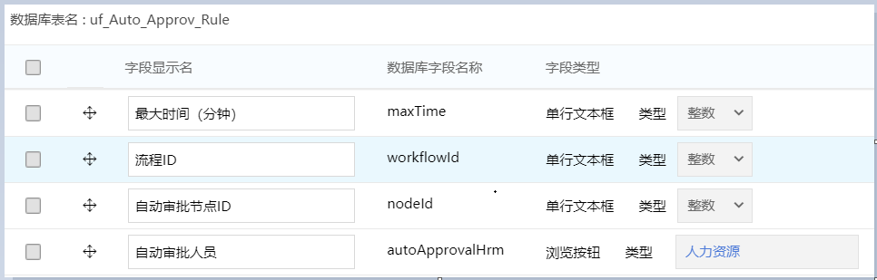
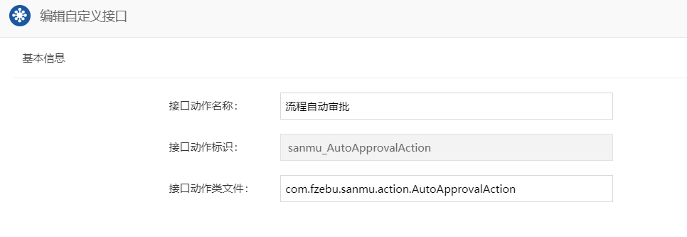

# 流程自动审批实现

> 三木项目关于流程自动审批的需求
>
> - 当 `A` 节点为特定人员（如张三）时，他审批后B节点不需要再重复审批，但是需要保留B节点在审批中的记录。签字意见固定显示内容为“同意”
> - 审批时间控制，因为如果实现自动审批的话，A和B节点的签批时间是一样的，在审计上会有问题，所以在希望通过开发把审批时间弄随机（比如设置1分钟-10分钟的时间区间，每次审批随机取这10分钟之间一个时间点）
> - 要做成流程可调用的，因为目前有几十条流程可能都存在这种场景，需要根据需要去配置或启用哪些流程需要实现这种控制效果

## 1. 建模表设置

>  表名为 `uf_Auto_Approv_Rule`，字段名如下，请严格按照下面截图进行设置。



- 流程ID：需要自动审批的流程ID
- 自动审批节点ID：需求描述中的`A`节点
- 自动审批人员：需求描述中的`A`节点的特定人员
- 最大时间（分钟）：审批时间的值的需求区间为 【0-10】分钟内

## 2. 节点Action配置

在需要进行自动审批的**节点前附加操作**上添加如下配置，接口类：`com.fzebu.sanmu.action.AutoApprovalAction`



## 3. 签字意见配置

> 需求中的意见内容默认为 `同意`，当然也可以在以下配置文件中进行相关配置

将文件放置在`ecology/WEB-INF/prop/sanmu_application.properties`

```properties
# 需求中的意见固定内容
WF_FIXED_SIGNATURE_REMARK=同意
```