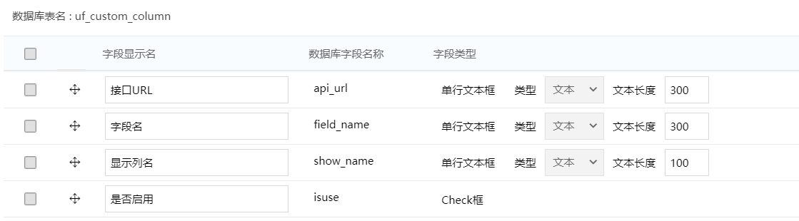
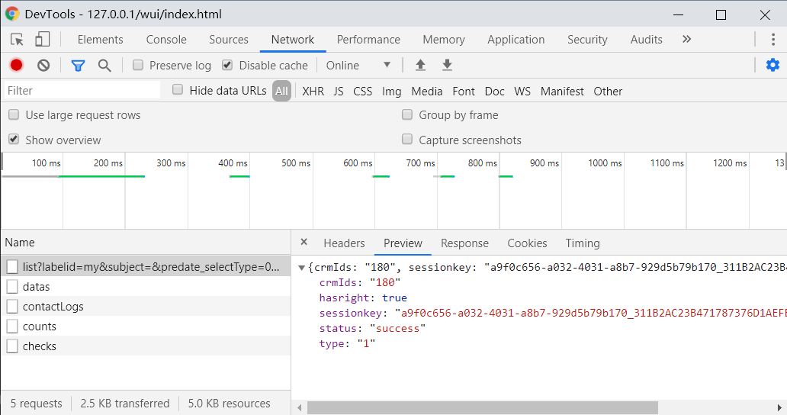

# 关于列表自定义列配置的开发

## 1. 需求背景

系统标准的客户模块中的商机管理列表默认展示的列仅有四列，可查看数据过少。可通过无侵入开发，通过代理`api`接口的方式以及表单配置，对列表进行列扩展。

## 2. 自定义列配置

通过建模新增模块如下



- 接口URL：需要代理的接口URL
- 字段名：扩展字段的数据库字段名
- 是否启用：启用则新增，否则过滤

## 3. 实现方式

`e9` 列表数据的步骤如下：

- 根据相关接口生成`dataKey`，并配置表格的相关配置参数。将其写入到缓存中
- 将生成的`datakey` 传给通用 ` /api/ec/dev/table/datas ` 接口，从而获取数据。

通过采用云商店目前还在内测的一种无侵入开发模式，使用 `weaverboot-e9` 框架，对**商机管理**列表进行接口代理。通过修改缓存中的相关配置参数，从而实现修改表格数据的效果。

### 3.1 抓取生成dataKey的接口

如下图中的接口的响应参数中，`sessionkey`即`datakey`



### 3.2 根据响应参数创建ReceiveResultMsg

该类需要继承 `com.weaverboot.weaResultMsg.impl.tableResult.inte.AbstractWeaTableComponentReciveResultMsg`

实现 `parseAndGetWeaTable` 方法，并且 在该类中，类的成员变量需要与响应参数想对应。

如下面代码中，需要实现 `crmIds`，`hasright`，`sessionKey`，`status` 等参数。（必须实现！）

```java
@Setter
@Getter
public static class ReceiveResultMsg extends AbstractWeaTableComponentReciveResultMsg {

    private String crmIds;

    private String status;

    private boolean hasRight;

    private String sessionKey;

    @Override
    public <T extends AbstractWeaTable> T parseAndGetWeaTable(Class<T> clazz) throws Exception {
        String sessionKey = this.getDatas();
        T t = WeaTableTools.checkTableStringConfig(sessionKey, clazz);
        this.setWeaTable(t);
        return t;
    }
}
```

### 3.3 实现接口代理

```java
@WeaIocReplaceComponent
public class CrmSellChanceTableReplace {

    @WeaReplaceAfter(value = "/api/crm/sellchance/list", order = 1)
    public String tableReplace(WeaAfterReplaceParam param) throws Exception {
        // 获取接口响应参数
        ReceiveResultMsg resultMsg = JSONObject.parseObject(param.getData(), ReceiveResultMsg.class);
        // 根据 sessionKey 获取表格对象
        String sessionKey = resultMsg.getSessionKey();
        DefaultWeaTable table = WeaTableTools.checkTableStringConfig(sessionKey, DefaultWeaTable.class);
        // 开始一顿修改参数操作
        // ...
        // 将修改后的参数推送到缓存中
        WeaTableTools.setTableStringVal(sessionKey,WeaTableTools
                                        .toTableString(table));
        return param.getData();
    }
}
```