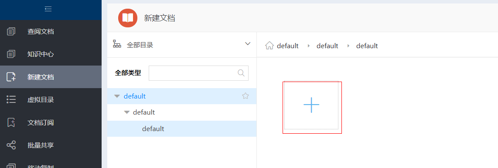
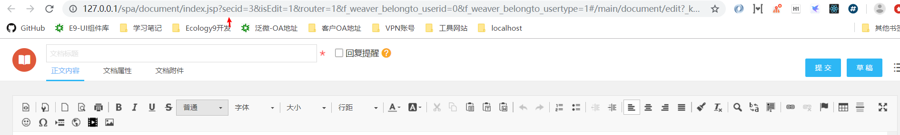
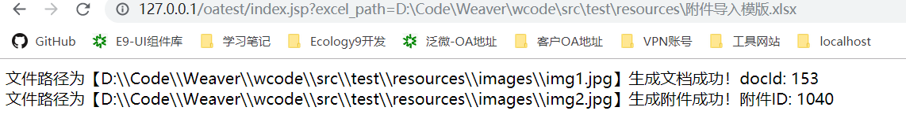

# 附件迁移方案

> 该文档提供了异构系统上的附件完整的迁移到 `e-cology` 平台上的实现方案

## 1. 下载Excel模版

模版下载地址：[附件迁移模版](https://github.com/Y-Aron/cloud-note/blob/master/weaver/%E9%A1%B9%E7%9B%AE%E4%BA%8C%E5%BC%80%E6%96%87%E6%A1%A3/%E9%99%84%E4%BB%B6%E8%BF%81%E7%A7%BB%E6%96%B9%E6%A1%88/%E9%99%84%E4%BB%B6%E8%BF%81%E7%A7%BB%E6%A8%A1%E7%89%88.xlsx)

- 文件绝对路径：需要生成的附件文件，注意这里需要填写绝对路径
- 文档别名：如果有生成文档，则该列字段为生成的文档别名，否则为文件名
- 目录ID：`ecology` 平台上的知识管理的目录ID，查看方式可以参考以下截图

进入知识管理，点击新建大图标

在新建页面，查看页面的URL，其中`secid` 参数就是目录ID

- 是否生成文档：1-生成文档；0-不生成文档。**正常情况下默认生成文档**
- 创建人ID：如果生成文档，则该字段为文档的创建人ID（`ecology`上的人员ID）

## 2. 下载迁移脚本

下载补丁包：[oatest.zip](https://github.com/Y-Aron/cloud-note/blob/master/weaver/%E9%A1%B9%E7%9B%AE%E4%BA%8C%E5%BC%80%E6%96%87%E6%A1%A3/%E9%99%84%E4%BB%B6%E8%BF%81%E7%A7%BB%E6%96%B9%E6%A1%88/oatest.zip)

解压丢到 `ecology/` 根目录下

打开浏览器，输入`http://127.0.0.1/oatest/index.jsp?excel_path=D:\Code\Weaver\wcode\src\test\resources\附件导入模版.xlsx`

`excel_path=`后面跟上的是附件导入模版的文件绝对路径，然后回测等待即可。执行结果如下：

