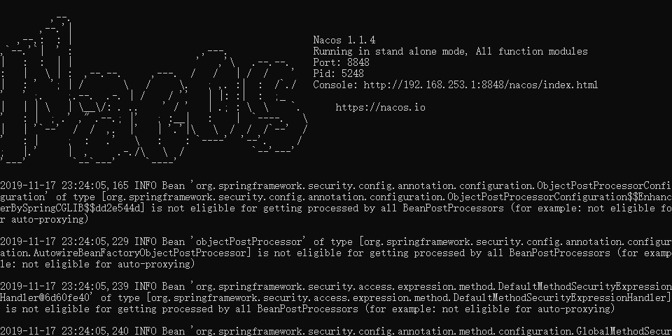
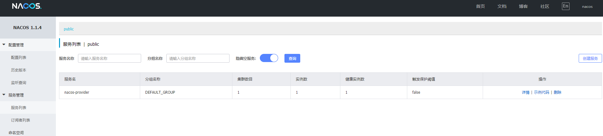
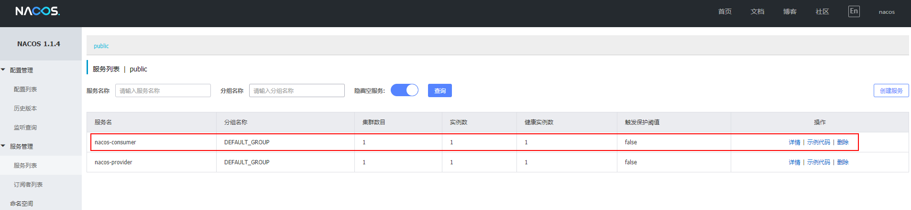
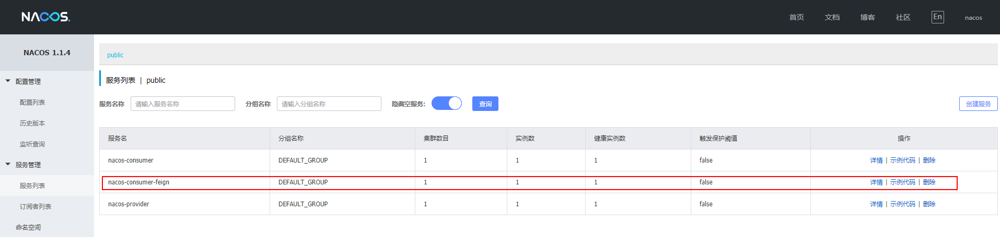
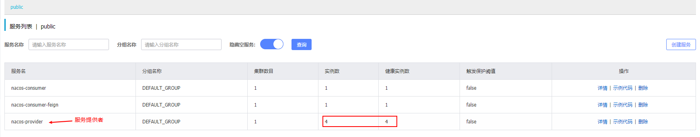
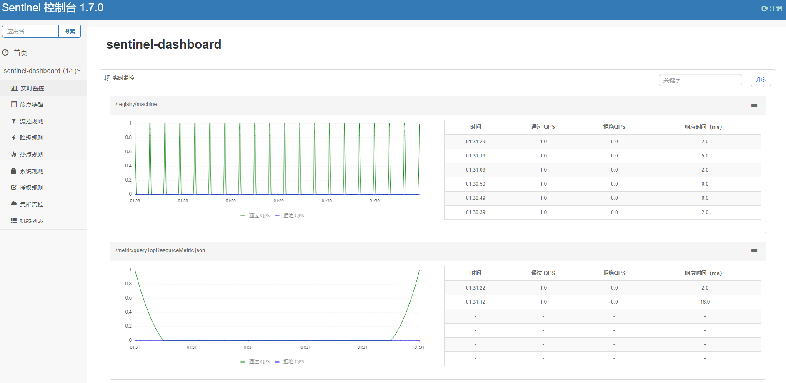
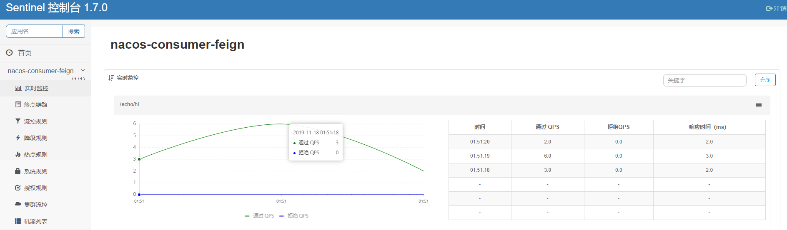

# Spring-Cloud入门

## 1. 简介

Spring Cloud Alibaba 致力于提供微服务开发的一站式解决方案。此项目包含开发分布式应用微服务的必需组件，方便开发者通过 Spring Cloud 编程模型轻松使用这些组件来开发分布式应用服务。

依托 Spring Cloud Alibaba，您只需要添加一些注解和少量配置，就可以将 Spring Cloud 应用接入阿里微服务解决方案，通过阿里中间件来迅速搭建分布式应用系统。

### 1.1 主要功能

- **服务限流降级**：默认支持 Servlet、Feign、RestTemplate、Dubbo 和 RocketMQ 限流降级功能的接入，可以在运行时通过控制台实时修改限流降级规则，还支持查看限流降级 Metrics 监控。
- **服务注册与发现**：适配 Spring Cloud 服务注册与发现标准，默认集成了 Ribbon 的支持。
- **分布式配置管理**：支持分布式系统中的外部化配置，配置更改时自动刷新。
- **消息驱动能力**：基于 Spring Cloud Stream 为微服务应用构建消息驱动能力。
- **阿里云对象存储**：阿里云提供的海量、安全、低成本、高可靠的云存储服务。支持在任何应用、任何时间、任何地点存储和访问任意类型的数据。
- **分布式任务调度**：提供秒级、精准、高可靠、高可用的定时（基于 Cron 表达式）任务调度服务。同时提供分布式的任务执行模型，如网格任务。网格任务支持海量子任务均匀分配到所有 Worker（schedulerx-client）上执行。

### 1.2 组件

- **Sentinel**：把流量作为切入点，从流量控制、熔断降级、系统负载保护等多个维度保护服务的稳定性。
- **Nacos**：一个更易于构建云原生应用的动态服务发现、配置管理和服务管理平台。
- **RocketMQ**：一款开源的分布式消息系统，基于高可用分布式集群技术，提供低延时的、高可靠的消息发布与订阅服务。
- **Alibaba Cloud ACM**：一款在分布式架构环境中对应用配置进行集中管理和推送的应用配置中心产品。
- **Alibaba Cloud OSS**: 阿里云对象存储服务（Object Storage Service，简称 OSS），是阿里云提供的海量、安全、低成本、高可靠的云存储服务。您可以在任何应用、任何时间、任何地点存储和访问任意类型的数据。
- **Alibaba Cloud SchedulerX**: 阿里中间件团队开发的一款分布式任务调度产品，提供秒级、精准、高可靠、高可用的定时（基于 Cron 表达式）任务调度服务。

## 2. 创建统一的依赖管理

> Spring Cloud Alibaba 项目都是基于 Spring Cloud，而 Spring Cloud 项目又是基于 Spring Boot 进行开发，并且都是使用 Maven 做项目管理工具。在实际开发中，我们一般都会创建一个依赖管理项目作为 Maven 的 Parent 项目使用，这样做可以极大的方便我们对 Jar 包版本的统一管理。

**Spring-Cloud，Spring-Cloud-Alibab，Spring-Boot 间的版本关系如下**

| Spring Cloud Version   | Spring Cloud Alibaba Version | Spring Boot Version |
| ---------------------- | ---------------------------- | ------------------- |
| Spring Cloud Greenwich | 2.1.1.RELEASE                | 2.1.X.RELEASE       |
| Spring Cloud Finchley  | 2.0.1.RELEASE                | 2.0.X.RELEASE       |
| Spring Cloud Edgware   | 1.5.1.RELEASE                | 1.5.X.RELEASE       |

创建Maven工程 `sc-alibaba-dependencies`，`pom.xml` 如下所示

```xml
<?xml version="1.0" encoding="UTF-8"?>
<project xmlns="http://maven.apache.org/POM/4.0.0" xmlns:xsi="http://www.w3.org/2001/XMLSchema-instance"
         xsi:schemaLocation="http://maven.apache.org/POM/4.0.0 http://maven.apache.org/xsd/maven-4.0.0.xsd">
  <modelVersion>4.0.0</modelVersion>

  <parent>
    <groupId>org.springframework.boot</groupId>
    <artifactId>spring-boot-starter-parent</artifactId>
    <version>2.1.10.RELEASE</version>
  </parent>

  <groupId>com.jack</groupId>
  <artifactId>sc-alibaba-dependencies</artifactId>
  <version>1.0-SNAPSHOT</version>
  <packaging>pom</packaging>

  <name>sc-alibaba-dependencies</name>

  <properties>
    <!-- Environment Settings -->
    <java.version>1.8</java.version>
    <project.build.sourceEncoding>UTF-8</project.build.sourceEncoding>
    <project.reporting.outputEncoding>UTF-8</project.reporting.outputEncoding>

    <!-- Spring Settings -->
    <spring-cloud.version>Greenwich.SR3</spring-cloud.version>
    <spring-cloud-alibaba.version>2.1.1.RELEASE</spring-cloud-alibaba.version>
  </properties>

  <dependencyManagement>
    <dependencies>
      <dependency>
        <groupId>org.springframework.cloud</groupId>
        <artifactId>spring-cloud-dependencies</artifactId>
        <version>${spring-cloud.version}</version>
        <type>pom</type>
        <scope>import</scope>
      </dependency>
      <dependency>
        <groupId>org.springframework.cloud</groupId>
        <artifactId>spring-cloud-alibaba-dependencies</artifactId>
        <version>${spring-cloud-alibaba.version}</version>
        <type>pom</type>
        <scope>import</scope>
      </dependency>
    </dependencies>
  </dependencyManagement>
</project>
```

## 3. 服务注册与发现

> 使用 Nacos 作为服务注册与发现服务器

### 3.1 下载并安装

最新稳定版本下载地址：https://github.com/alibaba/nacos/releases 

### 3.2 启动服务

**注意，启动服务前需要 [配置 `java` 的环境变量](https://www.cnblogs.com/ssrs-wanghao/articles/8994856.html)**

进入 `nacos/bin` 目录，window 下使用 `startup.cmd` 启动服务，浏览器输入 http://localhost:8848/nacos 即可访问，默认账户密码为 nacos/nacos



## 4. 创建服务器提供者

### 4.1 创建 Nacos-Provider 

#### 4.1.1 POM.xml

```xml
<?xml version="1.0" encoding="UTF-8"?>
<project xmlns="http://maven.apache.org/POM/4.0.0" xmlns:xsi="http://www.w3.org/2001/XMLSchema-instance"
         xsi:schemaLocation="http://maven.apache.org/POM/4.0.0 http://maven.apache.org/xsd/maven-4.0.0.xsd">
  <modelVersion>4.0.0</modelVersion>

  <parent>
    <groupId>com.jack</groupId>
    <artifactId>sc-alibaba-dependencies</artifactId>
    <version>1.0-SNAPSHOT</version>
    <relativePath>../sc-alibaba-dependencies/pom.xml</relativePath>
  </parent>

  <artifactId>nacos-provider</artifactId>
  <packaging>jar</packaging>

  <name>nacos-provider</name>

  <dependencies>
    <!-- Spring Boot Begin -->
    <dependency>
      <groupId>org.springframework.boot</groupId>
      <artifactId>spring-boot-starter-web</artifactId>
    </dependency>
    <dependency>
      <groupId>org.springframework.boot</groupId>
      <artifactId>spring-boot-starter-actuator</artifactId>
    </dependency>
    <dependency>
      <groupId>org.springframework.boot</groupId>
      <artifactId>spring-boot-starter-test</artifactId>
      <scope>test</scope>
    </dependency>
    <!-- Spring Boot End -->

    <!-- Spring Cloud Begin -->
    <dependency>
      <groupId>com.alibaba.cloud</groupId>
      <artifactId>spring-cloud-starter-alibaba-nacos-discovery</artifactId>
      <version>${spring-cloud-alibaba.version}</version>
    </dependency>
    <!-- Spring Cloud End -->
  </dependencies>

  <build>
    <plugins>
      <plugin>
        <groupId>org.springframework.boot</groupId>
        <artifactId>spring-boot-maven-plugin</artifactId>
        <configuration>
          <mainClass>com.jack.nacos.provider.NacosProviderApplication</mainClass>
        </configuration>
      </plugin>
    </plugins>
  </build>
</project>
```

#### 4.1.2 Application

- 通过 `@EnableDiscoveryClient` 注解表明是一个 Nacos 客户端，该注解是 Spring Cloud 提供的原生注解

```java
@SpringBootApplication
@EnableDiscoveryClient
public class NacosProviderApplication {
    public static void main(String[] args) {
        SpringApplication.run(NacosProviderApplication.class, args);
    }

    @RestController
    public class EchoController {
        @GetMapping(value = "/echo/{message}")
        public String echo(@PathVariable String message) {
            return "Hello Nacos Discovery " + message;
        }
    }
}
```

#### 4.1.3 Application.yml

```yaml
spring:
  application:
    name: nacos-provider
  cloud:
    nacos:
      discovery:
        server-addr: 127.0.0.1:8848

server:
  port: 8081

management:
  endpoints:
    web:
      exposure:
        include: "*"
```

### 4.2 启动工程

通过浏览器访问 `http://localhost:8848/nacos`，即 Nacos Server 网址



- 浏览器输入 http://localhost:8081/echo/hi，你会在浏览器看到如下结果

```
Hello Nacos Discovery hi
```

### 4.3 服务的端点检查

> spring-cloud-starter-alibaba-nacos-discovery 在实现的时候提供了一个 EndPoint, EndPoint 的访问地址为 `http://ip:port/actuator/nacos-discovery`。 

EndPoint 的信息主要提供了两类:

```text
1、subscribe: 显示了当前有哪些服务订阅者
2、NacosDiscoveryProperties: 显示了当前服务实例关于 Nacos 的基础配置
```

 通过浏览器访问 `http://localhost:8081/actuator/nacos-discovery` 你会在浏览器上看到：

```json
{
    subscribe: [ ],
    NacosDiscoveryProperties: {
        serverAddr: "127.0.0.1:8848",
        endpoint: "",
        namespace: "",
        watchDelay: 30000,
        logName: "",
        service: "nacos-provider",
        weight: 1,
        clusterName: "DEFAULT",
        group: "DEFAULT_GROUP",
        namingLoadCacheAtStart: "false",
        metadata: {
            preserved.register.source: "SPRING_CLOUD"
        },
        registerEnabled: true,
        ip: "192.168.253.1",
        networkInterface: "",
        port: 8081,
        secure: false,
        accessKey: "",
        secretKey: "",
        heartBeatInterval: null,
        heartBeatTimeout: null,
        ipDeleteTimeout: null
    }
}
```
### 4.4 Nacos Starter 配置项

| 配置项          | Key                                            | 默认值                     | 说明                                                         |
| --------------- | ---------------------------------------------- | -------------------------- | ------------------------------------------------------------ |
| 服务端地址      | spring.cloud.nacos.discovery.server-addr       | 无                         | Nacos Server 启动监听的ip地址和端口                          |
| 服务名          | spring.cloud.nacos.discovery.service           | ${spring.application.name} | 给当前的服务命名                                             |
| 权重            | spring.cloud.nacos.discovery.weight            | 1                          | 取值范围 1 到 100，数值越大，权重越大                        |
| 网卡名          | spring.cloud.nacos.discovery.network-interface | 无                         | 当IP未配置时，注册的IP为此网卡所对应的IP地址，如果此项也未配置，则默认取第一块网卡的地址 |
| 注册的IP地址    | spring.cloud.nacos.discovery.ip                | 无                         | 优先级最高                                                   |
| 注册的端口      | spring.cloud.nacos.discovery.port              | -1                         | 默认情况下不用配置，会自动探测                               |
| 命名空间        | spring.cloud.nacos.discovery.namespace         | 无                         | 常用场景之一是不同环境的注册的区分隔离，例如开发测试环境和生产环境的资源（如配置、服务）隔离等。 |
| AccessKey       | spring.cloud.nacos.discovery.access-key        | 无                         | 当要上阿里云时，阿里云上面的一个云账号名                     |
| SecretKey       | spring.cloud.nacos.discovery.secret-key        | 无                         | 当要上阿里云时，阿里云上面的一个云账号密码                   |
| Metadata        | spring.cloud.nacos.discovery.metadata          | 无                         | 使用 Map 格式配置，用户可以根据自己的需要自定义一些和服务相关的元数据信息 |
| 日志文件名      | spring.cloud.nacos.discovery.log-name          | 无                         |                                                              |
| 接入点          | spring.cloud.nacos.discovery.enpoint           | UTF-8                      | 地域的某个服务的入口域名，通过此域名可以动态地拿到服务端地址 |
| 是否集成 Ribbon | ribbon.nacos.enabled                           | true                       | 一般都设置成 true 即可                                       |

## 5. 创建服务消费者

### 5.1 创建 Nacos-Consumer 

#### 5.1.1 POM.xml

```xml
<?xml version="1.0" encoding="UTF-8"?>
<project xmlns="http://maven.apache.org/POM/4.0.0" xmlns:xsi="http://www.w3.org/2001/XMLSchema-instance"
         xsi:schemaLocation="http://maven.apache.org/POM/4.0.0 http://maven.apache.org/xsd/maven-4.0.0.xsd">
  <modelVersion>4.0.0</modelVersion>

  <parent>
    <groupId>com.jack</groupId>
    <artifactId>sc-alibaba-dependencies</artifactId>
    <version>1.0-SNAPSHOT</version>
    <relativePath>../sc-alibaba-dependencies/pom.xml</relativePath>
  </parent>

  <artifactId>nacos-consumer</artifactId>
  <packaging>jar</packaging>

  <name>nacos-consumer</name>

  <dependencies>
    <!-- Spring Boot Begin -->
    <dependency>
      <groupId>org.springframework.boot</groupId>
      <artifactId>spring-boot-starter-web</artifactId>
    </dependency>
    <dependency>
      <groupId>org.springframework.boot</groupId>
      <artifactId>spring-boot-starter-actuator</artifactId>
    </dependency>
    <dependency>
      <groupId>org.springframework.boot</groupId>
      <artifactId>spring-boot-starter-test</artifactId>
      <scope>test</scope>
    </dependency>
    <!-- Spring Boot End -->

    <!-- Spring Cloud Begin -->
    <dependency>
      <groupId>com.alibaba.cloud</groupId>
      <artifactId>spring-cloud-starter-alibaba-nacos-discovery</artifactId>
      <version>${spring-cloud-alibaba.version}</version>
    </dependency>
    <!-- Spring Cloud End -->
  </dependencies>

  <build>
    <plugins>
      <plugin>
        <groupId>org.springframework.boot</groupId>
        <artifactId>spring-boot-maven-plugin</artifactId>
        <configuration>
          <mainClass>com.jack.nacos.consumer.NacosConsumerApplication</mainClass>
        </configuration>
      </plugin>
    </plugins>
  </build>
</project>
```

#### 5.1.2 Application

```java
@SpringBootApplication
@EnableDiscoveryClient
public class NacosConsumerApplication {
    public static void main(String[] args) {
        SpringApplication.run(NacosConsumerApplication.class, args);
    }
}
```

#### 5.1.3 Application.yml

```yml
spring:
  application:
    name: nacos-consumer
  cloud:
    nacos:
      discovery:
        server-addr: 127.0.0.1:8848

server:
  port: 9091

management:
  endpoints:
    web:
      exposure:
        include: "*"
```

#### 5.1.4 Configuration

创建一个名为 `NacosConsumerConfiguration` 的 Java 配置类，主要作用是为了注入 `RestTemplate`

```java
package com.jack.nacos.consumer.config;

import org.springframework.context.annotation.Bean;
import org.springframework.context.annotation.Configuration;
import org.springframework.web.client.RestTemplate;

@Configuration
public class NacosConsumerConfiguration {
    @Bean
    public RestTemplate restTemplate() {
        return new RestTemplate();
    }
}
```

#### 5.1.5 Controller

创建 `IndexController`测试

```java
package com.jack.nacos.consumer.controller;

import org.springframework.beans.factory.annotation.Autowired;
import org.springframework.beans.factory.annotation.Value;
import org.springframework.cloud.client.ServiceInstance;
import org.springframework.cloud.client.loadbalancer.LoadBalancerClient;
import org.springframework.web.bind.annotation.GetMapping;
import org.springframework.web.bind.annotation.RestController;
import org.springframework.web.client.RestTemplate;

@RestController
public class IndexController {

    @Autowired
    private LoadBalancerClient loadBalancerClient;

    @Autowired
    private RestTemplate restTemplate;

    @Value("${spring.application.name}")
    private String appName;

    @GetMapping(value = "/echo/app/name")
    public String echo() {
        //使用 LoadBalanceClient 和 RestTemplate 结合的方式来访问
        ServiceInstance serviceInstance = loadBalancerClient.choose("nacos-provider");
        String url = String.format("http://%s:%s/echo/%s", serviceInstance.getHost(), serviceInstance.getPort(), appName);
        return restTemplate.getForObject(url, String.class);
    }
}
```

### 5.2 启动工程

- 通过浏览器访问 `http://localhost:8848/nacos`，即 Nacos Server 网址



- 浏览器输入 `http://localhost:9091/echo/app/name` ，你会在浏览器看到如下结果

```
Hello Nacos Discovery nacos-consumer
```

## 6. 创建服务消费者(Feign)

### 6.1 创建  Nacos-Consumer-Feign 

#### 6.1.1 POM.xml

```xml
<?xml version="1.0" encoding="UTF-8"?>
<project xmlns="http://maven.apache.org/POM/4.0.0" xmlns:xsi="http://www.w3.org/2001/XMLSchema-instance"
         xsi:schemaLocation="http://maven.apache.org/POM/4.0.0 http://maven.apache.org/xsd/maven-4.0.0.xsd">
  <modelVersion>4.0.0</modelVersion>

  <parent>
    <groupId>com.jack</groupId>
    <artifactId>sc-alibaba-dependencies</artifactId>
    <version>1.0-SNAPSHOT</version>
    <relativePath>../sc-alibaba-dependencies/pom.xml</relativePath>
  </parent>

  <artifactId>nacos-consumer-feign</artifactId>
  <packaging>jar</packaging>

  <name>nacos-consumer-feign</name>

  <dependencies>
    <!-- Spring Boot Begin -->
    <dependency>
      <groupId>org.springframework.boot</groupId>
      <artifactId>spring-boot-starter-web</artifactId>
    </dependency>
    <dependency>
      <groupId>org.springframework.boot</groupId>
      <artifactId>spring-boot-starter-actuator</artifactId>
    </dependency>
    <dependency>
      <groupId>org.springframework.boot</groupId>
      <artifactId>spring-boot-starter-test</artifactId>
      <scope>test</scope>
    </dependency>
    <!-- Spring Boot End -->

    <!-- Spring Cloud Begin -->
    <dependency>
      <groupId>com.alibaba.cloud</groupId>
      <artifactId>spring-cloud-starter-alibaba-nacos-discovery</artifactId>
      <version>${spring-cloud-alibaba.version}</version>
    </dependency>
    <dependency>
      <groupId>org.springframework.cloud</groupId>
      <artifactId>spring-cloud-starter-openfeign</artifactId>
    </dependency>
    <!-- Spring Cloud End -->
  </dependencies>

  <build>
    <plugins>
      <plugin>
        <groupId>org.springframework.boot</groupId>
        <artifactId>spring-boot-maven-plugin</artifactId>
        <configuration>
          <mainClass>com.jack.nacos.consumer.feign.NacosConsumerFeignApplication</mainClass>
        </configuration>
      </plugin>
    </plugins>
  </build>
</project>
```

#### 6.1.2 Application

```java
@SpringBootApplication
@EnableDiscoveryClient
@EnableFeignClients
public class NacosConsumerFeignApplication {
    public static void main(String[] args) {
        SpringApplication.run(NacosConsumerFeignApplication.class, args);
    }
}
```

#### 6.1.3 创建 Feign 接口

通过 `@FeignClient("服务名")` 注解来指定调用哪个服务。代码如下：

```java
package com.jack.nacos.consumer.feign.service;

import org.springframework.cloud.openfeign.FeignClient;
import org.springframework.web.bind.annotation.GetMapping;
import org.springframework.web.bind.annotation.PathVariable;

@FeignClient(value = "nacos-provider")
public interface EchoService {

    @GetMapping(value = "/echo/{message}")
    String echo(@PathVariable("message") String message);
}
```

#### 6.1.4 Controller

```java
package com.jack.nacos.consumer.feign.controller;

import com.jack.nacos.consumer.feign.service.EchoService;
import org.springframework.beans.factory.annotation.Autowired;
import org.springframework.web.bind.annotation.GetMapping;
import org.springframework.web.bind.annotation.RestController;

@RestController
public class IndexController {
    @Autowired
    private EchoService echoService;

    @GetMapping(value = "/echo/hi")
    public String echo() {
        return echoService.echo("Hi Feign");
    }
}
```

#### 6.1.5 Application.yml

```yml
spring:
  application:
    name: nacos-consumer-feign
  cloud:
    nacos:
      discovery:
        server-addr: 127.0.0.1:8848

server:
  port: 9092

management:
  endpoints:
    web:
      exposure:
        include: "*"
```

### 6.2 启动工程

- 通过浏览器访问 `http://localhost:8848/nacos`，即 Nacos Server 网址



- 浏览器输入 `http://localhost:9092/echo/hi` ，你会在浏览器上看到

```
Hello Nacos Discovery Hi Feign
```

### 6.3 测试负载均衡

-  启动多个 `consumer-provider` 实例，效果图如下



- 修改 `consumer-provider` 项目中的 `Controller` 代码，用于确定负载均衡生效

```java
package com.jack.nacos.provider;

import org.springframework.beans.factory.annotation.Value;
import org.springframework.boot.SpringApplication;
import org.springframework.boot.autoconfigure.SpringBootApplication;
import org.springframework.cloud.client.discovery.EnableDiscoveryClient;
import org.springframework.web.bind.annotation.GetMapping;
import org.springframework.web.bind.annotation.PathVariable;
import org.springframework.web.bind.annotation.RestController;

@SpringBootApplication
@EnableDiscoveryClient
public class NacosProviderApplication {
    public static void main(String[] args) {
        SpringApplication.run(NacosProviderApplication.class, args);
    }

    @Value("${server.port}")
    private String port;

    @RestController
    public class EchoController {
        @GetMapping(value = "/echo/{message}")
        public String echo(@PathVariable String message) {
            return "Hello Nacos Discovery " + message + " i am from port " + port;
        }
    }
}
```

- 在浏览器上多次访问 `http://localhost:9092/echo/hi` ，浏览器交替显示

```
Hello Nacos Discovery Hi Feign i am from port 8081
Hello Nacos Discovery Hi Feign i am from port 8082
Hello Nacos Discovery Hi Feign i am from port 8083
Hello Nacos Discovery Hi Feign i am from port 8084
```

## 7. Sentinel 熔断器

### 7.1 基本使用

- 在 Nacos-Consumer-Feign 的 pom.xml 中加入以下依赖

```xml
<dependency>
    <groupId>com.alibaba.cloud</groupId>
    <artifactId>spring-cloud-starter-alibaba-sentinel</artifactId>
</dependency>
```

- Sentinel 适配了 Feign 组件。但默认是关闭的。需要在配置文件中配置打开它，在配置文件增加以下代码

```yaml
feign:
  sentinel:
    enabled: true
```

- 在Service 中增加 fallback 指定类

```java
package com.jack.nacos.consumer.feign.service;

import com.jack.nacos.consumer.feign.service.fallback.EchoServiceFallbackImpl;
import org.springframework.cloud.openfeign.FeignClient;
import org.springframework.web.bind.annotation.GetMapping;
import org.springframework.web.bind.annotation.PathVariable;

@FeignClient(value = "nacos-provider", fallback = EchoServiceFallbackImpl.class)
public interface EchoService {

    @GetMapping(value = "/echo/{message}")
    String echo(@PathVariable("message") String message);
}
```

- 创建熔断器类并实现对应的 Feign 接口

```java
package com.jack.nacos.consumer.feign.service.fallback;

import com.jack.nacos.consumer.feign.service.EchoService;
import org.springframework.stereotype.Component;

@Component
public class EchoServiceFallbackImpl implements EchoService {

    @Override
    public String echo(String message) {
        return "echo fallback";
    }
}
```

### 7.2 测试熔断器

此时我们关闭服务提供者，再次请求 http://localhost:9092/echo/hi 浏览器会显示

```
echo fallback
```

### 7.3 熔断器仪表盘

> 下载地址：https://github.com/alibaba/Sentinel/releases

#### 7.3.1 启动服务

```bash
java -Dserver.port=8080 -Dcsp.sentinel.dashboard.server=localhost:8080 -Dproject.name=sentinel-dashboard -jar sentinel-dashboard.jar
```

#### 7.3.2 访问服务

打开浏览器访问：http://localhost:8080/#/dashboard/home

**默认账户密码为： sentinel/ sentinel**



#### 7.3.3 客户端使用

- 在 Nacos-Consunmer-Fegin 的配置文件 `application.yml` 加入以下参数

```yaml
spring:
  cloud:
    sentinel:
      enabled: true
      transport:
        port: 8719
        dashboard: localhost:8080
```

- 浏览器打开 http://localhost:9092/echo/hi ，触发熔断机制，测试 Sentinel



## 8. API 网关

### 8.1 创建 Spring-Cloud-Gateway

#### 8.1.1 POM.xml

```xml
<?xml version="1.0" encoding="UTF-8"?>
<project xmlns="http://maven.apache.org/POM/4.0.0" xmlns:xsi="http://www.w3.org/2001/XMLSchema-instance"
         xsi:schemaLocation="http://maven.apache.org/POM/4.0.0 http://maven.apache.org/xsd/maven-4.0.0.xsd">
  <modelVersion>4.0.0</modelVersion>

  <parent>
    <groupId>com.jack</groupId>
    <artifactId>sc-alibaba-dependencies</artifactId>
    <version>1.0-SNAPSHOT</version>
    <relativePath>../sc-alibaba-dependencies/pom.xml</relativePath>
  </parent>

  <artifactId>sc-gateway</artifactId>
  <packaging>jar</packaging>

  <name>sc-gateway</name>

  <dependencies>
    <!-- Spring Boot Begin -->
    <dependency>
      <groupId>org.springframework.boot</groupId>
      <artifactId>spring-boot-starter-actuator</artifactId>
    </dependency>
    <dependency>
      <groupId>org.springframework.boot</groupId>
      <artifactId>spring-boot-starter-test</artifactId>
      <scope>test</scope>
    </dependency>
    <!-- Spring Boot End -->

    <!-- Spring Cloud Begin -->
    <dependency>
      <groupId>com.alibaba.cloud</groupId>
      <artifactId>spring-cloud-starter-alibaba-nacos-discovery</artifactId>
      <version>${spring-cloud-alibaba.version}</version>
    </dependency>
    <dependency>
      <groupId>com.alibaba.cloud</groupId>
      <artifactId>spring-cloud-starter-alibaba-sentinel</artifactId>
      <version>${spring-cloud-alibaba.version}</version>
    </dependency>
    <dependency>
      <groupId>org.springframework.cloud</groupId>
      <artifactId>spring-cloud-starter-openfeign</artifactId>
    </dependency>
    <dependency>
      <groupId>org.springframework.cloud</groupId>
      <artifactId>spring-cloud-starter-gateway</artifactId>
    </dependency>
    <!-- Spring Cloud End -->

    <!-- Commons Begin -->
    <dependency>
      <groupId>javax.servlet</groupId>
      <artifactId>javax.servlet-api</artifactId>
    </dependency>
    <!-- Commons Begin -->
  </dependencies>

  <build>
    <plugins>
      <plugin>
        <groupId>org.springframework.boot</groupId>
        <artifactId>spring-boot-maven-plugin</artifactId>
        <configuration>
          <mainClass>com.jack.sc.gateway.GatewayApplication</mainClass>
        </configuration>
      </plugin>
    </plugins>
  </build>
</project>
```

**特别注意**

- `Spring Cloud Gateway` 不使用 Web 作为服务器，而是 **使用 WebFlux 作为服务器**，Gateway 项目已经依赖了 `starter-webflux`，所以这里 **千万不要依赖 `starter-web`**
- 由于过滤器等功能依然需要 Servlet 支持，故这里还需要依赖 `javax.servlet:javax.servlet-api`

 #### 8.1.2 Application

```java
package com.jack.sc.gateway;

import org.springframework.boot.SpringApplication;
import org.springframework.boot.autoconfigure.SpringBootApplication;
import org.springframework.cloud.client.discovery.EnableDiscoveryClient;
import org.springframework.cloud.openfeign.EnableFeignClients;

@SpringBootApplication
@EnableDiscoveryClient
@EnableFeignClients
public class GatewayApplication {
    public static void main(String[] args) {
        SpringApplication.run(GatewayApplication.class, args);
    }
}
```

#### 8.1.3 Application.yml

```yml
spring:
  application:
    # 应用名称
    name: sc-gateway
  cloud:
    # 使用 Naoos 作为服务注册发现
    nacos:
      discovery:
        server-addr: 127.0.0.1:8848
    # 使用 Sentinel 作为熔断器
    sentinel:
      enabled: true
      transport:
        port: 8721
        dashboard: localhost:8080
    # 路由网关配置
    gateway:
      # 设置与服务注册发现组件结合，这样可以采用服务名的路由策略
      discovery:
        locator:
          enabled: true
      # 配置路由规则
      routes:
        # 采用自定义路由 ID（有固定用法，不同的 id 有不同的功能
        # 详见：https://cloud.spring.io/spring-cloud-gateway/2.0.x/single/spring-cloud-gateway.html#gateway-route-filters）
        - id: NACOS-CONSUMER
          # 采用 LoadBalanceClient 方式请求，以 lb:// 开头，后面的是注册在 Nacos 上的服务名
          uri: lb://nacos-consumer
          # Predicate 翻译过来是"谓词"的意思，必须，主要作用是匹配用户的请求，有很多种用法
          predicates:
            # Method 方法谓词，这里是匹配 GET 和 POST 请求
            - Method=GET,POST
        - id: NACOS-CONSUMER-FEIGN
          uri: lb://nacos-consumer-feign
          predicates:
            - Method=GET,POST
server:
  port: 9000

# 目前无效
feign:
  sentinel:
    enabled: true

# 目前无效
management:
  endpoints:
    web:
      exposure:
        include: "*"

# 配置日志级别，方别调试
logging:
  level:
    org.springframework.cloud.gateway: debug
```

### 8.2 网关测试

依次运行 Nacos 服务、`NacosProviderApplication`、`NacosConsumerApplication`、`NacosConsumerFeignApplication`、`GatewayApplication`

**注意：请求方式是 `http://路由网关IP:路由网关Port/服务名/\**`**

打开浏览器访问：http://localhost:9000/nacos-consumer/echo/app/name 浏览器显示

```
Hello Nacos Discovery nacos-consumer i am from port 8081
```

打开浏览器访问：http://localhost:9000/nacos-consumer-feign/echo/hi 浏览器显示

```
Hello Nacos Discovery Hi Feign i am from port 8082
```

